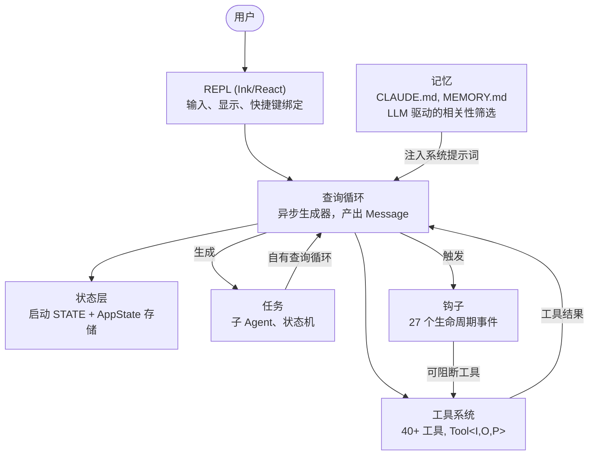
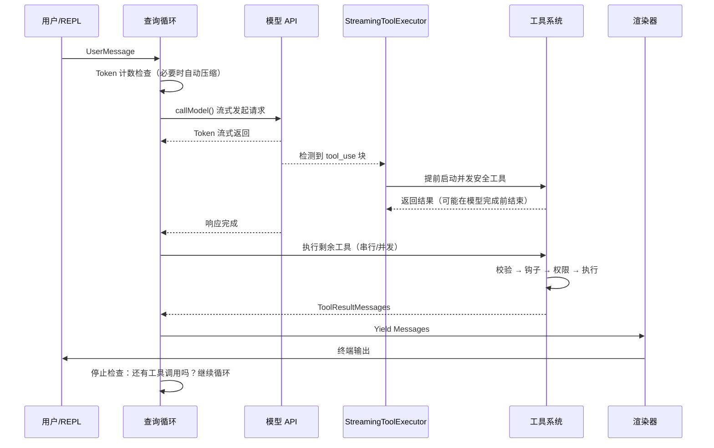
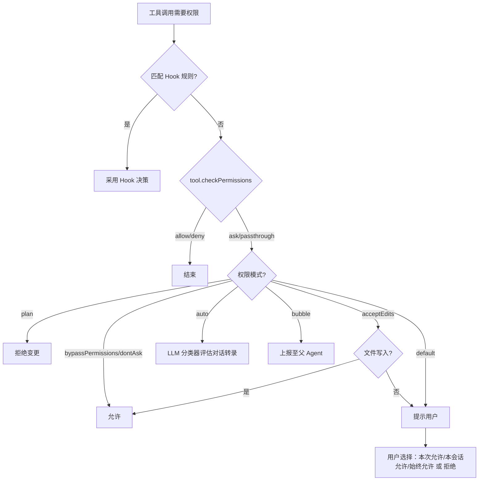
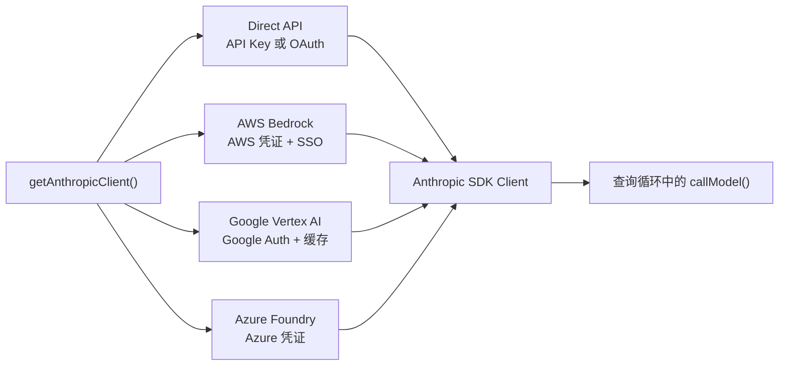
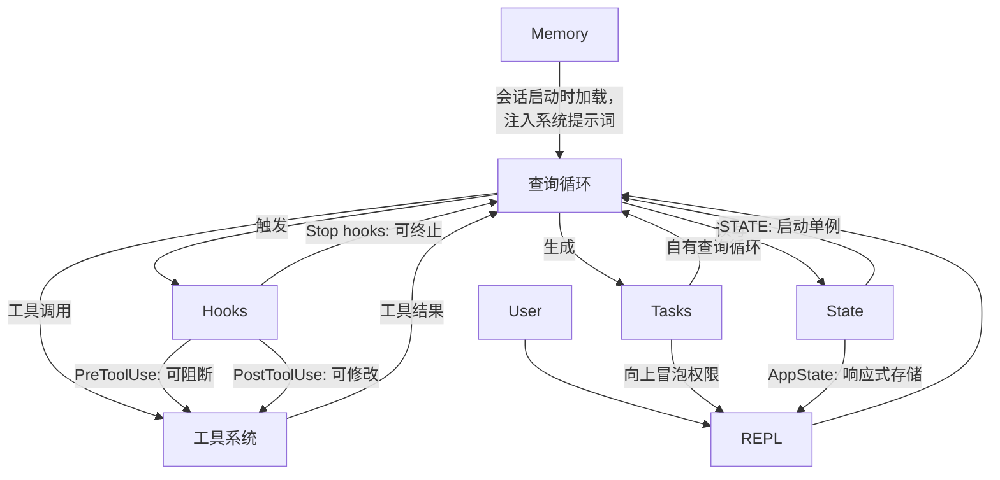

# 第1章：AI Agent 的架构

## 你正在面对的是什么

传统的命令行接口（CLI）本质上是一个函数。它接收参数，执行任务，然后退出。`grep` 不会自作主张地再去运行 `sed`；`curl` 也不会在下载内容后自动打开文件并对其进行修补。其契约非常简单：一条命令，一个动作，确定性的输出。

而 Agent 化的 CLI 打破了这一契约的所有部分。它接收自然语言提示词（prompt），自主决定使用哪些工具，根据当前情况以任意顺序执行这些工具，评估执行结果，并不断循环，直到任务完成或用户主动终止。这里的“程序”不再是一组固定的指令序列——而是一个围绕语言模型的循环，该模型在运行时动态生成自己的指令序列。工具调用构成了副作用（side effects），而模型的推理过程则充当了控制流（control flow）。

Claude Code 是 Anthropic 对这一理念的生产级实现：这是一个包含近两千个文件的 TypeScript 单体应用，它将终端转变为一个由 Claude 驱动的全功能开发环境。它已交付给数十万开发者使用，这意味着每一个架构决策都承载着真实的现实后果。本章将为你构建相应的心智模型。整个系统由六个抽象定义，并由单一的数据流将它们串联起来。一旦你将这条从按键输入到最终输出的“黄金路径”（golden path）内化于心，后续每一章都不过是对这条路径中某一片段的深入放大。

接下来的内容是一种回顾式的拆解——这六个抽象并非事先在白板上设计好的。它们是在向庞大用户群交付生产级 Agent 的压力下逐渐涌现出来的。理解它们实际的样子，而非它们被规划时的样子，才能为阅读本书的其余部分建立正确的预期。

---

## 六大核心抽象

Claude Code 建立在六个核心抽象之上。其他一切——包括 400 多个工具文件、分叉的终端渲染器、Vim 模拟层、成本追踪器——都是为了支撑这六个抽象而存在的。



以下是每个抽象的功能及其存在的原因。

**1. 查询循环（Query Loop）** (`query.ts`, ~1,700 行)。这是一个异步生成器（async generator），也是整个系统的心跳。它以流式方式接收模型响应，收集工具调用，执行这些调用，将结果追加到消息历史中，然后进入下一次循环。所有的交互——无论是 REPL、SDK、子 Agent，还是无头模式下的 `--print`——都流经这同一个函数。它产出（yield）供 UI 消费的 `Message` 对象。其返回类型是一个名为 `Terminal` 的可辨识联合类型（discriminated union），精确编码了循环停止的原因：正常完成、用户中止、Token 预算耗尽、Stop 钩子干预、达到最大轮次或不可恢复的错误。相比于回调或事件发射器，生成器模式提供了天然的反压机制（backpressure）、优雅的取消操作以及类型安全的终态。第5章将全面剖析该循环的内部机制。

**2. 工具系统（Tool System）** (`Tool.ts`, `tools.ts`, `services/tools/`)。工具即 Agent 能在外部世界中执行的任何操作：读取文件、运行 Shell 命令、编辑代码、搜索网页等。这种目标上的简洁性掩盖了其背后复杂的机制。每个工具都实现了一个丰富的接口，涵盖身份标识、Schema 定义、执行逻辑、权限控制和渲染展示。工具不仅仅是函数——它们还携带自身的权限逻辑、并发声明、进度上报和 UI 渲染能力。系统将工具调用划分为并发批次和串行批次，且流式执行器（streaming executor）会在模型尚未完成响应之前就提前启动那些并发安全的工具。第6章将详述完整的工具接口与执行流水线。

**3. 任务（Tasks）** (`Task.ts`, `tasks/`)。任务是后台工作单元——主要是子 Agent。它们遵循状态机模型：`pending -> running -> completed | failed | killed`。`AgentTool` 会生成一个新的 `query()` 生成器实例，该实例拥有独立的消息历史、工具集和权限模式。任务赋予了 Claude Code 递归能力：一个 Agent 可以委派任务给子 Agent，而子 Agent 还可以进一步委派。

**4. 状态（State）**（双层结构）。系统在两个层级上维护状态。一个可变单例（`STATE`）保存了约 80 个会话级基础设施字段：工作目录、模型配置、成本追踪、遥测计数器、会话 ID 等。它在启动时设置一次，随后直接修改——不具备响应式特性。一个极简的响应式存储（34 行代码，类 Zustand 风格）驱动 UI 更新：消息列表、输入模式、工具审批、进度指示器等。这种分离是有意为之的：基础设施状态变更频率低，无需触发重渲染；而 UI 状态变化频繁，必须触发重渲染。第3章将深入探讨这种双层架构。

**5. 记忆（Memory）** (`memdir/`)。这是 Agent 跨会话的持久化上下文。分为三个层级：项目级（仓库中的 `CLAUDE.md` 文件）、用户级（`~/.claude/MEMORY.md`）和团队级（通过符号链接共享）。在会话开始时，系统会扫描所有记忆文件，解析 frontmatter，并由 LLM 筛选出与当前对话相关的记忆内容。记忆机制使 Claude Code 能够“记住”你的代码库规范、架构决策和调试历史。

**6. 钩子（Hooks）** (`hooks/`, `utils/hooks/`)。用户自定义的生命周期拦截器，可在 4 种执行类型的 27 个不同事件点触发：Shell 命令、单次 LLM 提示、多轮 Agent 对话以及 HTTP Webhook。钩子可以阻断工具执行、修改输入、注入额外上下文，甚至短路整个查询循环。权限系统本身也部分通过钩子实现——`PreToolUse` 钩子可以在交互式权限弹窗出现之前就拒绝工具调用。

---

## 黄金路径：从按键到输出

让我们追踪一个请求在系统中的完整流转。用户输入“为登录函数添加错误处理”并按下回车键。



关于此流程，有三点值得注意。

首先，查询循环是一个生成器，而非回调链。REPL 通过 `for await` 从中拉取消息，这意味着反压是天然的——如果 UI 处理不过来，生成器就会暂停。这是相对于事件发射器或 Observable 流的刻意选择。

其次，工具执行与模型流式输出是重叠进行的。`StreamingToolExecutor` 不会等待模型完全响应后再启动并发安全的工具。一个 `Read` 调用可以在模型仍在生成其余响应时就已完成并返回结果。这是一种推测执行（speculative execution）——如果模型的最终输出使该工具调用失效（虽罕见但有可能），则该结果会被丢弃。

第三，整个循环是可重入的（re-entrant）。当模型发起工具调用时，结果会被追加到消息历史中，循环随即带着更新后的上下文再次调用模型。这里不存在独立的“工具结果处理”阶段——一切都在这同一个循环中完成。模型只需不再生成工具调用，即表示任务完成。

---

## 权限系统

Claude Code 会在你的机器上执行任意 Shell 命令、编辑你的文件、生成子进程、发起网络请求，甚至修改你的 Git 历史。如果没有权限系统，这将是一场安全灾难。

系统定义了七种权限模式，按宽松程度从高到低排列：

| 模式 | 行为 |
|------|----------|
| `bypassPermissions` | 允许一切操作。不做任何检查。仅限内部/测试使用。 |
| `dontAsk` | 允许所有操作，但仍会记录日志。不弹出用户确认提示。 |
| `auto` | 由转录分类器（LLM）决定允许或拒绝。 |
| `acceptEdits` | 文件编辑自动批准；所有其他变更操作需弹窗确认。 |
| `default` | 标准交互模式。用户需逐一批准每个操作。 |
| `plan` | 只读模式。阻止所有变更操作。 |
| `bubble` | 将决策权上报给父 Agent（子 Agent 模式）。 |

当工具调用需要权限验证时，解析过程遵循严格的链路：



`auto` 模式值得特别关注。它会发起一次独立的轻量级 LLM 调用，根据对话转录内容对工具调用进行分类判断。分类器看到的是工具输入的紧凑表示，并据此判断该操作是否符合用户的意图。正是这种模式让 Claude Code 能够半自主地工作——在批准常规操作的同时，标记出任何看似偏离用户意图的行为。

子 Agent 默认处于 `bubble` 模式，这意味着它们无权自行批准危险操作。权限请求会逐级上报至父 Agent，最终到达用户。这防止了子 Agent 在用户毫不知情的情况下静默执行破坏性命令。

---

## 多提供商架构

Claude Code 通过四种不同的基础设施路径与 Claude 通信，这对系统的其余部分完全透明。



关键洞察在于：Anthropic SDK 为每个云提供商提供了封装类，这些封装类对外呈现与 Direct API 客户端完全一致的接口。`getAnthropicClient()` 工厂函数读取环境变量和配置来确定使用哪个提供商，构建相应的客户端并返回。从此之后，`callModel()` 及所有其他消费方都将其视为通用的 Anthropic 客户端。

提供商的选择在启动时确定并存储在 `STATE` 中。查询循环从不检查当前激活的是哪个提供商。这意味着从 Direct API 切换到 Bedrock 只是配置变更，而非代码变更——Agent 循环、工具系统和权限模型完全与提供商无关。

---

## 构建系统

Claude Code 既作为 Anthropic 内部工具发布，也作为公开的 npm 包发布。同一套代码库服务于两者，通过编译时特性开关（feature flags）控制包含的内容。

```typescript
// 受特性开关保护的条件导入
const reactiveCompact = feature('REACTIVE_COMPACT')
  ? require('./services/compact/reactiveCompact.js')
  : null
```

`feature()` 函数来自 `bun:bundle`，即 Bun 内置的打包器 API。在构建时，每个特性开关都会被解析为布尔字面量。当开关为 false 时，打包器的死代码消除（dead code elimination）会将 `require()` 调用完全剥离——该模块永远不会被加载、不会被包含在产物中、也不会被发布。

该模式是一致的：顶层用 `feature()` 守卫包裹 `require()` 调用。这里特意使用 `require()` 而非 `import`，是因为当守卫为 false 时，动态 `require()` 可以被打包器完全消除，而动态 `import()` 则不行（它返回一个 Promise，打包器必须保留）。

这里有一个值得注意的讽刺之处：早期 npm 版本发布的 Source Map 中包含了 `sourcesContent`——即完整的原始 TypeScript 源码，包括仅限内部使用的代码路径。特性开关成功剥离了运行时代码，却在 Source Map 中留下了源码。这正是 Claude Code 源码得以公开可读的原因。

---

## 各组件如何连接

这六个抽象构成了一个依赖图：



记忆作为系统提示词的一部分注入查询循环。查询循环驱动工具执行。工具结果作为消息反馈回查询循环。任务是拥有隔离消息历史的递归查询循环。钩子在预定义的节点拦截查询循环。状态被所有组件读写，其中响应式存储负责桥接 UI。

查询循环与工具系统之间的循环依赖是该系统的决定性特征。模型生成工具调用；工具执行并产生结果；结果被追加到消息历史中；模型看到结果后决定下一步行动。这个循环持续进行，直到模型不再生成工具调用，或外部约束（Token 预算、最大轮次、用户中止）将其终止。

它们与后续章节的关联如下：从输入到输出的黄金路径是贯穿全书的主线。第2章追溯系统如何启动直至该路径可被执行。第3章解释该路径所读写的双层状态架构。第4章涵盖查询循环所调用的 API 层。后续每一章都将聚焦于你刚刚看到的端到端路径中的某一个片段。

---

## 实践应用

如果你正在构建一个 Agent 系统——即任何由 LLM 在运行时自主决定采取何种操作的系统——以下是 Claude Code 架构中可迁移的模式。

**生成器循环模式。** 使用异步生成器作为你的 Agent 循环，而非回调或事件发射器。生成器为你提供天然的反压机制（消费方按自身节奏拉取数据）、优雅的取消操作（调用生成器的 `.return()`）以及用于终态的类型化返回值。它解决的问题是：在基于回调的 Agent 循环中，很难判断循环何时“完成”以及为何完成。生成器将终止条件提升为类型系统的一等公民。

**自描述的工具接口。** 每个工具都应声明自身的并发安全性、权限要求和渲染行为。不要将这些逻辑放在一个“了解”每个工具的中央编排器中。它解决的问题是：中央编排器会变成一个上帝对象（god object），每新增一个工具都需要更新它。自描述的工具可线性扩展——新增第 N+1 个工具无需对现有代码做任何修改。

**区分基础设施状态与响应式状态。** 并非所有状态都需要触发 UI 更新。会话配置、成本追踪和遥测数据应放在普通的可变对象中。消息历史、进度指示器和审批队列应放在响应式存储中。它解决的问题是：将所有状态都设为响应式会给那些仅在启动时变更一次、却被读取上千次的状态带来不必要的订阅开销和复杂性。两层架构对应两种访问模式。

**权限模式，而非权限检查。** 定义一小组命名模式（plan、default、auto、bypass），并通过模式来解析每一个权限决策。不要在各个工具的实现中散落 `if (isAllowed)` 检查。它解决的问题是：权限执行不一致。当每个工具都经过相同的基于模式的解析链路时，你只需知道当前激活的模式，就能推断出整个系统的安全态势。

**基于任务的递归 Agent 架构。** 子 Agent 应该是同一 Agent 循环的新实例，拥有独立的消息历史，而非特殊处理的代码路径。权限通过 `bubble` 模式向上冒泡。它解决的问题是：子 Agent 逻辑与主 Agent 循环发生分歧，导致行为和错误处理上的微妙差异。如果子 Agent 使用的是同一个循环，它就能继承所有相同的保障。
