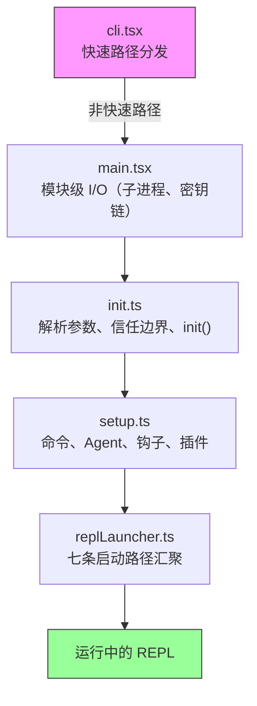
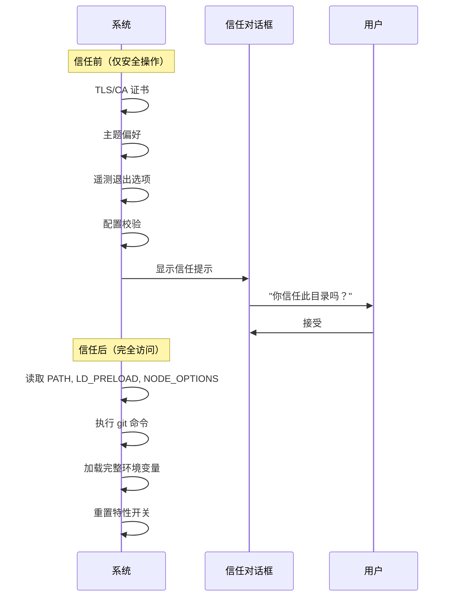

# 第2章：快速启动——引导流水线

如果说第1章为你提供了 Claude Code 架构的全景图，那么本章将展示它抵达可用状态所经过的路径。六大抽象中的每一个组件——查询循环、工具系统、状态层、钩子、记忆——都必须在用户看到光标之前完成初始化。而这一切的预算仅有：300毫秒。

300毫秒是人类感知工具为“即时响应”的阈值。超过这个阈值，CLI 就会显得迟钝；若大幅超标，开发者便会弃之不用。本章中的一切设计都是为了守住这条红线。

引导过程必须完成四件事：验证环境、建立安全边界、配置通信层以及渲染 UI。这四件事必须在 300ms 内全部完成。其架构上的核心洞察在于：这四项任务可以部分重叠、精心排序并激进裁剪，从而塞进一个对于如此复杂的系统而言看似不可能的时间预算中。

关于方法论的说明：本章中的时间戳是近似值，源自代码库自身的性能分析检查点。它们代表现代硬件上典型的热启动耗时。冷启动会更慢。绝对数值的重要性不如相对结构：哪些操作重叠执行，哪些阻塞等待，哪些被延迟处理。

---

## 流水线的形态

启动流水线分布在五个文件中，按顺序执行。每个文件都会缩小系统下一步所需执行的操作范围：



每个文件在将控制权传递给下一个文件之前，只执行必要的最少工作。`cli.tsx` 尝试在导入任何重量级模块之前退出。`main.tsx` 在模块求值期间以副作用的形式触发耗时操作。`init.ts` 解析配置并建立信任边界。`setup.ts` 注册各项能力。`replLauncher.ts` 选择正确的入口点并启动 UI。

三种并行策略使其保持快速：

1.  **模块级子进程分发。** 在*模块求值期间*以副作用形式触发密钥链和 MDM 读取。子进程运行的同时，剩余约 135ms 的静态导入也在加载。
2.  **Setup 阶段的 Promise 并行。** Socket 绑定、钩子快照生成、命令加载和 Agent 定义加载均并发执行。
3.  **渲染后延迟预取。** 用户在输入第一条消息之前不需要的所有信息——git 状态、模型能力、AWS 凭证——都在提示符可见之后才运行。

第四种策略虽不那么显眼但同样重要：**通过动态导入延迟模块求值**。代码库在至少十几个地方使用了 `await import('./module.js')`，以避免在需要之前加载代码。OpenTelemetry（400KB + 700KB gRPC）仅在遥测初始化时加载。React 组件仅在渲染时加载。每次动态导入都是以冷路径延迟（首次使用时触发模块求值）换取热路径速度（启动时无需为可能永远不会使用的模块付出代价）。

---

## 阶段 0：快速路径分发 (cli.tsx)

进程进入的第一个文件 `cli.tsx` 只有一个职责：判断是否根本需要完整的引导流水线。许多调用——如 `claude --version`、`claude --help`、`claude mcp list`——只需要一个特定的答案，别无他求。此时加载 React、初始化遥测、读取密钥链和设置工具系统纯属浪费。

其模式是：检查 `argv`，仅动态导入所需的处理器，然后在系统其余部分加载之前退出。

```typescript
// 快速路径模式的伪代码
if (args.length === 1 && args[0] === '--version') {
  const { printVersion } = await import('./commands/version.js')
  await printVersion()
  process.exit(0)
}
```

大约有十几个快速路径，涵盖版本、帮助、配置、MCP 服务器管理和更新检查。具体细节并不重要——重要的是模式。每条路径都精确地动态导入一个模块，调用一个函数，然后退出。代码库的其余部分从未被加载。

这是贯穿整个引导过程的一个原则的首次体现：**通过更深入地了解意图来减少工作量**。argv 数组揭示了用户的意图。如果意图狭窄，执行路径也应同样狭窄。

如果没有匹配的快速路径，`cli.tsx` 将落入完整的 `main.tsx` 导入流程，真正的启动随之开始。

---

## 阶段 1：模块级 I/O (main.tsx)

当 `main.tsx` 被导入时，其模块级副作用会在求值期间触发——在该文件中任何函数被调用之前。这是整个引导过程中最关键的性能优化技术：

```typescript
// 这些在导入时运行，而非调用时
const mdmPromise = startMDMSubprocess()
const keychainPromise = readKeychainCredentials()
```

当 JavaScript 引擎对 `main.tsx` 的其余部分及其传递性导入进行求值时（约 138ms 的模块求值时间），这两个 Promise 已经在执行中。MDM（移动设备管理）子进程检查组织安全策略。密钥链读取获取存储的凭证。两者都是 I/O 密集型操作，否则将会串行阻塞关键路径。

核心洞察：模块求值并非空闲时间——它是可以与 I/O 重叠利用的时间。当 `main.tsx` 导出的函数首次被调用时，这些 Promise 通常已经 resolve。

该技术需要在相关文件中抑制 ESLint 的顶层 await 和模块作用域副作用规则。代码库专门针对 `process.env` 访问模式制定了自定义 ESLint 规则，允许在模块作用域内进行受控的副作用操作，同时防止其他地方的不受控副作用。

---

## 阶段 2：解析与信任 (init.ts)

`init()` 函数是记忆化的（memoized）——多次调用是安全的且返回相同结果。这很重要，因为多个入口点（REPL、print 模式、SDK 模式）都可能各自调用 `init()`，而记忆化保证了它只精确执行一次。

该函数通过 Commander 解析命令行参数，从多个来源（全局设置、项目设置、环境变量）加载配置，然后触及流水线中最重要的边界。

### 信任边界

在信任边界之前，系统以受限模式运行。越过边界后，完整能力才可用。该边界的存在是因为 Claude Code 会读取环境变量——而环境变量可能被投毒。



信任边界关乎的不是用户信任 Claude Code，而是 Claude Code 信任*环境*。恶意的 `.bashrc` 可能设置 `LD_PRELOAD` 向每个子进程注入代码。信任对话框确保用户明确同意在一个可能由他人配置的目录中运行。

系统有十种不同的信任敏感操作。在用户接受信任对话框之前，仅运行安全操作：TLS 证书配置、主题偏好、遥测退出选项。信任之后，系统才会读取潜在危险的环境变量（PATH、LD_PRELOAD、NODE_OPTIONS）、执行 git 命令并应用完整的环境配置。

### preAction 钩子

Commander 的 `preAction` 钩子是架构的关键枢纽。Commander 解析命令结构（标志、子命令、位置参数）*但不执行任何操作*。`preAction` 钩子在解析之后、匹配的命令处理器运行之前触发：

```typescript
program.hook('preAction', async (thisCommand) => {
  await init(thisCommand)
})
```

这种分离意味着快速路径命令（在 Commander 加载之前于 `cli.tsx` 中处理）无需承担 `init()` 的成本。只有需要完整环境的命令才会触发初始化。

---

## 阶段 3：设置 (setup.ts)

`init()` 完成后，`setup()` 注册系统所需的所有能力：

```mermaid
gantt
    title 阶段 3：并行设置
    dateFormat X
    axisFormat %Lms

    section 串行
    命令注册   :0, 5
    section 并行
    Agent 定义      :5, 15
    钩子注册      :5, 12
    插件初始化  :5, 20
    MCP 服务器连接 :5, 25
```



命令、Agent、钩子和插件尽可能并行注册。设置阶段是系统从“我知道我的配置”过渡到“我拥有所有能力”的阶段。设置完成后，每个工具都已注册，每个钩子都已接入，系统已准备好处理用户输入。

设置阶段还负责安全钩子快照。钩子配置从磁盘读取一次，冻结为不可变快照，并在会话的剩余时间内使用。后续对磁盘上钩子配置文件的修改将被忽略。这防止了攻击者在会话开始后修改钩子规则——冻结的快照是权限决策的唯一事实来源。

---

## 阶段 4：启动 (replLauncher.ts)

七条不同的代码路径汇聚于 `replLauncher.ts`：交互式 REPL、print 模式 (`--print`)、SDK 模式、恢复 (`--resume`)、继续 (`--continue`)、管道模式和无头模式。启动器检查 `init()` 生成的配置并分发到正确的入口点。

两个例子展示了其范围：

**交互式 REPL** ——标准情况。启动器挂载 React/Ink 组件树，启动终端渲染器，并进入事件循环。用户看到提示符后即可开始输入。

**Print 模式** (`--print`) ——来自 argv 的单次提示。启动器创建一个无 React 树的无头查询循环，运行至完成，将输出流式传输到 stdout，然后退出。相同的 Agent 循环，不同的呈现方式。

重要细节：所有七条路径最终都会调用 `query()` ——即第1章中的同一个 Agent 循环。启动路径决定了循环*如何*呈现（交互终端、单次执行、SDK 协议），而非*做什么*。这种收敛使得架构可测试且可预测：无论用户如何调用 Claude Code，核心行为都是一致的。

---

## 启动时间线

以下是完整流水线的时间视图：

```mermaid
gantt
    title 引导时间线 (~240ms)
    dateFormat X
    axisFormat %Lms

    section 阶段 0
    快速路径检查          :0, 5

    section 阶段 1
    模块求值        :5, 143
    MDM 子进程 (并行) :8, 60
    密钥链读取 (并行)  :8, 50

    section 阶段 2
    Commander 解析          :143, 146
    init()                   :146, 160
    信任边界           :160, 175

    section 阶段 3
    setup() + 并行注册 :175, 210

    section 阶段 4
    启动路径选择    :210, 215
    首次渲染             :215, 240
```



关键路径贯穿模块求值（最长的单一阶段，约 138ms），然后是 Commander 解析、init 和 setup。并行 I/O 操作（MDM、密钥链）与模块求值重叠，通常在需要之前就已 resolve。

### 性能预算

| 阶段 | 耗时 | 发生的事件 |
|-------|------|-------------|
| 快速路径检查 | ~5ms | 检查 argv，尽可能提前退出 |
| 模块求值 | ~138ms | 导入树，触发并行 I/O |
| Commander 解析 | ~3ms | 解析标志和子命令 |
| init() | ~14ms | 配置解析，信任边界 |
| setup() | ~35ms | 命令、Agent、钩子、插件 |
| 启动 + 首次渲染 | ~25ms | 选择路径，挂载 React，首次绘制 |
| **总计** | **~240ms** | 低于 300ms 预算 |

在现代机器上总耗时约为 240ms——在 300ms 预算下留有 60ms 的余量。冷启动（重启后首次运行，操作系统缓存为空）可能将模块求值推至 200ms 以上，使总耗时接近上限。

---

## 迁移系统

简要说明一个在 init 期间运行的子系统：Schema 迁移。Claude Code 将配置和会话数据存储在本地文件和目录中。当版本间格式发生变化时，迁移会在启动时自动运行。

每个迁移都是一个带有版本号的函数。系统检查当前 Schema 版本与最高迁移版本，按顺序运行待处理的迁移，并更新版本号。迁移是幂等的且速度快（操作小型本地文件，而非数据库）。整个迁移过程通常在 5ms 内完成。如果迁移失败，它会记录错误并继续——对于本地配置而言，可用性优于严格一致性。

---

## 启动过程对系统设计的启示

引导流水线是对范围收窄的研究。每个阶段都在缩减可能性的空间：

- 阶段 0 将范围从“任意 CLI 调用”收窄至“需要完整引导”
- 阶段 1 将范围从“必须加载一切”收窄至“与 I/O 并行加载”
- 阶段 2 将范围从“未知环境”收窄至“受信任、已配置的环境”
- 阶段 3 将范围从“无能力”收窄至“完全注册”
- 阶段 4 将范围从“七种可能模式”收窄至“一条具体的启动路径”

当 REPL 渲染时，所有决策都已做出。查询循环接收到的是一个完全配置好的环境，对其所处模式、可用工具或适用权限没有任何歧义。300ms 的预算不仅仅是一个性能目标——它是一种强制机制，防止引导过程变成一个惰性初始化系统，避免决策被推迟并分散在整个代码库中。

---

## 实践应用

**将 I/O 与初始化重叠。** 在模块求值时、在需要之前触发耗时操作（子进程生成、凭证读取、网络检查）。JavaScript 引擎无论如何都在做同步工作——利用这段时间进行并行 I/O。模式：在文件顶部 `const promise = startSlowThing()`，在使用点 `await promise`。

**尽早收窄范围。** 引导流水线的五个文件构成了一个漏斗：每个阶段都消除了后续阶段无需执行的工作。快速路径分发是最极端的例子，但该原则适用于所有场景。如果你能在解析时确定某条代码路径是不必要的，就跳过它。

**显式建立信任边界。** 如果你的应用程序从不由其控制的环境中读取数据（环境变量、配置文件、Shell 设置），请在“用户同意前可安全读取”和“同意后方可读取”之间划清界限。信任边界防止了一类攻击，即恶意环境在用户有机会评估应用程序之前就对其投毒。

**记忆化你的 init 函数。** 使初始化幂等——调用两次产生相同结果。当多个入口点都可能触发初始化时，这消除了顺序相关的 Bug。记忆化模式虽然简单，但消除了一整类双重初始化 Bug。

**在让出控制权前捕获早期输入。** 在事件驱动的系统中，初始化期间到达的用户输入可能会丢失。Claude Code 在任何异步工作开始之前就从 argv 捕获初始提示，确保即使初始化耗时超出预期，`claude "fix the bug"` 也不会丢弃提示词。
