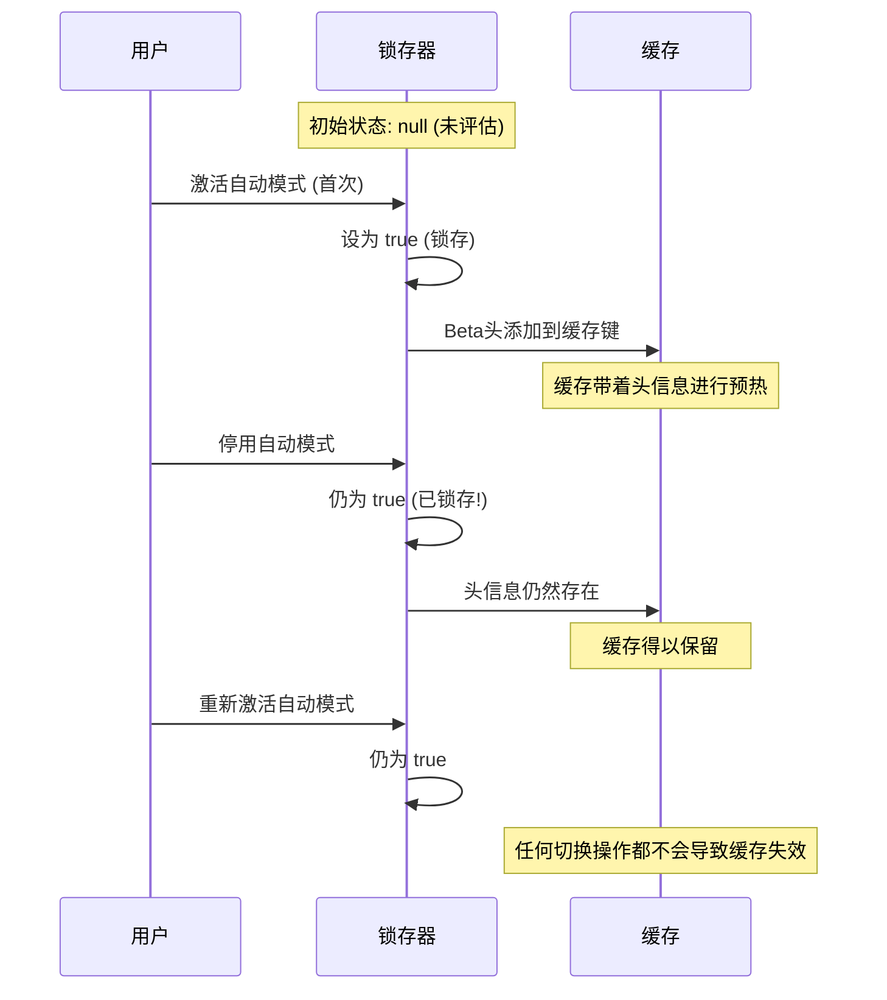
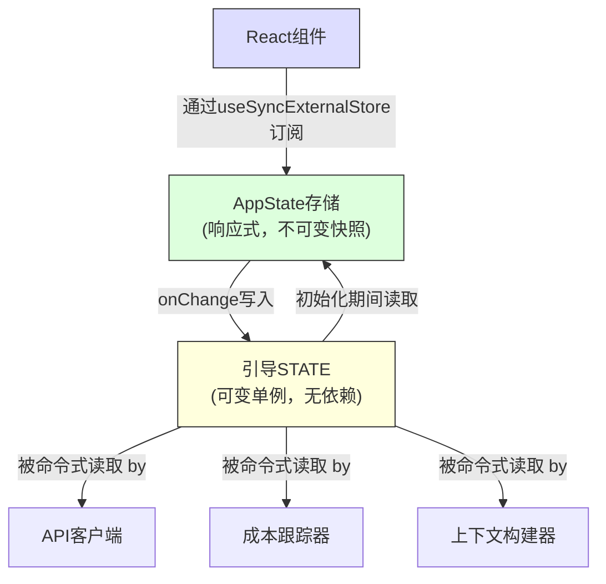

# 第3章：状态——双层架构

第2章追溯了从进程启动到首次渲染的引导流水线。结束时，系统已拥有一个完全配置好的环境。但究竟配置了*什么*？会话ID存储在哪里？当前模型呢？消息历史？成本跟踪器？权限模式？状态究竟存在于何处，又为何存在于彼处？

每个长期运行的应用程序最终都会面临这个问题。对于一个简单的CLI工具，答案微不足道——`main()`中的几个变量即可。但Claude Code并非简单的CLI工具。它是一个通过Ink渲染的React应用程序，其进程生命周期长达数小时，插件系统在任意时刻加载，API层必须从缓存的上下文中构建提示词，成本跟踪器需在进程重启后存活，还有数十个基础设施模块需要在不相互导入的情况下读写共享数据。

朴素的方法——单一的全局存储——会立即失败。如果成本跟踪器更新了驱动React重新渲染的同一个存储，每次API调用都会触发完整的组件树协调（reconciliation）。基础设施模块（引导、上下文构建、成本跟踪、遥测）无法导入React。它们在React挂载之前运行，在React卸载之后运行，甚至在根本不存在组件树的上下文中运行。将所有内容放入一个感知React的存储中，会在整个导入图中产生循环依赖。

Claude Code通过双层架构解决了这一问题：一个用于基础设施状态的可变进程单例，以及一个用于UI状态的最小化响应式存储。本章将解释这两个层级、连接它们的副作用系统，以及依赖此基础的相关子系统。后续每一章都假定你已理解状态存在于何处及其存在的原因。

---

## 3.1 引导状态——进程单例

### 为何使用可变单例

引导状态模块（`bootstrap/state.ts`）是在进程启动时创建的一次性可变对象：

```typescript
const STATE: State = getInitialState()
```

该行上方的注释写道：`尤其是这里（AND ESPECIALLY HERE）`。类型定义上方两行写着：`不要在此处添加更多状态——谨慎使用全局状态（DO NOT ADD MORE STATE HERE - BE JUDICIOUS WITH GLOBAL STATE）`。这些注释的语气，来自那些曾为不受管控的全局对象付出过惨痛代价的工程师。

在此处选择可变单例基于三个原因。首先，引导状态必须在任何框架初始化之前可用——在React挂载之前、在存储创建之前、在插件加载之前。模块作用域初始化是唯一能保证在导入时即可用的机制。其次，数据本质上是进程作用域的：会话ID、遥测计数器、成本累加器、缓存路径。不存在有意义的“先前状态”可供差分比对，没有需要通知的订阅者，也没有撤销历史。第三，该模块必须是导入依赖图中的叶子节点。如果它导入了React、存储或任何服务模块，就会产生循环依赖，从而破坏第2章描述的引导序列。由于仅依赖实用工具类型和`node:crypto`，它可以从任何地方被安全导入。

### 约80个字段

`State`类型包含大约80个字段。部分采样即可看出其广度：

**标识与路径**——`originalCwd`、`projectRoot`、`cwd`、`sessionId`、`parentSessionId`。`originalCwd`在进程启动时通过`realpathSync`解析并进行NFC标准化。它永不改变。

**成本与指标**——`totalCostUSD`、`totalAPIDuration`、`totalLinesAdded`、`totalLinesRemoved`。这些值在整个会话期间单调递增，并在退出时持久化到磁盘。

**遥测**——`meter`、`sessionCounter`、`costCounter`、`tokenCounter`。OpenTelemetry句柄，全部可为空（在遥测初始化之前为null）。

**模型配置**——`mainLoopModelOverride`、`initialMainLoopModel`。当用户在会话中途更改模型时设置覆盖值。

**会话标志**——`isInteractive`、`kairosActive`、`sessionTrustAccepted`、`hasExitedPlanMode`。用于在会话期间控制行为的布尔值。

**缓存优化**——`promptCache1hAllowlist`、`promptCache1hEligible`、`systemPromptSectionCache`、`cachedClaudeMdContent`。这些字段的存在是为了防止冗余计算和提示词缓存失效（cache busting）。

### Getter/Setter模式

`STATE`对象从不直接导出。所有访问均通过大约100个独立的getter和setter函数进行：

```typescript
// 伪代码——说明模式
export function getProjectRoot(): string {
  return STATE.projectRoot
}

export function setProjectRoot(dir: string): void {
  STATE.projectRoot = dir.normalize('NFC')  // 每个路径setter都进行NFC标准化
}
```

这种模式强制执行了封装、每个路径setter上的NFC标准化（防止macOS上的Unicode不匹配）、类型收窄以及引导隔离。代价是冗长——80个字段对应100个函数。但在一个随意的变更就可能使50,000 token的提示词缓存失效的代码库中，显式明确胜过一切。

### Signal模式

引导模块不能导入监听器（它是DAG叶子节点），因此它使用了一个名为`createSignal`的最小化发布/订阅原语。`sessionSwitched`信号恰好只有一个消费者：`concurrentSessions.ts`，它负责保持PID文件同步。该信号以`onSessionSwitch = sessionSwitched.subscribe`的形式暴露，允许调用者自行注册，而无需引导模块知道它们是谁。

### 五个粘性锁存器

引导状态中最微妙的字段是五个布尔锁存器（latch），它们遵循相同的模式：一旦某个功能在会话期间首次被激活，相应的标志就会在会话剩余时间内保持为`true`。它们存在的原因只有一个：保护提示词缓存。



Claude的API支持服务端提示词缓存。当连续请求共享相同的系统提示词前缀时，服务器会重用缓存的计算结果。但缓存键包含HTTP头和请求体字段。如果某个beta头出现在请求N中但未出现在请求N+1中，即使提示词内容完全相同，缓存也会失效。对于超过50,000 token的系统提示词，缓存未命中的代价极其高昂。

五个锁存器：

| 锁存器 | 防止的问题 |
|-------|-----------------|
| `afkModeHeaderLatched` | Shift+Tab切换自动模式会导致AFK beta头开启/关闭 |
| `fastModeHeaderLatched` | 快速模式冷却进入/退出会切换快速模式头 |
| `cacheEditingHeaderLatched` | 远程特性标志变更会使所有活跃用户的缓存失效 |
| `thinkingClearLatched` | 在确认缓存未命中（空闲>1小时）时触发。防止重新启用思考块（thinking blocks）导致刚预热的缓存失效 |
| `pendingPostCompaction` | 遥测的一次性消费标志：区分由压缩引起的缓存未命中和TTL过期引起的未命中 |

这五个锁存器均使用三态类型：`boolean | null`。初始值`null`表示“尚未评估”。`true`表示“已锁存开启”。一旦设为`true`，它们永远不会回到`null`或`false`。这是锁存器的决定性特征。

实现模式：

```typescript
function shouldSendBetaHeader(featureCurrentlyActive: boolean): boolean {
  const latched = getAfkModeHeaderLatched()
  if (latched === true) return true       // 已锁存——始终发送
  if (featureCurrentlyActive) {
    setAfkModeHeaderLatched(true)          // 首次激活——锁存它
    return true
  }
  return false                             // 从未激活——不发送
}
```

为什么不总是发送所有beta头？因为头信息是缓存键的一部分。发送未识别的头会创建不同的缓存命名空间。锁存器确保你只在真正需要时才进入某个缓存命名空间，然后一直留在其中。

---

## 3.2 AppState——响应式存储

### 34行的实现

UI状态存储位于`state/store.ts`：

存储的实现大约30行：一个包裹`state`变量的闭包、一个防止虚假更新的`Object.is`相等性检查、同步监听器通知，以及一个用于副作用的`onChange`回调。骨架如下：

```typescript
// 伪代码——说明模式
function makeStore(initial, onTransition) {
  let current = initial
  const subs = new Set()
  return {
    read:      () => current,
    update:    (fn) => { /* Object.is 守卫，然后通知 */ },
    subscribe: (cb) => { subs.add(cb); return () => subs.delete(cb) },
  }
}
```

三十四行代码。没有中间件，没有开发者工具，没有时间旅行调试，没有action类型。仅仅是一个包裹可变变量的闭包、一个监听器Set和一个`Object.is`相等性检查。这就是不依赖库的Zustand。

值得审视的设计决策：

**更新器函数模式。** 没有`setState(newValue)`——只有`setState((prev) => next)`。每次变更都接收当前状态并必须产出下一个状态，消除了并发变更导致的陈旧状态bug。

**`Object.is`相等性检查。** 如果更新器返回相同的引用，则该变更为空操作。不会触发监听器，不会运行副作用。这对性能至关重要——使用展开运算符设值但未实际改变值的组件不会产生重新渲染。

**`onChange`在监听器之前触发。** 可选的`onChange`回调同时接收旧状态和新状态，并在通知任何订阅者之前同步触发。这用于必须在UI重新渲染之前完成的副作用（见3.4节）。

**无中间件，无开发者工具。** 这不是疏忽。当你的存储恰好只需要三个操作（get、set、subscribe）、一个`Object.is`相等性检查和一个同步`onChange`钩子时，34行你自己拥有的代码优于一个外部依赖。你可以精确控制语义，并在三十秒内读完整个实现。

### AppState类型

`AppState`类型（约452行）定义了UI渲染所需的一切数据的形状。大多数字段被`DeepImmutable<>`包裹，包含函数类型的字段被显式排除在外：

```typescript
export type AppState = DeepImmutable<{
  settings: SettingsJson
  verbose: boolean
  // ... 约150个更多字段
}> & {
  tasks: { [taskId: string]: TaskState }  // 包含AbortController
  agentNameRegistry: Map<string, AgentId>
}
```

交叉类型使得大多数字段深度不可变，同时豁免了持有函数、Map和可变引用的字段。完全不可变是默认行为，仅在类型系统与运行时语义冲突的地方提供精确的逃生舱。

### React集成

存储通过`useSyncExternalStore`与React集成：

```typescript
// 标准React模式——带选择器的useSyncExternalStore
export function useAppState<T>(selector: (state: AppState) => T): T {
  const store = useContext(AppStoreContext)
  return useSyncExternalStore(
    store.subscribe,
    () => selector(store.getState()),
  )
}
```

选择器必须返回现有的子对象引用（而非新构造的对象），以便`Object.is`比较能防止不必要的重新渲染。如果你写成`useAppState(s => ({ a: s.a, b: s.b }))`，每次渲染都会产生新的对象引用，组件将在每次状态变更时重新渲染。这与Zustand用户面临的约束相同——比较成本更低，但选择器编写者必须理解引用同一性。

---

## 3.3 两个层级如何关联

两个层级通过显式的窄接口进行通信。



引导状态在初始化期间流入AppState：`getDefaultAppState()`从磁盘读取设置（引导模块协助定位了该路径），检查特性标志（引导模块已评估），并设置初始模型（引导模块从CLI参数和设置中解析得出）。

AppState通过副作用流回引导状态：当用户更改模型时，`onChangeAppState`调用引导模块中的`setMainLoopModelOverride()`。当设置变更时，引导模块中的凭证缓存会被清除。

但两个层级从不共享引用。导入引导状态的模块无需了解React。读取AppState的组件无需了解进程单例。

一个具体例子阐明了数据流。当用户输入`/model claude-sonnet-4`时：

1. 命令处理器调用`store.setState(prev => ({ ...prev, mainLoopModel: 'claude-sonnet-4' }))`
2. 存储的`Object.is`检查检测到变更
3. `onChangeAppState`触发，检测到模型已更改，调用`setMainLoopModelOverride()`（更新引导状态）和`updateSettingsForSource()`（持久化到磁盘）
4. 所有存储订阅者触发——React组件重新渲染以显示新模型名称
5. 下一次API调用从引导状态的`getMainLoopModelOverride()`中读取模型

步骤1-4是同步的。步骤5中的API客户端可能在几秒后运行。但它从引导状态（在步骤3中已更新）读取，而非从AppState读取。这就是双层交接：UI存储是用户选择的唯一事实来源，而引导状态是API客户端使用的唯一事实来源。

DAG属性——引导模块不依赖任何东西，AppState在初始化时依赖引导模块，React依赖AppState——由一条ESLint规则强制执行，该规则禁止`bootstrap/state.ts`导入其允许集合之外的模块。

---

## 3.4 副作用：onChangeAppState

`onChange`回调是两个层级同步的地方。每次`setState`调用都会触发`onChangeAppState`，它接收新旧状态并决定触发哪些外部效应。

**权限模式同步**是主要用例。在这个集中式处理器出现之前，8条以上的变更路径中仅有2条将权限模式同步到了远程会话（CCR）。其余六条——Shift+Tab循环、对话框选项、斜杠命令、回退（rewind）、桥接回调——都在未通知CCR的情况下变更了AppState。外部元数据因此失去了同步。

修复方案：停止在变更点分散通知，转而在一个地方钩入差分逻辑。源代码中的注释列出了每一条曾损坏的变更路径，并注明“上述分散的调用点无需任何更改”。这就是集中式副作用的架构优势——覆盖范围是结构性的，而非手动的。

**模型变更**保持引导状态与UI渲染内容同步。**设置变更**清除凭证缓存并重新应用环境变量。**详细模式开关**和**展开视图**被持久化到全局配置中。

这种模式——基于可差分状态转换的集中式副作用——本质上是将观察者模式应用于状态差分的粒度，而非单个事件。它比分散的事件发射更具扩展性，因为副作用数量的增长速度远慢于变更点数量的增长速度。

---

## 3.5 上下文构建

`context.ts`中的三个记忆化异步函数构建了附加到每次对话前的系统提示词上下文。每个函数在每个会话中仅计算一次，而非每轮对话计算一次。

`getGitStatus`并行运行五个git命令（`Promise.all`），生成包含当前分支、默认分支、最近提交和工作树状态的代码块。`--no-optional-locks`标志防止git获取写锁，以免干扰另一个终端中并发的git操作。

`getUserContext`加载CLAUDE.md内容并通过`setCachedClaudeMdContent`将其缓存在引导状态中。此缓存打破了一个循环依赖：自动模式分类器需要CLAUDE.md内容，但CLAUDE.md加载经过文件系统，文件系统经过权限检查，权限检查又调用分类器。通过在引导状态（DAG叶子节点）中进行缓存，循环被打破。

所有三个上下文函数都使用Lodash的`memoize`（计算一次，永久缓存），而非基于TTL的缓存。理由是：如果git状态每5分钟重新计算一次，变更将使服务端提示词缓存失效。系统提示词甚至告诉模型：“这是对话开始时的git状态。请注意，此状态是时间快照。”

---

## 3.6 成本跟踪

每个API响应都会流经`addToTotalSessionCost`，该函数累加按模型分类的使用量，更新引导状态，向OpenTelemetry报告，并递归处理顾问工具使用情况（响应中嵌套的模型调用）。

成本状态通过保存到项目配置文件并在重启时恢复来跨越进程重启。会话ID用作守卫——仅当持久化的会话ID与正在恢复的会话匹配时，才会恢复成本数据。

直方图使用蓄水池抽样（Algorithm R）在保持有限内存的同时准确表示分布。1,024条目的蓄水池可产出p50、p95和p99百分位数。为何不使用简单的移动平均？因为平均值隐藏了分布形状。一个95%的API调用耗时200ms、5%耗时10秒的会话，与所有调用均耗时690ms的会话具有相同的平均值，但用户体验截然不同。

---

## 3.7 经验总结

代码库已从简单的CLI发展为一个拥有约450行状态类型定义、约80个进程状态字段、副作用系统、多个持久化边界和缓存优化锁存器的系统。这些都不是预先设计的。当缓存失效成为可衡量的成本问题时，添加了粘性锁存器。当发现8条权限同步路径中有6条损坏时，集中化了`onChange`处理器。当出现循环依赖时，添加了CLAUDE.md缓存。

这是复杂应用程序中状态的自然增长模式。双层架构提供了足够的结构来遏制增长——新的引导字段不会影响React渲染，新的AppState字段不会产生导入循环——同时保持足够的灵活性以适应原始设计中未预见到的模式。

---

## 3.8 状态架构总结

| 属性 | 引导状态 | AppState |
|---|---|---|
| **位置** | 模块作用域单例 | React上下文 |
| **可变性** | 通过setter可变 | 通过更新器生成不可变快照 |
| **订阅者** | 针对特定事件的Signal（发布/订阅） | 用于React的`useSyncExternalStore` |
| **可用性** | 导入时（React之前） | Provider挂载后 |
| **持久化** | 进程退出处理器 | 通过onChange写入磁盘 |
| **相等性** | 不适用（命令式读取） | `Object.is`引用检查 |
| **依赖关系** | DAG叶子节点（不导入任何东西） | 从整个代码库导入类型 |
| **测试重置** | `resetStateForTests()` | 创建新的存储实例 |
| **主要消费者** | API客户端、成本跟踪器、上下文构建器 | React组件、副作用 |

---

## 实践应用

**按访问模式而非领域分离状态。** 会话ID属于单例，并非因为它在抽象意义上是“基础设施”，而是因为它必须在React挂载前可读，且可在不通知订阅者的情况下可写。权限模式属于响应式存储，因为更改它必须触发重新渲染和副作用。让访问模式驱动层级划分，架构便会自然形成。

**粘性锁存器模式。** 任何与缓存（提示词缓存、CDN、查询缓存）交互的系统都面临同样的问题：在会话中途改变缓存键的特性开关会导致缓存失效。一旦功能被激活，其对缓存键的贡献在整个会话期间保持活跃。三态类型（`boolean | null`，意为“未评估/开启/永不开启”）使意图自文档化。当缓存不受你控制时，这一点尤其有价值。

**在状态差分上集中副作用。** 当多条代码路径可以更改同一状态时，不要在变更点分散通知。钩入存储的`onChange`回调并检测哪些字段发生了变更。覆盖范围变为结构性的（任何变更都会触发效应），而非手动的（每个变更点都必须记得通知）。

**宁要34行自有代码，不要不可控的库。** 当你的需求恰好是get、set、subscribe和一个变更回调时，最小化的实现让你完全掌控语义。在一个状态管理bug可能造成真实经济损失的系统中，这种透明度具有价值。关键洞察在于识别何时*不需要*库。

**有意地将进程退出作为持久化边界。** 多个子系统在进程退出时持久化状态。权衡是明确的：非优雅终止（SIGKILL、OOM）会丢失累积数据。这是可以接受的，因为数据是诊断性的而非事务性的，并且对于每个会话递增数百次的计数器而言，每次状态变更都写入磁盘代价过高。

---

本章建立的双层架构——用于基础设施的引导单例、用于UI的响应式存储、连接两者的副作用——是后续每一章构建的基础。对话循环（第4章）从记忆化的构建器中读取上下文。工具系统（第5章）从AppState中检查权限。代理系统（第8章）在AppState中创建任务条目，同时在引导状态中跟踪成本。理解状态存在于何处及其原因，是理解这些系统如何工作的前提。

有些字段跨越了边界。主循环模型同时存在于两个层级中：AppState中的`mainLoopModel`（用于UI渲染）和引导状态中的`mainLoopModelOverride`（供API客户端使用）。`onChangeAppState`处理器保持两者同步。这种重复是双层拆分的代价。但替代方案——让API客户端导入React存储，或让React组件从进程单例读取——将违反维持架构健全的依赖方向。少量受控的重复，辅以集中的同步点，优于纠缠不清的依赖图。
