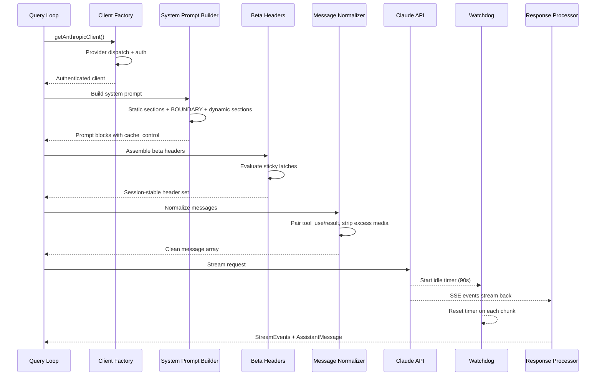
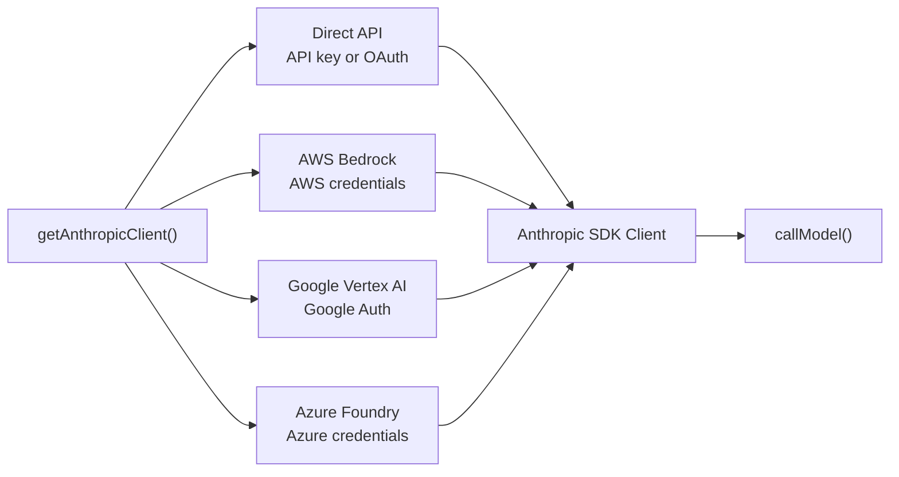
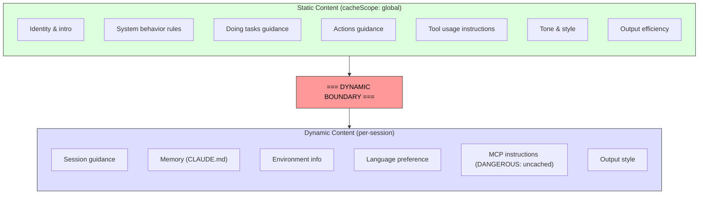

# 第四章：与 Claude 对话——API 层

第三章确立了状态的存放位置以及两个层级之间的通信方式。现在，我们来追踪当这些状态被投入使用时的情况：系统需要与语言模型进行交互。Claude Code 中的一切——引导序列、状态系统、权限框架——都是为了服务于这一时刻而存在的。

该层处理的故障模式比系统中的任何其他部分都多。它必须通过一个透明的接口路由到四个云提供商。它必须以字节级的感知能力构建系统提示词（system prompt），以了解服务器的提示词缓存如何工作，因为一个放错位置的片段就可能破坏价值 50,000+ token 的缓存。它必须在流式传输响应时进行主动故障检测，因为 TCP 连接可能会静默断开。此外，它还必须维护会话稳定的不变量，以便在对话中途更改功能标志不会导致隐性的性能断崖。

让我们从头到尾追踪一次 API 调用。

---

## 多提供商客户端工厂

`getAnthropicClient()` 函数是所有模型通信的唯一工厂。它返回一个针对部署目标提供商配置的 Anthropic SDK 客户端：

分发完全由环境变量驱动，并按固定的优先级顺序进行评估。所有四个特定于提供商的 SDK 类都通过 `as unknown as Anthropic` 强制转换为 `Anthropic` 类型。源代码中的注释非常坦诚：“我们一直在关于返回类型撒谎。”这种故意的类型擦除意味着每个消费者看到的都是一个统一的接口。代码库的其余部分永远不会根据提供商进行分支判断。

每个提供商的 SDK 都是动态导入的——`AnthropicBedrock`、`AnthropicFoundry`、`AnthropicVertex` 都是拥有各自依赖树的重量级模块。动态导入确保了未使用的提供商永远不会被加载。

提供商的选择在启动时确定并存储在引导状态 `STATE` 中。查询循环从不检查哪个提供商处于活动状态。从 Direct API 切换到 Bedrock 是配置变更，而不是代码变更。

### buildFetch 包装器

每个出站 fetch 请求都会被包装，以注入 `x-client-request-id` 标头——这是一个为每个请求生成的 UUID。当请求超时时，服务器永远不会为响应分配请求 ID。如果没有客户端 ID，API 团队就无法将超时与服务器端日志关联起来。这个标头填补了这一空白。它仅发送给 Anthropic 自有端点——第三方提供商可能会拒绝未知标头。

---

## 系统提示词构建

系统提示词是整个系统中对缓存最敏感的工件。Claude 的 API 提供服务器端提示词缓存：跨请求的相同提示词前缀可以被缓存，从而节省延迟和成本。一次 200K token 的对话可能有 50-70K token 与上一轮相同。破坏该缓存会迫使服务器重新处理所有内容。

### 动态边界标记

提示词被构建为一个字符串数组，其中包含一条关键的分界线：

边界之前的所有内容在所有会话、用户和组织之间都是相同的——它们获得最高级别的服务器端缓存。边界之后的内容包含用户特定信息，降级为每会话缓存。

片段的命名约定故意做得非常醒目。添加新片段需要在 `systemPromptSection`（安全，已缓存）和 `DANGEROUS_uncachedSystemPromptSection`（破坏缓存，需要理由字符串）之间进行选择。`_reason` 参数在运行时未使用，但作为强制性文档存在——每个破坏缓存的片段都在源代码中携带其理由。

### 2^N 问题

`prompts.ts` 中的一段注释解释了为什么条件片段必须放在边界之后：

> 这里的每个条件都是一个运行时位，否则会将 Blake2b 前缀哈希变体数量倍增（2^N）。

边界之前的每个布尔条件都会使唯一的全局缓存条目数量翻倍。三个条件产生 8 个变体；五个条件产生 32 个。静态片段被故意设计为无条件。编译时功能标志（由打包器解析）可以放在边界之前。运行时检查（这是 Haiku 吗？用户有自动模式吗？）必须放在边界之后。

这是一种直到你违反它时才看得见的约束。一位好心的工程师如果在边界之前添加了一个由用户设置控制的片段，可能会静默地碎片化全局缓存，并使整个集群的提示词处理成本翻倍。

---

## 流式传输

### 原始 SSE 优于 SDK 抽象

流式实现使用原始的 `Stream<BetaRawMessageStreamEvent>` 而不是 SDK 更高级别的 `BetaMessageStream`。原因是：`BetaMessageStream` 会在每个 `input_json_delta` 事件上调用 `partialParse()`。对于具有大型 JSON 输入的工具调用（包含数百行的文件编辑），这会在每个数据块上从头开始重新解析不断增长的 JSON 字符串——表现为 O(n^2) 的行为。Claude Code 自行处理工具输入的累积，因此部分解析纯属浪费。

### 空闲看门狗

TCP 连接可能会在没有通知的情况下断开。服务器可能崩溃，负载均衡器可能静默丢弃连接，或者企业代理可能超时。SDK 的请求超时仅覆盖初始 fetch——一旦收到 HTTP 200，超时条件即满足。如果流式主体停止，没有任何机制能捕获它。

看门狗：一个 `setTimeout`，在每次接收到数据块时重置。如果 90 秒内没有收到任何数据块，流将被中止，系统回退到非流式重试。在第 45 秒时会发出警告。当看门狗触发时，它会记录带有客户端请求 ID 的事件以便关联。

### 非流式回退

当流式传输在响应中途失败（网络错误、停滞、截断）时，系统会回退到同步的 `messages.create()` 调用。这处理了代理返回带有非 SSE 主体的 HTTP 200，或在 SSE 流中途截断的情况。

当流式工具执行处于活动状态时，可以禁用回退，因为回退将重新执行整个请求并可能导致工具运行两次。

---

## 提示词缓存系统

### 三个层级

提示词缓存在三个级别上运行：

**临时缓存**（默认）：每会话缓存，具有服务器定义的 TTL（约 5 分钟）。所有用户都享有此缓存。

**1 小时 TTL**：符合条件的用户获得扩展缓存。资格由订阅状态决定，并在引导状态中锁定——来自第三章的 `promptCache1hEligible` 粘性锁存器确保会话中途的超额翻转不会改变 TTL。

**全局范围**：系统提示词缓存条目获得跨会话、跨组织的共享。Claude Code 用户的提示词静态部分都是相同的，因此单个缓存副本即可服务于所有人。当存在 MCP 工具时，全局范围被禁用，因为 MCP 工具定义是用户特定的，会将缓存碎片化为数百万个唯一的前缀。

### 粘性锁存器的作用

来自第三章的五个粘性锁存器在此处（请求构建期间）进行评估。每个锁存器起始为 `null`，一旦设置为 `true`，则在会话期间保持为 `true`。锁存器块上方的注释非常精确：“用于动态 beta 标头的粘性开启锁存器。每个标头一旦首次发送，将在会话剩余时间内持续发送，因此会话中途的切换不会改变服务器端缓存键并破坏 ~50-70K token。”

有关锁存器模式、五个特定锁存器以及为何“始终发送所有标头”不是正确解决方案的完整解释，请参阅第三章第 3.1 节。

---

## queryModel 生成器

`queryModel()` 函数是一个异步生成器（约 700 行），它协调整个 API 调用生命周期。它产出 `StreamEvent`、`AssistantMessage` 和 `SystemAPIErrorMessage` 对象。

请求组装遵循精心排序的顺序：

1. **熔断开关检查**——最昂贵模型层级的安全阀
2. **Beta 标头组装**——特定于模型，应用粘性锁存器
3. **工具模式构建**——通过 `Promise.all()` 并行执行，延迟工具在被发现之前排除
4. **消息标准化**——修复孤立的 tool_use/tool_result 不匹配，剥离多余媒体，移除过时块
5. **系统提示词块构建**——在动态边界处拆分，分配缓存范围
6. **带重试包装的流式传输**——处理 529（过载）、模型回退、思考降级、OAuth 刷新

### 输出 Token 上限

默认输出上限为 8,000 token，而非典型的 32K 或 64K。生产数据显示，p99 输出为 4,911 token——标准限制过度预留了 8-16 倍。当响应达到上限时（<1% 的请求），它会在 64K 限制下进行一次性干净重试。这在集群规模下节省了显著成本。

### 错误处理与重试

`withRetry()` 函数本身是一个异步生成器，它产出 `SystemAPIErrorMessage` 事件，以便 UI 显示重试状态。重试策略：

- **529（过载）**：等待并重试，可选降级快速模式
- **模型回退**：主模型失败，尝试回退模型（例如从 Opus 到 Sonnet）
- **思考降级**：上下文窗口溢出触发减少的思考预算
- **OAuth 401**：刷新令牌并重试一次

生成器模式意味着重试进度（“服务器过载，5 秒后重试...”）作为事件流的自然部分出现，而不是作为侧通道通知。

---

## 应用实践

**将提示词缓存视为架构约束，而非功能开关。** 大多数 LLM 应用程序只是“开启”缓存。Claude Code 将其视为一种设计约束，塑造了提示词排序、片段记忆化、标头锁存和配置管理。结构良好的提示词（50K token 缓存命中）与结构糟糕的提示词（每轮完全重新处理）之间的差异，是系统中最大的成本杠杆。

**对昂贵的逃生舱口使用 DANGEROUS 命名约定。** 当代码库中存在一个容易意外违反的不变量时，使用醒目前缀命名逃生舱口可以做三件事：使违规行为在代码审查中可见，强制文档化（必需的 reason 参数），并对安全默认值产生心理摩擦。这可以推广到任何具有隐性成本的操作 beyond caching。

**构建带有看门狗的流式传输，而不仅仅是超时。** SDK 的请求超时在 HTTP 200 时即满足，但响应主体可能在任何时候停止到达。一个在每个数据块上重置的 `setTimeout` 可以捕获这种情况。非流式回退处理了在企业环境中比你预期的更常见的代理故障模式（带有非 SSE 主体的 HTTP 200，流中途截断）。

**使重试策略基于产出（yield-based），而非基于异常（exception-based）。** 通过将重试包装器设为产出状态事件的异步生成器，调用者可以将重试进度显示为事件流的自然部分。模型回退模式（Opus 失败，尝试 Sonnet）对于生产弹性特别有用。

**将快速路径与完整管道分离。** 并非每个 API 调用都需要工具搜索、顾问集成、思考预算和流式基础设施。Claude Code 的 `queryHaiku()` 函数为内部操作（压缩、分类）提供了一条精简路径，跳过了所有代理相关关注点。具有简化接口的单独函数可以防止意外的复杂性泄漏。

---

## 展望未来

API 层位于后续所有内容的基础之上。第五章将展示查询循环如何使用流式响应来驱动工具执行——包括工具如何在模型完成其响应之前开始执行。第六章将解释压缩系统如何在对话接近上下文限制时保持缓存效率。第七章将展示每个代理线程如何拥有自己的消息数组和请求链。

所有这些系统都继承了此处建立的约束：缓存稳定性作为架构不变量，通过客户端工厂实现的提供商透明性，以及通过锁存系统实现的会话稳定配置。API 层不仅仅发送请求——它定义了其他每个系统运行的规则。
