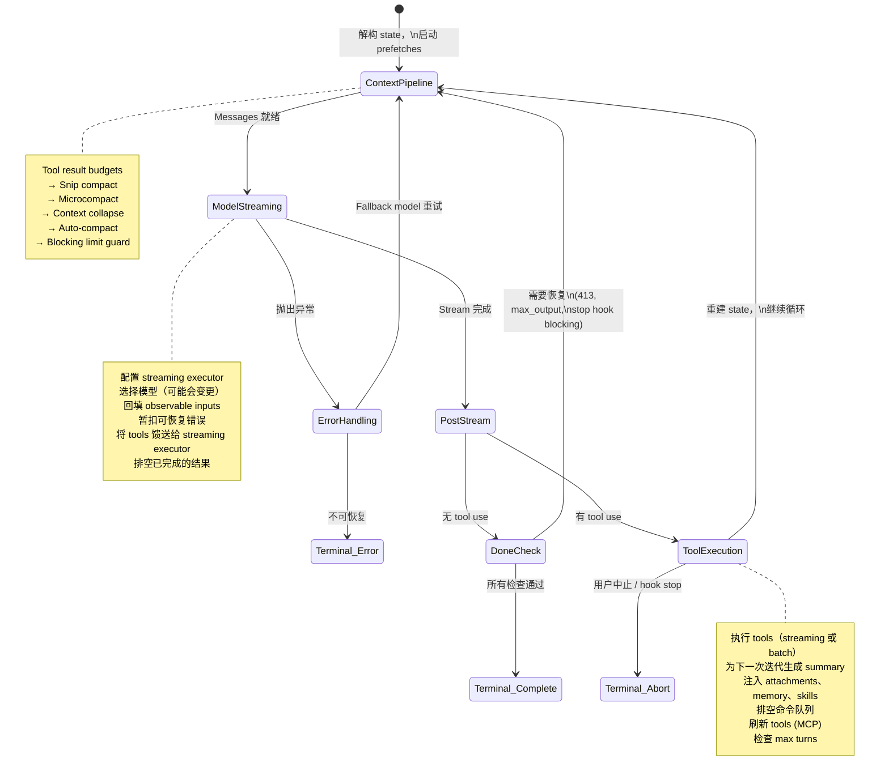
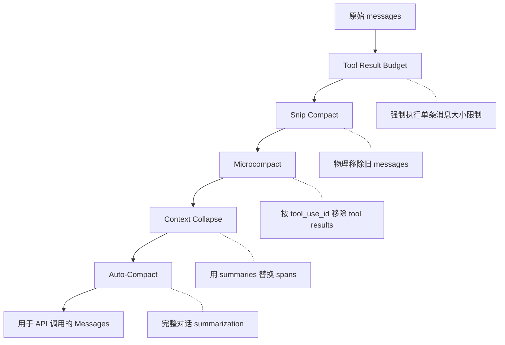
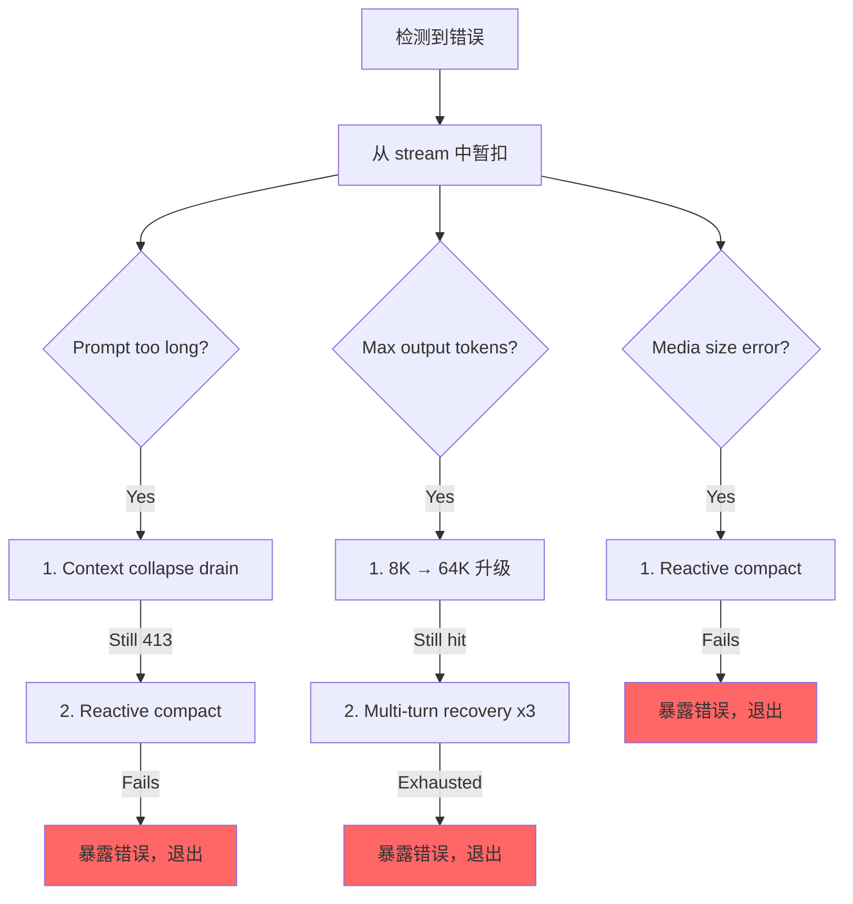

# 第 5 章：Agent Loop

## 跳动的心脏

第 4 章展示了 API 层如何将配置转换为流式 HTTP 请求——客户端如何构建、system prompt 如何组装、响应如何以 server-sent events 的形式到达。该层处理的是与模型交互的*机制*。但单次 API 调用并非 agent。Agent 是一个循环：调用模型，执行 tools，将结果反馈回去，再次调用模型，直到工作完成。

每个系统都有一个重心。在数据库中，它是存储引擎。在编译器中，它是中间表示（intermediate representation）。在 Claude Code 中，它是 `query.ts`——一个长达 1,730 行的文件，包含驱动每次交互的 async generator，从 REPL 中的第一次按键到 headless `--print` 调用的最后一次 tool call。

这并非夸张。与模型对话、执行 tools、管理 context、从错误中恢复以及决定何时停止的代码路径有且仅有一条。这条代码路径就是 `query()` 函数。REPL 调用它，SDK 调用它，sub-agents 调用它，headless runner 也调用它。如果你正在使用 Claude Code，你就身处 `query()` 之中。

这个文件很密集，但其复杂性并非源于纠缠不清的继承层次结构。它的复杂性更像一艘潜艇：单一船体配备众多冗余系统，每一个系统的增加都是因为海水曾找到了渗入的途径。每一个 `if` 分支背后都有故事。每一条被暂扣（withheld）的错误信息都代表一个真实的 bug，即 SDK 消费者在恢复过程中断开连接。每一个 circuit breaker 阈值都是针对真实会话调优的，这些会话曾在无限循环中消耗了数千次 API 调用。

本章将从头到尾追踪整个循环。读完之后，你不仅会了解发生了什么，还会理解每个机制存在的原因以及缺失它会导致什么后果。

---

## 为何选择 Async Generator

第一个架构问题是：为什么 agent loop 是 generator 而不是基于 callback 的 event emitter？

```typescript
// 简化版——展示概念，非精确类型
async function* agentLoop(params: LoopParams): AsyncGenerator<Message | Event, TerminalReason>
```

实际签名会 yield 多种 message 和 event 类型，并返回一个 discriminated union 来编码循环停止的原因。

原因有三，按重要性排序如下。

**Backpressure（背压）。** Event emitter 无论消费者是否准备好都会触发事件。而 generator 仅在消费者调用 `.next()` 时才 yield。当 REPL 的 React renderer 正忙于绘制上一帧时，generator 会自然暂停。当 SDK 消费者正在处理 tool result 时，generator 会等待。不会出现 buffer overflow，不会丢失消息，也不存在“快生产者/慢消费者”问题。

**返回值语义。** Generator 的返回类型是 `Terminal`——一个 discriminated union，精确编码循环停止的原因。是正常完成？用户中止？token budget 耗尽？stop hook 干预？达到 max-turns 限制？还是不可恢复的模型错误？共有 10 种不同的终止状态。调用者无需订阅 "end" 事件并祈祷 payload 中包含原因。他们可以直接从 `for await...of` 或 `yield*` 中获得类型化的返回值。

**通过 `yield*` 实现可组合性。** 外层 `query()` 函数通过 `yield*` 委托给 `queryLoop()`，这会透明地转发每一个 yielded 值和最终返回值。像 `handleStopHooks()` 这样的 sub-generators 也使用相同的模式。这建立了一条清晰的责任链，无需 callbacks，无需 promise 嵌套 promise，也无需事件转发的样板代码。

这种选择也有代价——JavaScript 中的 async generators 无法“倒带”或 fork。但 agent loop 不需要这两者。它是一个严格向前推进的状态机。

还有一个微妙之处：`function*` 语法使函数变为*惰性*（lazy）。函数体直到第一次 `.next()` 调用才会执行。这意味着 `query()` 会立即返回——所有繁重的初始化（config snapshot、memory prefetch、budget tracker）仅在消费者开始拉取值时才发生。在 REPL 中，这意味着在循环的第一行代码运行之前，React 渲染管线就已经设置完毕。

---

## 调用者提供的参数

在追踪循环之前，了解输入内容会有所帮助：

```typescript
// 简化版——说明关键字段
type LoopParams = {
  messages: Message[]
  prompt: SystemPrompt
  permissionCheck: CanUseToolFn
  context: ToolUseContext
  source: QuerySource         // 'repl', 'sdk', 'agent:xyz', 'compact' 等
  maxTurns?: number
  budget?: { total: number }  // API 级别的任务预算
  deps?: LoopDeps             // 用于测试注入
}
```

值得注意的字段：

- **`querySource`**：字符串判别符，如 `'repl_main_thread'`、`'sdk'`、`'agent:xyz'`、`'compact'` 或 `'session_memory'`。许多条件分支都基于此判断。compact agent 使用 `querySource: 'compact'`，以防止 blocking limit guard 导致死锁（compact agent 需要运行以*减少* token 数量）。

- **`taskBudget`**：API 级别的任务预算（`output_config.task_budget`）。不同于 `+500k` auto-continue token budget 功能。`total` 是整个 agentic turn 的预算；`remaining` 在每次迭代时根据累计 API 使用量计算，并在 compaction 边界处进行调整。

- **`deps`**：可选的依赖注入。默认为 `productionDeps()`。这是测试的接缝点，可用于替换 fake model calls、fake compaction 和确定性 UUID。

- **`canUseTool`**：返回给定 tool 是否被允许的函数。这是权限层——它检查信任设置、hook 决策和当前权限模式。

---

## 双层入口点

公共 API 是对真实循环的一层薄封装：

外层函数包裹内层循环，跟踪在该轮次中消费了哪些排队命令。内层循环完成后，已消费的命令被标记为 `'completed'`。如果循环抛出异常或 generator 通过 `.return()` 关闭，完成通知永远不会触发——失败的轮次不应将命令标记为成功处理。在轮次期间排队的命令（通过 `/` slash commands 或任务通知）在循环内部被标记为 `'started'`，并在封装层中被标记为 `'completed'`。如果循环抛出异常或 generator 通过 `.return()` 关闭，完成通知永远不会触发。这是有意为之——失败的轮次不应将命令标记为成功处理。

---

## State 对象

循环将其状态承载于单个类型化对象中：

```typescript
// 简化版——说明关键字段
type LoopState = {
  messages: Message[]
  context: ToolUseContext
  turnCount: number
  transition: Continue | undefined
  // ... 加上恢复计数器、compaction 跟踪、待处理的 summary 等
}
```

十个字段，每个都有其存在的理由：

| 字段 | 存在原因 |
|-------|---------------|
| `messages` | 对话历史，每次迭代都会增长 |
| `toolUseContext` | 可变 context：tools、abort controller、agent state、options |
| `autoCompactTracking` | 跟踪 compaction 状态：turn counter、turn ID、连续失败次数、compacted flag |
| `maxOutputTokensRecoveryCount` | output token 限制的多轮恢复尝试次数（最多 3 次） |
| `hasAttemptedReactiveCompact` | 一次性防护标志，防止无限的 reactive compaction 循环 |
| `maxOutputTokensOverride` | 在升级（escalation）期间设置为 64K，之后清除 |
| `pendingToolUseSummary` | 来自上一次迭代的 Haiku summary promise，在当前 streaming 期间 resolve |
| `stopHookActive` | 防止在 blocking retry 后重新运行 stop hooks |
| `turnCount` | 单调递增计数器，与 `maxTurns` 进行比对检查 |
| `transition` | 上一次迭代继续的原因——首次迭代时为 `undefined` |

### 可变循环中的不可变转换

以下是循环中每个 `continue` 语句处出现的模式：

```typescript
const next: State = {
  messages: [...messagesForQuery, ...assistantMessages, ...toolResults],
  toolUseContext: toolUseContextWithQueryTracking,
  autoCompactTracking: tracking,
  turnCount: nextTurnCount,
  maxOutputTokensRecoveryCount: 0,
  hasAttemptedReactiveCompact: false,
  pendingToolUseSummary: nextPendingToolUseSummary,
  maxOutputTokensOverride: undefined,
  stopHookActive,
  transition: { reason: 'next_turn' },
}
state = next
```

每个 continue 站点都会构建一个完整的新 `State` 对象。不是 `state.messages = newMessages`，也不是 `state.turnCount++`，而是完全重建。这样做的好处是每次转换都是自文档化的。你可以阅读任何 `continue` 站点，准确地看到哪些字段发生了变化，哪些被保留了。新 state 上的 `transition` 字段记录了循环继续的*原因*——测试通过断言此字段来验证正确的恢复路径是否被触发。

---

## 循环体

以下是单次迭代的完整执行流程，压缩为其骨架：



这就是整个循环。Claude Code 中的每一项功能——从 memory 到 sub-agents 再到错误恢复——都汇入或消费自这一单一的迭代结构。

---

## Context 管理：四个压缩层

在每次 API 调用之前，message history 最多会经过四个 context 管理阶段。它们按特定顺序运行，且该顺序至关重要。



### 第 0 层：Tool Result Budget

在任何压缩之前，`applyToolResultBudget()` 会对 tool results 强制执行单条消息的大小限制。没有有限 `maxResultSizeChars` 的 tools 会被豁免。

### 第 1 层：Snip Compact

最轻量的操作。Snip 从数组中物理移除旧 messages，并 yield 一条边界消息以向 UI 发出移除信号。它会报告释放了多少 tokens，该数值会被传入 auto-compact 的阈值检查中。

### 第 2 层：Microcompact

Microcompact 移除不再需要的 tool results，通过 `tool_use_id` 识别。对于 cached microcompact（会编辑 API cache），边界消息会延迟到 API 响应之后才发出。原因是：客户端的 token 估算不可靠。只有 API 响应中的实际 `cache_deleted_input_tokens` 才能告诉你真正释放了多少空间。

### 第 3 层：Context Collapse

Context collapse 用 summaries 替换对话片段（spans）。它在 auto-compact 之前运行，这种排序是刻意的：如果 collapse 将 context 减少到 auto-compact 阈值以下，auto-compact 就会变成空操作（no-op）。这保留了细粒度的 context，而不是将所有内容替换为单个单体 summary。

### 第 4 层：Auto-Compact

最重量级的操作：它会 fork 整个 Claude 对话来 summarize 历史。实现中包含一个 circuit breaker——连续失败 3 次后，它将停止尝试。这防止了在生产环境中观察到的噩梦场景：超过 context 限制的会话陷入无限的 compact-fail-retry 循环，每天烧毁 250K 次 API 调用。

### Auto-Compact 阈值

阈值源自模型的 context window：

```
effectiveContextWindow = contextWindow - min(modelMaxOutput, 20000)

阈值（相对于 effectiveContextWindow）：
  Auto-compact 触发：      effectiveWindow - 13,000
  Blocking limit（硬限制）：   effectiveWindow - 3,000
```

| 常量 | 值 | 用途 |
|----------|-------|---------|
| `AUTOCOMPACT_BUFFER_TOKENS` | 13,000 | effective window 下方的缓冲空间，用于触发 auto-compact |
| `MANUAL_COMPACT_BUFFER_TOKENS` | 3,000 | 预留空间以确保 `/compact` 仍然可用 |
| `MAX_CONSECUTIVE_AUTOCOMPACT_FAILURES` | 3 | Circuit breaker 阈值 |

13,000-token 的缓冲区意味着 auto-compact 会在硬限制之前很早触发。Auto-compact 阈值与 blocking limit 之间的间隙是 reactive compact 运作的区域——如果主动式 auto-compact 失败或被禁用，reactive compact 会捕获 413 错误并按需进行 compact。

### Token 计数

标准函数 `tokenCountWithEstimation` 结合了权威的 API 报告 token 计数（来自最近的响应）与该响应之后新增 messages 的粗略估算。这种近似是保守的——它倾向于更高的计数，这意味着 auto-compact 会稍微提前触发而不是稍微延后。

---

## Model Streaming

### callModel() 循环

API 调用发生在一个支持 model fallback 的 `while(attemptWithFallback)` 循环内：

```typescript
let attemptWithFallback = true
while (attemptWithFallback) {
  attemptWithFallback = false
  try {
    for await (const message of deps.callModel({ messages, systemPrompt, tools, signal })) {
      // 处理每个 streamed message
    }
  } catch (innerError) {
    if (innerError instanceof FallbackTriggeredError && fallbackModel) {
      currentModel = fallbackModel
      attemptWithFallback = true
      continue
    }
    throw innerError
  }
}
```

启用后，`StreamingToolExecutor` 会在 streaming 期间 `tool_use` blocks 到达时立即开始执行 tools——而不是等到完整响应完成后。Tools 如何被编排成并发批次是第 7 章的主题。

### Withholding 模式

这是文件中最重要的模式之一。可恢复的错误会从 yield stream 中被抑制：

```typescript
let withheld = false
if (contextCollapse?.isWithheldPromptTooLong(message)) withheld = true
if (reactiveCompact?.isWithheldPromptTooLong(message)) withheld = true
if (isWithheldMaxOutputTokens(message)) withheld = true
if (!withheld) yield yieldMessage
```

为什么要 withhold？因为 SDK 消费者——Cowork、桌面应用——会在收到任何带有 `error` 字段的消息时终止会话。如果你 yield 了一个 prompt-too-long 错误，然后通过 reactive compaction 成功恢复，消费者此时已经断开连接。恢复循环仍在运行，但已无人监听。因此错误被暂扣，推送到 `assistantMessages` 中，以便下游恢复检查能够找到它。如果所有恢复路径都失败，被暂扣的消息才会最终浮出水面。

### Model Fallback

当捕获到 `FallbackTriggeredError`（主模型需求过高）时，循环会切换模型并重试。但 thinking signatures 是绑定模型的——将一个模型的 protected-thinking block 重放到不同的 fallback 模型会导致 400 错误。代码会在重试前剥离 signature blocks。来自失败尝试的所有孤立 assistant messages 都会被标记为 tombstoned，以便 UI 将其移除。

---

## 错误恢复：升级阶梯

query.ts 中的错误恢复并非单一策略。它是一个逐步升级的干预阶梯，每一步都在上一步失败时触发。



### Death Spiral 防护

最危险的故障模式是无限循环。代码中有多重防护措施：

1. **`hasAttemptedReactiveCompact`**：一次性标志。Reactive compact 对每种错误类型只触发一次。
2. **`MAX_OUTPUT_TOKENS_RECOVERY_LIMIT = 3`**：multi-turn recovery 尝试次数的硬上限。
3. **Auto-compact 上的 circuit breaker**：连续失败 3 次后，auto-compact 完全停止尝试。
4. **错误响应上不运行 stop hooks**：当最后一条消息是 API 错误时，代码会在到达 stop hooks 之前显式返回。注释解释道："error -> hook blocking -> retry -> error -> ...（hook 在每个周期注入更多 tokens）。"
5. **在 stop hook retries 间保留 `hasAttemptedReactiveCompact`**：当 stop hook 返回 blocking errors 并强制重试时，reactive compact 防护标志会被保留。注释记录了该 bug："在此处重置为 false 导致了无限循环，烧毁了数千次 API 调用。"

这些防护措施中的每一个都是因为有人在生产环境中遭遇了相应的故障模式而添加的。

---

## 实例演练：“修复 auth.ts 中的 Bug”

为了让循环具体化，让我们追踪一个真实交互的三次迭代过程。

**用户输入：** `Fix the null pointer bug in src/auth/validate.ts`

**迭代 1：模型读取文件。**

循环进入。Context 管理运行（无需压缩——对话很短）。模型 stream 响应：“Let me look at the file.” 它发出一个 `tool_use` block：`Read({ file_path: "src/auth/validate.ts" })`。Streaming executor 发现这是一个并发安全的 tool，立即启动它。当模型完成其响应文本时，文件内容已在内存中。

Post-stream 处理：模型使用了 tool，因此我们进入 tool-use 路径。Read result（带行号的文件内容）被推送到 `toolResults`。后台启动一个 Haiku summary promise。State 使用新 messages 重建，`transition: { reason: 'next_turn' }`，循环继续。

**迭代 2：模型编辑文件。**

Context 管理再次运行（仍低于阈值）。模型 stream：“I see the bug on line 42 -- `userId` can be null.” 它发出 `Edit({ file_path: "src/auth/validate.ts", old_string: "const user = getUser(userId)", new_string: "if (!userId) return { error: 'unauthorized' }\nconst user = getUser(userId)" })`。

Edit 不是并发安全的，因此 streaming executor 将其排队直到响应完成。然后 14 步执行管线启动：Zod 验证通过，input backfill 展开路径，PreToolUse hook 检查权限（用户批准），编辑被应用。来自迭代 1 的 pending Haiku summary 在 streaming 期间 resolve——其结果作为 `ToolUseSummaryMessage` 被 yield。State 重建，循环继续。

**迭代 3：模型宣布完成。**

模型 stream：“I've fixed the null pointer bug by adding a guard clause.” 没有 `tool_use` blocks。我们进入 "done" 路径。Prompt-too-long 恢复？不需要。Max output tokens？否。Stop hooks 运行——无 blocking errors。Token budget 检查通过。循环返回 `{ reason: 'completed' }`。

总计：三次 API 调用，两次 tool 执行，一次用户权限提示。循环处理了 streaming tool execution、与 API 调用重叠的 Haiku summarization 以及完整的权限管线——所有这些都在同一个 `while(true)` 结构中完成。

---

## Token Budgets

用户可以为一轮对话请求 token budget（例如 `+500k`）。Budget 系统在模型完成响应后决定是继续还是停止。

`checkTokenBudget` 根据三条规则做出二元的 continue/stop 决策：

1. **Subagents 总是停止。** Budget 仅是顶层概念。
2. **90% 完成阈值。** 如果 `turnTokens < budget * 0.9`，则 continue。
3. **收益递减检测。** 在 3 次以上 continuations 后，如果当前和前一次的 delta 均低于 500 tokens，则提前停止。模型每次 continuation 产生的输出越来越少。

当决策为 "continue" 时，会注入一条 nudge message 告知模型剩余 budget。

---

## Stop Hooks：强制模型继续工作

当模型完成但未请求任何 tool use 时——它认为自己已完成——stop hooks 会运行。Hooks 评估它是否*真的*完成了。

管线运行模板作业分类，触发后台任务（prompt suggestion、memory extraction），然后执行真正的 stop hooks。当 stop hook 返回 blocking errors——“你说你完成了，但 linter 发现了 3 个错误”——这些错误会被追加到 message history 中，循环以 `stopHookActive: true` 继续。此标志防止在重试时重新运行相同的 hooks。

当 stop hook 发出 `preventContinuation` 信号时，循环立即以 `{ reason: 'stop_hook_prevented' }` 退出。

---

## State Transitions：完整目录

循环的每次退出都属于两种类型之一：`Terminal`（循环返回）或 `Continue`（循环迭代）。

### Terminal States（10 种原因）

| 原因 | 触发条件 |
|--------|---------|
| `blocking_limit` | Token 计数达到硬限制，auto-compact 关闭 |
| `image_error` | ImageSizeError、ImageResizeError 或不可恢复的 media error |
| `model_error` | 不可恢复的 API/model 异常 |
| `aborted_streaming` | 模型 streaming 期间用户中止 |
| `prompt_too_long` | 所有恢复手段耗尽后暂扣的 413 错误 |
| `completed` | 正常完成（无 tool use，或 budget 耗尽，或 API error） |
| `stop_hook_prevented` | Stop hook 显式阻止继续 |
| `aborted_tools` | Tool 执行期间用户中止 |
| `hook_stopped` | PreToolUse hook 停止继续 |
| `max_turns` | 达到 `maxTurns` 限制 |

### Continue States（7 种原因）

| 原因 | 触发条件 |
|--------|---------|
| `collapse_drain_retry` | Context collapse 在 413 错误时排空了暂存的 collapses |
| `reactive_compact_retry` | Reactive compact 在 413 或 media error 后成功 |
| `max_output_tokens_escalate` | 触及 8K 上限，升级至 64K |
| `max_output_tokens_recovery` | 仍触及 64K，multi-turn recovery（最多 3 次尝试） |
| `stop_hook_blocking` | Stop hook 返回 blocking errors，必须重试 |
| `token_budget_continuation` | Token budget 未耗尽，注入 nudge message |
| `next_turn` | 正常的 tool-use 继续 |

---

## Orphaned Tool Results：协议安全网

API 协议要求每个 `tool_use` block 后都必须跟随一个 `tool_result`。函数 `yieldMissingToolResultBlocks` 会为模型发出的每一个未获得对应结果的 `tool_use` block 创建错误 `tool_result` messages。如果没有这个安全网，streaming 期间的崩溃会留下孤立的 `tool_use` blocks，导致下一次 API 调用时出现协议错误。

它在三个地方触发：外层错误处理器（模型崩溃）、fallback 处理器（streaming 中途切换模型）和中止处理器（用户中断）。每条路径有不同的错误消息，但机制相同。

---

## Abort 处理：两条路径

Abort 可能发生在两个时间点：streaming 期间和 tool 执行期间。两者行为各异。

**Streaming 期间 Abort**：Streaming executor（如果处于活动状态）会排空剩余结果，为排队的 tools 生成合成的 `tool_results`。如果没有 executor，`yieldMissingToolResultBlocks` 会填补空缺。`signal.reason` 检查区分了硬中止（Ctrl+C）和 submit-interrupt（用户输入了新消息）——submit-interrupts 跳过中断消息，因为排队的用户消息已提供了 context。

**Tool 执行期间 Abort**：逻辑类似，中断消息上的 `toolUse: true` 参数向 UI 发出信号表明 tools 正在进行中。

---

## Thinking Rules

Claude 的 thinking/redacted_thinking blocks 有三条不可违反的规则：

1. 包含 thinking block 的 message 必须是 `max_thinking_length > 0` 的 query 的一部分
2. Thinking block 不能是 message 中的最后一个 block
3. Thinking blocks 必须在 assistant trajectory 的整个持续时间内被保留

违反其中任何一条都会产生不透明的 API 错误。代码在多处处理这些问题：fallback 处理器剥离 signature blocks（它们是绑定模型的），compaction 管线保留受保护的尾部，microcompact 层绝不触碰 thinking blocks。

---

## Dependency Injection

`QueryDeps` 类型刻意保持精简——四个依赖项，而非四十个：

四个注入的依赖项：model caller、compactor、microcompactor 和 UUID generator。测试将 `deps` 传入 loop params 以直接注入 fakes。使用 `typeof fn` 进行类型定义可使签名自动保持同步。除了可变的 `State` 和可注入的 `QueryDeps` 外，不可变的 `QueryConfig` 在 `query()` 入口处进行一次快照——feature flags、session state 和环境变量仅捕获一次，不再重新读取。这种三元分离（可变 state、不可变 config、可注入 deps）使循环易于测试，并使最终重构为纯 `step(state, event, config)` reducer 变得简单直接。

---

## 实践应用：构建你自己的 Agent Loop

**使用 generator，而非 callbacks。** Backpressure 是免费获得的。返回值语义是免费获得的。通过 `yield*` 实现的可组合性也是免费获得的。Agent loops 是严格向前推进的——你永远不需要倒带或 fork。

**使 state transitions 显式化。** 在每个 `continue` 站点重建完整的 state 对象。这种冗长正是其特性所在——它防止了部分更新 bug，并使每次转换都自文档化。

**暂扣可恢复错误。** 如果你的消费者在遇到错误时断开连接，不要在确认恢复失败之前 yield 错误。将它们推送到内部 buffer，尝试恢复，仅在耗尽时才暴露。

**分层管理 context。** 轻量级操作优先（移除），重量级操作在后（summarization）。这在可能的情况下保留了细粒度 context，仅在必要时才回退到单体 summaries。

**为每次重试添加 circuit breakers。** `query.ts` 中的每个恢复机制都有明确的限制：3 次 auto-compact 失败、3 次 max-output 恢复尝试、1 次 reactive compact 尝试。没有这些限制，第一个触发 retry-on-failure 循环的生产会话将在一夜之间耗尽你的 API budget。

如果你从零开始，最小化的 agent loop 骨架如下：

```
async function* agentLoop(params) {
  let state = initState(params)
  while (true) {
    const context = compressIfNeeded(state.messages)
    const response = await callModel(context)
    if (response.error) {
      if (canRecover(response.error, state)) { state = recoverState(state); continue }
      return { reason: 'error' }
    }
    if (!response.toolCalls.length) return { reason: 'completed' }
    const results = await executeTools(response.toolCalls)
    state = { ...state, messages: [...context, response.message, ...results] }
  }
}
```

Claude Code 循环中的每一项功能都是对这些步骤之一的细化。四个压缩层细化了步骤 3（compress）。Withholding 模式细化了模型调用。升级阶梯细化了错误恢复。Stop hooks 细化了 "no tool use" 退出。从这个骨架开始。仅当你遇到某个 elaboration 所解决的问题时，才添加它。

---

## 总结

Agent loop 是 1,730 行的单一 `while(true)`，它包揽了一切。它 stream 模型响应，并发执行 tools，通过四层压缩 context，从五类错误中恢复，通过收益递减检测跟踪 token budgets，运行可以强制模型重返工作的 stop hooks，管理 memory 和 skills 的 prefetch 管线，并产出一个类型化的 discriminated union 来精确说明它为何停止。

它是系统中最重要的文件，因为它是唯一触及所有其他子系统的文件。Context 管线汇入其中。Tool 系统从中输出。错误恢复包裹着它。Hooks 拦截它。State 层贯穿它。UI 从它渲染。

如果你理解了 `query()`，你就理解了 Claude Code。其余一切都是外围组件。
