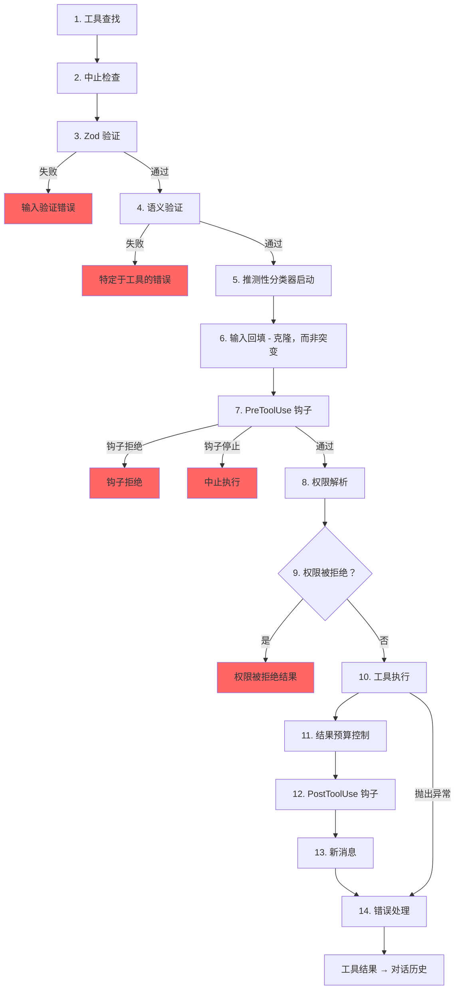

# 第6章：工具——从定义到执行

## 神经系统

第5章向你展示了智能体循环（agent loop）——那个流式传输模型响应、收集工具调用并将结果反馈回去的 `while(true)` 循环。这个循环是心跳。但是，如果没有将“模型想要运行 `git status`”转化为实际 shell 命令的神经系统，包括权限检查、结果预算控制和错误处理，那么心跳就毫无意义。

工具系统就是那个神经系统。它涵盖了40多个工具实现、一个带有功能标志 gating 的集中式注册表、一个14步执行管道、一个具有七种模式的权限解析器，以及一个在模型完成其响应之前就开始启动工具的流式执行器。

Claude Code 中的每一次工具调用——每一次文件读取、每一个 shell 命令、每一次 grep、每一次子智能体分发——都流经同一个管道。这种统一性是核心所在：无论工具是内置的 Bash 执行器还是第三方 MCP 服务器，它都会获得相同的验证、相同的权限检查、相同的结果预算控制以及相同的错误分类。

`Tool` 接口大约有45个成员。这听起来令人望而生畏，但对于理解系统如何工作而言，只有五个成员至关重要：

1. **`call()`** —— 执行工具
2. **`inputSchema`** —— 验证并解析输入
3. **`isConcurrencySafe()`** —— 是否可以并行运行？
4. **`checkPermissions()`** —— 是否被允许？
5. **`validateInput()`** —— 此输入在语义上是否有意义？

其他所有内容——12种渲染方法、分析钩子、搜索提示——都是为了支持 UI 和遥测层。从这五个开始，其余部分就会迎刃而解。

---

## 工具接口

### 三个类型参数

每个工具都基于三种类型进行参数化：

```typescript
Tool<Input extends AnyObject, Output, P extends ToolProgressData>
```

`Input` 是一个 Zod 对象 schema，它身兼两职：生成发送给 API 的 JSON Schema（以便模型知道要提供什么参数），并在运行时通过 `safeParse` 验证模型的响应。`Output` 是工具结果的 TypeScript 类型。`P` 是工具在运行期间发出的进度事件类型——BashTool 发出 stdout 块，GrepTool 发出匹配计数，AgentTool 发出子智能体转录内容。

### buildTool() 和故障关闭（Fail-Closed）默认值

没有任何工具定义直接构造 `Tool` 对象。每个工具都要经过 `buildTool()`，这是一个工厂函数，它在特定于工具的定义之下展开一个默认值对象：

```typescript
// 伪代码 — 说明故障关闭默认值模式
const SAFE_DEFAULTS = {
  isEnabled:         () => true,
  isParallelSafe:    () => false,   // 故障关闭：新工具串行运行
  isReadOnly:        () => false,   // 故障关闭：视为写入操作
  isDestructive:     () => false,
  checkPermissions:  (input) => ({ behavior: 'allow', updatedInput: input }),
}

function buildTool(definition) {
  return { ...SAFE_DEFAULTS, ...definition }  // 定义覆盖默认值
}
```

这些默认值在涉及安全的关键地方故意采用故障关闭策略。忘记实现 `isConcurrencySafe` 的新工具默认为 `false`——它串行运行，从不并行。忘记 `isReadOnly` 的工具默认为 `false`——系统将其视为写入操作。忘记 `toAutoClassifierInput` 的工具返回空字符串——自动模式安全分类器会跳过它，这意味着由通用权限系统来处理它，而不是自动绕过。

唯一*不*采用故障关闭策略的默认值是 `checkPermissions`，它返回 `allow`。这看起来似乎有些反常，直到你理解了分层权限模型：`checkPermissions` 是特定于工具的逻辑，它在通用权限系统已经评估了规则、钩子和基于模式的策略*之后*运行。从 `checkPermissions` 返回 `allow` 的工具是在说“我没有特定于工具的反对意见”——这并不是授予 blanket access（全面访问权限）。分组为子对象（`options`，命名字段如 `readFileState`）提供了聚焦接口所能提供的结构，而无需声明、实现并通过40多个调用点传递五个单独的接口类型的繁琐过程。

### 并发依赖于输入

签名 `isConcurrencySafe(input: z.infer<Input>): boolean` 接收解析后的输入，因为同一个工具对于某些输入可能是安全的，而对于其他输入则不安全。BashTool 是典型的例子：`ls -la` 是只读且并发安全的，但 `rm -rf /tmp/build` 则不是。该工具解析命令，针对已知安全集合对每个子命令进行分类，并且仅当每个非中性部分都是搜索或读取操作时才返回 `true`。

### ToolResult 返回类型

每个 `call()` 都返回一个 `ToolResult<T>`：

```typescript
type ToolResult<T> = {
  data: T
  newMessages?: (UserMessage | AssistantMessage | AttachmentMessage | SystemMessage)[]
  contextModifier?: (context: ToolUseContext) => ToolUseContext
}
```

`data` 是类型化的输出，会被序列化到 API 的 `tool_result` 内容块中。`newMessages` 允许工具向对话中注入额外的消息——AgentTool 使用它来附加子智能体转录内容。`contextModifier` 是一个用于修改后续工具的 `ToolUseContext` 的函数——这就是 `EnterPlanMode` 切换权限模式的方式。上下文修饰符仅对非并发安全的工具有效；如果你的工具并行运行，其修饰符会被排队，直到批处理完成。

---

## ToolUseContext：上帝对象

`ToolUseContext` 是一个巨大的上下文包，贯穿每次工具调用。它大约有40个字段。根据任何合理的定义，它都是一个上帝对象（god object）。它的存在是因为替代方案更糟糕。

像 BashTool 这样的工具需要 abort controller、文件状态缓存、应用状态、消息历史、工具集、MCP 连接以及半打 UI 回调。将这些作为单独的参数传递会产生具有15+个参数的函数签名。务实的解决方案是使用单个上下文对象，并按关注点进行分组：

**配置**（`options` 子对象）：工具集、模型名称、MCP 连接、调试标志。在查询开始时设置一次，大部分是不可变的。

**执行状态**：用于取消的 `abortController`，用于 LRU 文件缓存的 `readFileState`，用于完整对话历史的 `messages`。这些在执行过程中会发生变化。

**UI 回调**：`setToolJSX`、`addNotification`、`requestPrompt`。仅在交互式（REPL）上下文中连接。SDK 和无头模式将它们保留为 undefined。

**智能体上下文**：`agentId`、`renderedSystemPrompt`（冻结的父级提示，用于 fork 子智能体——重新渲染可能会因功能标志预热而发散并破坏缓存）。

`ToolUseContext` 的子智能体变体特别能说明问题。当 `createSubagentContext()` 为子智能体构建上下文时，它会刻意选择哪些字段共享，哪些字段隔离：对于异步智能体，`setAppState` 变为无操作（no-op），`localDenialTracking` 获得一个新对象，`contentReplacementState` 从父级克隆。每个选择都编码了从生产 bug 中学到的教训。

---

## 注册表

### getAllBaseTools()：单一事实来源

函数 `getAllBaseTools()` 返回当前进程中可能存在的每个工具的详尽列表。始终存在的工具排在前面，然后是由功能标志控制的有条件包含的工具：

```typescript
const SleepTool = feature('PROACTIVE') || feature('KAIROS')
  ? require('./tools/SleepTool/SleepTool.js').SleepTool
  : null
```

来自 `bun:bundle` 的 `feature()` 导入在打包时解析。当 `feature('AGENT_TRIGGERS')` 静态为 false 时，打包器会消除整个 `require()` 调用——这种死代码消除保持了二进制文件的小巧。

### assembleToolPool()：合并内置工具和 MCP 工具

最终到达模型的完整工具集来自 `assembleToolPool()`：

1. 获取内置工具（带有拒绝规则过滤、REPL 模式隐藏和 `isEnabled()` 检查）
2. 按拒绝规则过滤 MCP 工具
3. 将每个分区按名称字母顺序排序
4. 连接内置工具（前缀）+ MCP 工具（后缀）

先排序再连接的方法并非出于审美偏好。API 服务器在最后一个内置工具之后放置了一个提示缓存断点。如果对所有工具进行扁平排序，会将 MCP 工具交错插入内置工具列表中，并且添加或删除 MCP 工具会改变内置工具的位置，从而使缓存失效。

---

## 14步执行管道

函数 `checkPermissionsAndCallTool()` 是将意图转化为行动的地方。每次工具调用都要经过这14个步骤。



### 步骤 1-4：验证

**工具查找**回退到 `getAllBaseTools()` 以进行别名匹配，处理来自旧会话（其中工具已被重命名）的转录内容。**中止检查**防止在 Ctrl+C 传播之前排队的工具调用上进行浪费的计算。**Zod 验证**捕获类型不匹配；对于延迟加载的工具，错误会附加一个首先调用 ToolSearch 的提示。**语义验证**超越了 schema 一致性——FileEditTool 拒绝无操作编辑，当 MonitorTool 可用时，BashTool 阻止独立的 `sleep` 命令。

### 步骤 5-6：准备

**推测性分类器启动**并行启动 Bash 命令的自动模式安全分类器，在常见路径上节省数百毫秒。**输入回填**克隆解析后的输入并添加派生字段（将 `~/foo.txt` 扩展为绝对路径）以供钩子和权限使用，同时保留原始输入以保持转录稳定性。

### 步骤 7-9：权限

**PreToolUse 钩子**是扩展机制——它们可以做出权限决定、修改输入、注入上下文或完全停止执行。**权限解析**桥接钩子和通用权限系统：如果钩子已经做出决定，那就是最终决定；否则 `canUseTool()` 触发规则匹配、特定于工具的检查、基于模式的默认值和交互式提示。**权限拒绝处理**构建错误消息并执行 `PermissionDenied` 钩子。

### 步骤 10-14：执行和清理

**工具执行**使用原始输入运行实际的 `call()`。**结果预算控制**将过大的输出持久化到 `~/.claude/tool-results/{hash}.txt` 并用预览替换它。**PostToolUse 钩子**可以修改 MCP 输出或阻止继续。**新消息**被附加（子智能体转录内容、系统提醒）。**错误处理**对错误进行分类以用于遥测，从可能被篡改的名称中提取安全字符串，并发出 OTel 事件。

---

## 权限系统

### 七种模式

| 模式 | 行为 |
|------|----------|
| `default` | 特定于工具的检查；提示用户未识别的操作 |
| `acceptEdits` | 自动允许文件编辑；提示其他操作 |
| `plan` | 只读——拒绝所有写入操作 |
| `dontAsk` | 自动拒绝任何通常会提示的操作（后台智能体） |
| `bypassPermissions` | 允许一切而不提示 |
| `auto` | 使用转录分类器来决定（功能标志控制） |
| `bubble` | 子智能体的内部模式，升级到父级 |

### 解析链

当工具调用到达权限解析时：

1. **钩子决定**：如果 PreToolUse 钩子已经返回 `allow` 或 `deny`，那就是最终决定。
2. **规则匹配**：三个规则集——`alwaysAllowRules`、`alwaysDenyRules`、`alwaysAskRules`——匹配工具名称和可选的内容模式。`Bash(git *)` 匹配任何以 `git` 开头的 Bash 命令。
3. **特定于工具的检查**：工具的 `checkPermissions()` 方法。大多数返回 `passthrough`。
4. **基于模式的默认值**：`bypassPermissions` 允许一切。`plan` 拒绝写入。`dontAsk` 拒绝提示。
5. **交互式提示**：在 `default` 和 `acceptEdits` 模式下，未解决的决策会显示提示。
6. **自动模式分类器**：两阶段分类器（快速模型，然后是对模糊情况的扩展思考）。

`safetyCheck` 变体有一个 `classifierApprovable` 布尔值：`.claude/` 和 `.git/` 编辑是 `classifierApprovable: true`（不寻常但有时合法），而 Windows 路径绕过尝试是 `classifierApprovable: false`（几乎总是对抗性的）。

### 权限规则和匹配

权限规则存储为 `PermissionRule` 对象，包含三个部分：追踪来源的 `source`（userSettings、projectSettings、localSettings、cliArg、policySettings、session 等）、`ruleBehavior`（allow、deny、ask）以及包含工具名称和可选内容模式的 `ruleValue`。

`ruleContent` 字段启用细粒度匹配。`Bash(git *)` 允许任何以 `git` 开头的 Bash 命令。`Edit(/src/**)` 仅允许在 `/src` 内进行编辑。`Fetch(domain:example.com)` 允许从特定域获取。没有 `ruleContent` 的规则匹配该工具的所有调用。

BashTool 的权限匹配器通过 `parseForSecurity()`（一个 bash AST 解析器）解析命令，并将复合命令拆分为子命令。如果 AST 解析失败（带有 heredocs 或嵌套子 shell 的复杂语法），匹配器返回 `() => true`——故障安全，意味着钩子始终运行。假设是，如果命令太复杂而无法解析，那么它也过于复杂，无法自信地从安全检查中排除。

### 子智能体的 Bubble 模式

协调器-工作者模式中的子智能体无法显示权限提示——它们没有终端。`bubble` 模式导致权限请求向上传播到父上下文。在主线程中运行且具有终端访问权限的协调器智能体处理提示并将决策发送回下游。

---

## 工具延迟加载

具有 `shouldDefer: true` 的工具以 `defer_loading: true` 发送给 API——只有名称和描述，没有完整的参数 schema。这减少了初始提示的大小。要使用延迟加载的工具，模型必须首先调用 `ToolSearchTool` 来加载其 schema。故障模式具有启发性：在未加载的情况下调用延迟加载的工具会导致 Zod 验证失败（所有类型化参数都作为字符串到达），并且系统会附加一个有针对性的恢复提示。

延迟加载还提高了缓存命中率：以 `defer_loading: true` 发送的工具仅将其名称贡献给提示，因此添加或删除延迟加载的 MCP 工具只会改变几个 token，而不是数百个。

---

## 结果预算控制

### 每个工具的大小限制

每个工具声明 `maxResultSizeChars`：

| 工具 | maxResultSizeChars | 理由 |
|------|-------------------|-----------|
| BashTool | 30,000 | 足以满足大多数有用输出 |
| FileEditTool | 100,000 | Diff 可能很大，但模型需要它们 |
| GrepTool | 100,000 | 带有上下文行的搜索结果累积很快 |
| FileReadTool | Infinity | 通过自身的 token 限制自我约束；持久化会造成循环 Read 循环 |

当结果超过阈值时，完整内容保存到磁盘，并被替换为包含预览和文件路径的 `<persisted-output>` 包装器。然后，模型可以根据需要使用 `Read` 访问完整输出。

### 每次对话的聚合预算

除了每个工具的限制之外，`ContentReplacementState` 还会跟踪整个对话中的聚合预算，防止千刀万剐（death by a thousand cuts）——许多工具各自返回其单独限制的90%仍然可能压垮上下文窗口。

---

## 个别工具亮点

### BashTool：最复杂的工具

BashTool 无疑是系统中最复杂的工具。它解析复合命令，将子命令分类为只读或写入，管理后台任务，通过魔术字节检测图像输出，并实现 sed 模拟以进行安全的编辑预览。

复合命令解析特别有趣。`splitCommandWithOperators()` 将类似 `cd /tmp && mkdir build && ls build` 的命令分解为单独的子命令。每个子命令都针对已知安全命令集（`BASH_SEARCH_COMMANDS`、`BASH_READ_COMMANDS`、`BASH_LIST_COMMANDS`）进行分类。仅当所有非中性部分都是安全的时，复合命令才是只读的。中性集（echo、printf）被忽略——它们不会使命令变为只读，但也不会使其变为只写。

sed 模拟（`_simulatedSedEdit`）值得特别关注。当用户在权限对话框中批准 sed 命令时，系统通过在沙箱中运行 sed 命令并捕获输出来预计算结果。预计算的结果作为 `_simulatedSedEdit` 注入到输入中。当 `call()` 执行时，它直接应用编辑，绕过 shell 执行。这保证了用户预览的内容与写入的内容完全一致——而不是可能在预览和执行之间因文件更改而产生不同结果的重新执行。

### FileEditTool：陈旧性检测

FileEditTool 与 `readFileState` 集成，`readFileState` 是对话期间维护的文件内容和时间戳的 LRU 缓存。在应用编辑之前，它会检查文件自模型上次读取以来是否已被修改。如果文件已过期（stale）——由后台进程、另一个工具或用户修改——编辑将被拒绝，并附带一条消息，告诉模型首先重新读取文件。

`findActualString()` 中的模糊匹配处理了模型在空格上稍有错误的常见情况。它在匹配之前规范化空格和引号样式，因此针对带有尾随空格的 `old_string` 的编辑仍然可以匹配文件的实际内容。`replace_all` 标志启用批量替换；如果没有它，非唯一匹配将被拒绝，要求模型提供足够的上下文以识别单个位置。

### FileReadTool：多功能阅读器

FileReadTool 是唯一具有 `maxResultSizeChars: Infinity` 的内置工具。如果 Read 输出被持久化到磁盘，模型将需要 Read 持久化文件，而这本身可能会超出限制，从而造成无限循环。该工具改为通过 token 估算进行自我约束，并在源头截断。

该工具非常通用：它读取带行号的文本文件、图像（返回 base64 多模态内容块）、PDF（通过 `extractPDFPages()`）、Jupyter notebook（通过 `readNotebook()`）和目录（回退到 `ls`）。它阻止危险的设备路径（`/dev/zero`、`/dev/random`、`/dev/stdin`）并处理 macOS 截图文件名怪癖（“Screen Shot”文件名中的 U+202F 窄不换行空格与普通空格）。

### GrepTool：通过 head_limit 分页

GrepTool 包装 `ripGrep()` 并通过 `head_limit` 添加分页机制。默认值为250条条目——足以提供有用的结果，但又足够小以避免上下文膨胀。当发生截断时，响应包括 `appliedLimit: 250`，向模型发出信号以在下一次调用中使用 `offset` 进行分页。显式的 `head_limit: 0` 完全禁用限制。

GrepTool 自动排除六个 VCS 目录（`.git`、`.svn`、`.hg`、`.bzr`、`.jj`、`.sl`）。在 `.git/objects` 内搜索几乎从来都不是模型想要的，意外包含二进制包文件会耗尽 token 预算。

### AgentTool 和上下文修饰符

AgentTool 生成运行自己查询循环的子智能体。其 `call()` 返回包含子智能体转录内容的 `newMessages`，以及可选的将状态更改传播回父级的 `contextModifier`。由于 AgentTool 默认情况下不是并发安全的，单个响应中的多个 Agent 工具调用串行运行——每个子智能体的上下文修饰符在下一个子智能体启动之前应用。在协调器模式下，模式反转：协调器为独立任务分派子智能体，并且 `isAgentSwarmsEnabled()` 检查解锁并行智能体执行。

---

## 工具如何与消息历史交互

工具结果不仅仅是将数据返回给模型。它们作为结构化消息参与对话。

API 期望工具结果作为引用原始 `tool_use` 块 ID 的 `ToolResultBlockParam` 对象。大多数工具序列化为文本。FileReadTool 可以序列化为图像内容块（base64编码）以进行多模态响应。BashTool 通过检查 stdout 中的魔术字节来检测图像输出，并相应地切换到图像块。

`ToolResult.newMessages` 是工具超越简单的调用-响应模式扩展对话的方式。**智能体转录内容**：AgentTool 将子智能体的消息历史作为附件消息注入。**系统提醒**：内存工具注入出现在工具结果之后的系统消息——在下一轮对模型可见，但在 `normalizeMessagesForAPI` 边界处被剥离。**附件消息**：钩子结果、附加上下文和错误细节携带结构化元数据，模型可以在后续轮次中引用。

`contextModifier` 函数是改变执行环境的工具的机制。当 `EnterPlanMode` 执行时，它返回一个将权限模式设置为 `'plan'` 的修饰符。当 `ExitWorktree` 执行时，它修改工作目录。这些修饰符是工具影响后续工具的唯一方式——直接突变 `ToolUseContext` 是不可能的，因为上下文在每次工具调用之前都被 spread-copy（展开复制）。串行限制由编排层强制执行：如果两个并发工具都修改工作目录，哪个获胜？

---

## 应用此知识：设计工具系统

**故障关闭默认值。** 新工具在被明确标记为其他状态之前应该是保守的。忘记设置标志的开发人员会得到安全的行为，而不是危险的行为。

**依赖于输入的安全性。** `isConcurrencySafe(input)` 和 `isReadOnly(input)` 接收解析后的输入，因为同一工具在不同输入下具有不同的安全配置文件。将 BashTool 标记为“始终串行”的工具注册表是正确的，但是浪费的。

**分层你的权限。** 特定于工具的检查、基于规则的匹配、基于模式的默认值、交互式提示和自动分类器各自处理不同的情况。没有任何单一机制是足够的。

**预算结果，而不仅仅是输入。** 输入的 token 限制是标准的。但是工具结果可以任意大，并且它们会在各轮次中累积。每个工具的限制防止个体爆炸。聚合对话限制防止累积溢出。

**使错误分类对遥测安全。** 在最小化构建中，`error.constructor.name` 会被篡改。`classifyToolError()` 函数提取可用的最具信息量的安全字符串——遥测安全消息、errno 代码、稳定的错误名称——而永远不会将原始错误消息记录到分析中。

---

## 接下来是什么

本章追溯了单个工具调用如何从定义流经验证、权限、执行和结果预算控制。但是，模型很少一次只请求一个工具。如何将工具编排成并发批处理是第7章的主题。
