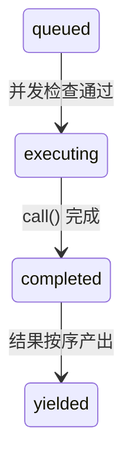

# 第7章：并发工具执行

## 等待的代价

第6章追踪了单次工具调用的生命周期——从API响应中的原始 `tool_use` 块，到输入验证、权限检查、执行以及结果格式化。该流水线处理的是单个工具。但模型很少只请求一个工具。

一次典型的 Claude Code 交互每轮涉及三到五次工具调用。“读取这两个文件，用 grep 搜索这个模式，然后编辑这个函数。”模型会在单次响应中发出所有这些指令。如果每个工具耗时200毫秒，顺序执行它们将耗费整整一秒。如果 Read 和 Grep 调用是独立的——事实上它们确实是——并行执行可将耗时缩短至200毫秒。这是五倍的性能提升，且无需额外成本。

但并非所有工具都是独立的。修改 `config.ts` 的 Edit 操作不能与另一个修改 `config.ts` 的 Edit 操作并发运行。创建目录的 Bash 命令必须先完成，才能执行向该目录写入文件的 Bash 命令。并发性不是工具的全局属性，而是特定输入下某次具体工具调用的属性。

这就是驱动整个并发系统的核心洞察：**安全性是针对每次调用的，而非针对每种工具类型的**。`Bash("ls -la")` 可以安全地并行化，而 `Bash("rm -rf build/")` 则不行。相同的工具，不同的输入，对应不同的并发分类。系统必须在做出决定前检查输入内容。

Claude Code 实现了两层并发优化。第一层是**批量编排（batch orchestration）**：在完整接收模型的响应后，将工具调用划分为并发组和串行组，然后分别以适当的方式执行各组。第二层是**推测执行（speculative execution）**：在*模型仍在流式传输其响应时*就开始运行工具，在响应尚未完全生成前就获取结果。这两种机制共同消除了大部分原本会被浪费在等待上的实际耗时（wall-clock time）。

---

## 分区算法

入口点是 `toolOrchestration.ts` 中的 `partitionToolCalls()`。它接收一个有序的 `ToolUseBlock` 消息数组，并生成一个批次（batch）数组，其中每个批次要么是“全部并发安全”的工具组，要么是“单个串行工具”。

```typescript
// 伪代码 — 阐释分区算法
type Group = { parallel: boolean; calls: ToolCall[] }

function groupBySafety(calls: ToolCall[], registry: ToolRegistry): Group[] {
  return calls.reduce((groups, call) => {
    const def = registry.lookup(call.name)
    const input = def?.schema.safeParse(call.input)
    // 失败封闭原则：解析失败或异常 → 归类为串行
    const safe = input?.success
      ? tryCatch(() => def.isParallelSafe(input.data), false)
      : false
    // 将连续的安全调用合并为一个组
    if (safe && groups.at(-1)?.parallel) {
      groups.at(-1)!.calls.push(call)
    } else {
      groups.push({ parallel: safe, calls: [call] })
    }
    return groups
  }, [] as Group[])
}
```

该算法从左到右遍历数组。对于每个工具调用：

1.  **按名称查找工具定义**。
2.  **使用工具的 Zod schema 通过 `safeParse()` 解析输入**。如果解析失败，该工具将被保守地归类为非并发安全。
3.  **对工具定义调用 `isConcurrencySafe(parsedInput)`**。这是基于输入进行分类的地方。Bash 工具会解析命令字符串，检查每个子命令是否都是只读的（如 `ls`、`grep`、`cat`、`git status`），仅当整个复合命令是纯读取操作时才返回 `true`。Read 工具始终返回 `true`。Edit 工具始终返回 `false`。该调用被包裹在 try-catch 中——如果 `isConcurrencySafe` 抛出异常（例如，shell-quote 库无法解析 Bash 命令字符串），该工具将默认归为串行。
4.  **合并或创建批次。** 如果当前工具是并发安全的，并且最近的批次也是并发安全的，则将其追加到该批次。否则，开始一个新的批次。

结果是一个在并发组和单独串行条目之间交替的批次序列。让我们看一个具体示例：

```
模型请求: [Read, Read, Grep, Edit, Read]

步骤 1: Read  → 并发安全 → 新批次 {safe, [Read]}
步骤 2: Read  → 并发安全 → 追加   {safe, [Read, Read]}
步骤 3: Grep  → 并发安全 → 追加   {safe, [Read, Read, Grep]}
步骤 4: Edit  → 非安全   → 新批次 {serial, [Edit]}
步骤 5: Read  → 并发安全 → 新批次 {safe, [Read]}

结果: 3 个批次
  批次 1: [Read, Read, Grep]  — 并发运行
  批次 2: [Edit]              — 单独运行
  批次 3: [Read]              — 并发运行（尽管只有一个工具）
```

分区过程是贪心的且保持顺序。连续的安全工具会累积到一个批次中。任何不安全的工具都会打断这一连续过程并开始一个新批次。这意味着模型发出工具调用的顺序很重要——如果它在两个 Read 之间插入了一个 Write，你将得到三个批次而不是两个。在实践中，模型倾向于将读取操作聚集在一起，这正是该算法所优化的常见场景。

---

## 批量执行

`runTools()` 生成器函数迭代分区后的批次，并将每个批次分派给相应的执行器。

### 并发批次

对于并发批次，`runToolsConcurrently()` 使用 `all()` 工具函数并行触发所有工具，该函数将活动生成器的数量限制在并发上限内：

```typescript
// 伪代码 — 阐释并发分派模式
async function* dispatchParallel(calls, context) {
  yield* boundedAll(
    calls.map(async function* (call) {
      context.markInProgress(call.id)
      yield* executeSingle(call, context)
      context.markComplete(call.id)
    }),
    MAX_CONCURRENCY,  // 默认值: 10
  )
}
```

并发上限默认为 10，可通过 `CLAUDE_CODE_MAX_TOOL_USE_CONCURRENCY` 配置。10 是一个宽裕的值——在单次模型响应中很少见到超过五六个工具调用。该限制作为极端情况下的安全阀存在，而非典型的约束条件。

`all()` 工具函数是 `Promise.all` 的生成器感知变体，具有有界并发特性。它同时启动最多 N 个生成器，产出最先完成者的结果，并在每个生成器完成时启动下一个排队的生成器。其机制类似于受信号量保护的任务池，但针对产出中间结果的异步生成器进行了适配。

**上下文修饰符排队**是微妙的部分。某些工具会产生*上下文修饰符（context modifiers）*——即用于转换后续工具的 `ToolUseContext` 的函数。当工具并发运行时，你不能立即应用这些修饰符，因为同一批次中的其他工具正在读取相同的上下文。相反，修饰符被收集在一个以工具使用 ID 为键的映射表中：

```typescript
const queuedContextModifiers: Record<
  string,
  ((context: ToolUseContext) => ToolUseContext)[]
> = {}
```

在整个并发批次完成后，修饰符按照工具提交顺序（而非完成顺序）应用，从而保证上下文演变的确定性：

```typescript
for (const block of blocks) {
  const modifiers = queuedContextModifiers[block.id]
  if (!modifiers) continue
  for (const modifier of modifiers) {
    currentContext = modifier(currentContext)
  }
}
```

实际上，当前的并发安全工具都不会产生上下文修饰符——代码库中的注释明确承认了这一点。但该基础设施之所以存在，是因为 MCP 服务器可以添加工具，而自定义的只读 MCP 工具可能确实需要修改上下文（例如更新“已见文件”集合）。

### 串行批次

串行执行很简单。每个工具运行后，其上下文修饰符会立即应用，下一个工具将看到更新后的上下文：

```typescript
for (const toolUse of toolUseMessages) {
  for await (const update of runToolUse(toolUse, /* ... */)) {
    if (update.contextModifier) {
      currentContext = update.contextModifier.modifyContext(currentContext)
    }
    yield { message: update.message, newContext: currentContext }
  }
}
```

这是关键区别所在。串行工具可以为后续工具改变环境状态。Edit 修改了文件；下一次 Read 看到的是修改后的版本。Bash 命令创建了目录；下一条 Bash 命令向其中写入文件。上下文修饰符是对这种依赖关系的形式化表达：它们让工具能够声明“执行环境已发生变化，变化方式如下”。

---

## 流式工具执行器

批量编排消除了模型响应到达*之后*不必要的序列化。但还有一个更大的优化机会：模型的响应需要时间进行流式传输。一个典型的多工具响应可能需要 2-3 秒才能完全到达。而第一个工具调用在 500 毫秒后即可解析。为什么要等待剩余的 2 秒？

`StreamingToolExecutor` 类实现了推测执行。随着模型流式传输其响应，每个 `tool_use` 块在被完整解析的瞬间就会被移交给执行器。执行器立即开始运行它——此时模型仍在生成下一个工具调用。等到响应流式传输完成时，几个工具可能已经执行完毕。

```mermaid
gantt
    title 顺序执行 vs 流式工具执行
    dateFormat X
    axisFormat %Ls

    section 顺序执行
    模型流式传输响应     :a1, 0, 2500
    工具 1 (0.2s)        :a2, after a1, 200
    工具 2 (0.3s)        :a3, after a2, 300
    工具 3 (0.1s)        :a4, after a3, 100

    section 流式执行器
    模型流式传输响应     :b1, 0, 2500
    工具 1 在 0.5s 启动  :b2, 500, 700
    工具 2 在 1.2s 启动  :b3, 1200, 1500
    工具 3 在流结束后排空 :b4, 2500, 2600
```



顺序执行总耗时：3.1秒。流式执行总耗时：2.6秒——工具 1 和 2 在流式传输期间完成，节省了 16% 的实际耗时。

这种节省是复合的。当模型请求五个只读工具且响应流式传输耗时 3 秒时，所有五个工具都可以在这 3 秒内启动并完成。流结束后的排空阶段无事可做。用户在模型响应的最后一个字符出现后几乎能立即看到结果。

### 工具生命周期

执行器跟踪的每个工具都会经历四个状态：



-   **queued（已排队）**：`tool_use` 块已被解析并注册。等待并发条件允许执行。
-   **executing（执行中）**：工具的 `call()` 函数正在运行。结果在缓冲区中累积。
-   **completed（已完成）**：执行结束。结果已准备好产出到对话中。
-   **yielded（已产出）**：结果已发出。终态。

### addTool()：流式传输期间的排队

```typescript
addTool(block: ToolUseBlock, assistantMessage: AssistantMessage): void
```

每当完整的 `tool_use` 块到达时，由流式响应解析器调用。该方法：

1.  查找工具定义。如果未找到，立即创建一个带有错误信息的 `completed` 条目——排队一个不存在的工具毫无意义。
2.  解析输入并使用与 `partitionToolCalls()` 相同的逻辑确定 `isConcurrencySafe`。
3.  推入一个状态为 `'queued'` 的 `TrackedTool`。
4.  调用 `processQueue()`——这可能会立即启动该工具。

对 `processQueue()` 的调用是“发后即忘”式的（`void this.processQueue()`）。执行器不会等待它。这是有意为之的：`addTool()` 是从流式解析器的事件处理程序中调用的，在此处阻塞会导致响应解析停滞。工具在后台开始执行，而解析器继续消费数据流。

### processQueue()：准入检查

准入检查是一个单一的谓词判断：

```typescript
// 伪代码 — 阐释互斥规则
canRun = noToolsRunning || (newToolIsSafe && allRunningAreSafe)
```

当且仅当满足以下条件时，工具才可以开始执行：
-   **当前没有工具在执行**（队列为空），或者
-   **新工具和所有当前正在执行的工具都是并发安全的。**

这是一个互斥契约。非并发工具需要独占访问权——不能有其他任何东西在运行。并发工具可以与其他并发工具共享运行通道，但只要执行集合中存在一个非并发工具，就会阻塞所有人。

`processQueue()` 方法按顺序遍历所有工具。对于每个排队的工具，它检查 `canExecuteTool()`。如果工具可以运行，它就启动。如果一个非并发工具尚不能运行，循环将*中断（break）*——它会完全停止检查后续工具，因为非并发工具必须保持顺序。如果一个并发工具不能运行（被正在执行的非并发工具阻塞），循环将*继续（continue）*——但在实践中这很少有帮助，因为在非并发阻塞者之后的并发工具通常无论如何都依赖于其结果。

### executeTool()：核心执行循环

真正的复杂性存在于这个方法中。它管理中止控制器（abort controllers）、错误级联、进度报告和上下文修饰符。

**子级中止控制器。** 每个工具都有自己的 `AbortController`，它是共享的同级控制器（sibling-level controller）的子级。

层级结构有三层深：查询级控制器（由 REPL 拥有，用户按下 Ctrl+C 时触发）是同级控制器的父级（同级控制器由流式执行器拥有，Bash 出错时触发），而同级控制器又是每个工具独立控制器的父级。中止同级控制器会终止所有正在运行的工具。中止某个工具的独立控制器仅终止该工具——但如果中止原因不是同级错误，它还会向上冒泡到查询控制器。这种向上冒泡机制防止了系统在诸如权限拒绝应结束整个回合的情况下，默默地丢弃执行器。

这种向上冒泡对于权限拒绝至关重要。当用户在权限对话框中拒绝某个工具时，该工具的中止控制器会被触发。该信号必须到达查询循环，以便其结束当前回合。如果没有它，查询循环会继续运行，仿佛什么都没发生一样，并向模型发送过时的拒绝消息。

**同级错误级联。** 当工具产生错误结果时，执行器会检查是否取消同级工具。规则是：**只有 Bash 错误才会级联。** 当 shell 命令出错时，执行器记录故障，捕获出错工具的描述，并中止同级控制器——这会取消批次中所有其他正在运行的工具。

这样做的理由是务实的。Bash 命令通常形成隐式依赖链：`mkdir build && cp src/* build/ && tar -czf dist.tar.gz build/`。如果 `mkdir` 失败，运行 `cp` 和 `tar` 是毫无意义的。立即取消同级工具可以节省时间并避免令人困惑的错误消息。

相比之下，Read 和 Grep 错误是独立的。如果一个文件读取失败是因为文件被删除了，这与在不同目录中搜索的并发 grep 无关。取消 grep 只会白白浪费工作。

错误级联会为同级工具生成合成错误消息：

```
Cancelled: parallel tool call Bash(mkdir build) errored
```

描述中包含出错工具命令或文件路径的前 40 个字符，为模型提供足够的上下文来理解出了什么问题。

**进度消息**与结果分开处理。结果被缓冲并按顺序产出，而进度消息（如“正在读取文件...”或“正在搜索...”等状态更新）进入 `pendingProgress` 数组，并通过 `getCompletedResults()` 立即产出。当有新进度到达时，resolve 回调会唤醒 `getRemainingResults()` 循环，防止 UI 在长时间运行的工具执行期间显得卡死。

**队列重新处理。** 每个工具完成后，再次调用 `processQueue()`：

```typescript
void promise.finally(() => {
  void this.processQueue()
})
```

这就是被并发批次阻塞的串行工具得以启动的方式。当最后一个并发工具完成时，后续非并发工具的 `canExecuteTool()` 检查通过，它便开始执行。

### 结果收集

流式执行器暴露了两个收集方法，专为响应生命周期的两个不同阶段设计。

**`getCompletedResults()` —— 流式传输中途收集。** 这是一个同步生成器，在流式 API 响应的数据块之间调用。它按顺序遍历工具数组，并产出任何已完成工具的结果：

`getCompletedResults()` 是一个同步生成器，按提交顺序遍历工具数组。对于每个工具，它首先排空任何待处理的进度消息。如果工具已完成，它产出结果并将其标记为已产出。关键规则是：如果一个非并发工具仍在执行，遍历将**中断**——即使后续工具已经完成，也不能产出其后的任何内容。串行工具之后的结果可能依赖于其上下文修改，因此必须等待。对于并发工具，此限制不适用；循环会跳过正在执行的并发工具并继续检查后续条目。

这个中断机制是顺序保持的核心。如果一个非并发工具仍在执行，就不能产出其后的任何内容——即使后续工具已经完成。串行工具之后的结果可能依赖于其上下文修改，因此必须等待。对于并发工具，此限制不适用；循环会跳过正在执行的并发工具并继续检查后续条目。

**`getRemainingResults()` —— 流结束后排空。** 在模型响应完全接收后调用。这个异步生成器循环直到每个工具都被产出：

`getRemainingResults()` 是流结束后的排空操作。它循环直到每个工具都被产出。在每次迭代中，它处理队列（启动任何新解除阻塞的工具），通过 `getCompletedResults()` 产出任何已完成的结果，然后——如果仍有工具在执行但没有新完成的工具——使用 `Promise.race` 空闲等待最先完成的事件：任何执行中工具的 promise，或进度可用信号。这避免了忙轮询，同时仍能在事情发生的瞬间醒来。当没有工具完成且没有新工具可以启动时，执行器等待任何执行中的工具完成（或等待进度到达）。这避免了忙轮询，同时仍能在事情发生的瞬间醒来。

### 顺序保持

结果是按照工具被*接收*的顺序产出的，而不是按照它们*完成*的顺序。这是一个深思熟虑的设计选择。

考虑一个模型响应请求 `[Read("a.ts"), Read("b.ts"), Read("c.ts")]`。三者并发启动。`c.ts` 最先完成（因为它较小），然后是 `a.ts`，最后是 `b.ts`。如果结果按完成顺序产出，对话将显示：

```
Tool result: c.ts contents
Tool result: a.ts contents
Tool result: b.ts contents
```

但模型是按 a-b-c 的顺序发出它们的。对话历史必须符合模型的预期，否则下一轮将对哪个结果对应哪个请求感到困惑。通过按到达顺序产出，对话保持一致性：

```
Tool result: a.ts contents  (第二个完成，第一个产出)
Tool result: b.ts contents  (第三个完成，第二个产出)
Tool result: c.ts contents  (第一个完成，第三个产出)
```

代价很小：如果工具 1 很慢而工具 2-5 很快，快速完成的结果会停留在缓冲区中直到工具 1 完成。但替代方案——对话不一致——要糟糕得多。

### discard()：流式回退逃生口

当 API 响应流在中途失败（网络错误、服务器断开连接）时，系统会通过新的 API 调用进行重试。但流式执行器可能已经从失败的尝试中启动了工具。这些结果现在成了孤儿——它们对应的是一个从未完全接收到的响应。

```typescript
discard(): void {
  this.discarded = true
}
```

设置 `discarded = true` 会导致：
-   `getCompletedResults()` 立即返回，不包含任何结果。
-   `getRemainingResults()` 立即返回，不包含任何结果。
-   任何开始执行的工具都会检查 `getAbortReason()`，看到 `streaming_fallback`，并获得一个合成错误而不是实际运行。

被丢弃的执行器将被废弃。系统会为重试尝试创建一个新的执行器。

---

## 工具并发属性

每个内置工具通过 `isConcurrencySafe()` 方法声明其并发特性。这种分类不是任意的——它反映了工具对共享状态的实际影响。

| 工具 | 并发安全 | 条件 | 理由 |
|------|---------|------|------|
| **Read** | 始终 | -- | 纯读取。无副作用。 |
| **Grep** | 始终 | -- | 纯读取。封装了 ripgrep。 |
| **Glob** | 始终 | -- | 纯读取。文件列表。 |
| **Fetch** | 始终 | -- | HTTP GET。无本地副作用。 |
| **WebSearch** | 始终 | -- | 对搜索提供商的 API 调用。 |
| **Bash** | 有时 | 仅限只读命令 | `isReadOnly()` 解析命令并对子命令进行分类。`ls`、`git status`、`cat`、`grep` 是安全的。`rm`、`mkdir`、`mv` 不是。 |
| **Edit** | 从不 | -- | 修改文件。对同一文件的两个并发编辑会导致损坏。 |
| **Write** | 从不 | -- | 创建或覆盖文件。同样的损坏风险。 |
| **NotebookEdit** | 从不 | -- | 修改 `.ipynb` 文件。 |

Bash 工具的分类值得详细说明。它使用 `splitCommandWithOperators()` 分解复合命令（`&&`、`||`、`;`、`|`），然后根据已知安全集对每个子命令进行分类：

-   **搜索命令**：`grep`、`rg`、`find`、`fd`、`ag`、`ack`
-   **读取命令**：`cat`、`head`、`tail`、`wc`、`jq`、`less`、`file`、`stat`
-   **列表命令**：`ls`、`tree`、`du`、`df`
-   **中性命令**：`echo`、`printf`（无副作用但也非“读取”）

只有当每个非中性子命令都在搜索、读取或列表集中时，复合命令才是只读的。`ls -la && cat README.md` 是安全的。`ls -la && rm -rf build/` 不是——`rm` 污染了整个命令。

---

## 中断行为契约

当工具正在执行时，用户可以输入新消息。应该发生什么？答案取决于工具。

每个工具声明一个 `interruptBehavior()` 方法，返回 `'cancel'` 或 `'block'`：

-   **`'cancel'`**：立即停止工具，丢弃部分结果，并处理新的用户消息。用于部分执行无害的工具（读取、搜索）。
-   **`'block'`**：保持工具运行直至完成。用户的新消息等待。用于中断会使系统处于不一致状态的工具（正在进行的写入、长时间运行的 bash 命令）。这是默认值。

流式执行器跟踪当前工具集的可中断状态：

可中断状态通过检查所有当前正在执行的工具来更新：仅当每个正在执行的工具都支持取消时，该集合才是可中断的。即使只有一个工具的中断行为是 `'block'`，整个集合也被视为不可中断。

只有当所有正在执行的工具都支持取消时，UI 才显示“可中断”指示器。即使只有一个工具是 `'block'`，整个集合也被视为不可中断。这是保守但正确的做法：你无法有意义地中断一个批次，因为其中一个工具无论如何都会继续运行。

当用户确实中断且所有工具都可取消时，中止控制器以 `'interrupt'` 原因触发。执行器的 `getAbortReason()` 方法单独检查每个工具的中断行为——`'cancel'` 工具获得合成的 `user_interrupted` 错误，而 `'block'` 工具（虽然不会出现在完全可中断的集合中，但代码处理了这种边缘情况）继续运行。

---

## 上下文修饰符：仅限串行的契约

上下文修饰符是类型为 `(context: ToolUseContext) => ToolUseContext` 的函数。它们让工具能够声明“我已经改变了执行环境的某些方面，后续工具需要知道这一点。”

契约很简单：**上下文修饰符仅应用于串行（非并发安全）工具。** 源码中明确说明了这一点：

```typescript
// NOTE: we currently don't support context modifiers for concurrent
//       tools. None are actively being used, but if we want to use
//       them in concurrent tools, we need to support that here.
// 注意：我们目前不支持并发工具的上下文修饰符。
//       当前没有主动使用的案例，但如果我们想在并发工具中使用
//       它们，我们需要在这里提供支持。
if (!tool.isConcurrencySafe && contextModifiers.length > 0) {
  for (const modifier of contextModifiers) {
    this.toolUseContext = modifier(this.toolUseContext)
  }
}
```

在批量编排路径（`toolOrchestration.ts`）中，并发批次的修饰符被收集并在批次完成后按工具提交顺序应用。这意味着批次内的并发工具看不到彼此的上下文更改，但它们之后的批次可以看到。

这种不对称性是故意的。如果工具 A 修改了上下文而工具 B 读取了该上下文，它们就存在数据依赖。数据依赖意味着它们不能并发运行。根据定义，如果两个工具是并发安全的，那么它们都不应依赖于对方的上下文修改。系统通过延迟应用来强制执行这一规则。

---

## 实践应用

Claude Code 中的并发模式可推广到任何编排多个独立操作的系统。有三个原则值得提取。

**按安全性分区，而非按类型分区。** `isConcurrencySafe(input)` 方法接收的是解析后的输入，而不仅仅是工具名称。这种基于每次调用的分类比静态的“此工具类型始终安全”声明更精确。在你自己的系统中，在决定是否并行化之前，请检查操作的参数。数据库读取可以安全地并行化；对同一行的数据库写入则不行。仅凭操作类型不足以告诉你足够多的信息。

**I/O 等待期间的推测执行。** 流式执行器在 API 响应仍在到达时就开始运行工具。同样的模式适用于任何慢速生产者和快速消费者的场景：在后续项目仍在生成时就开始处理早期项目。HTTP/2 服务器推送、编译器流水线并行化和 CPU 推测执行都具有这种结构。关键要求是你能够在完整指令集可用之前识别出独立的工作。

**在结果中保持提交顺序。** 按完成顺序产出结果很诱人——它能最小化首个结果的延迟。但如果消费者（在本例中是语言模型）期望结果按特定顺序排列，重新排序会造成混乱，解决这种混乱所花费的时间比节省的延迟还要多。缓冲已完成的结果并按请求顺序释放它们。实现成本只是一次简单的数组遍历；正确性收益则是绝对的。

流式执行器模式对智能体系统特别强大。只要你的智能体循环涉及“思考然后行动”的周期，且思考阶段产生多个独立动作，你就可以将思考的尾部与行动的开头重叠。节省的时间与思考时间和行动时间的比率成正比。对于语言模型智能体，由于思考时间（API 响应生成）占主导地位，节省的时间非常可观。

---

## 总结

Claude Code 的并发系统在两个层面运作。分区算法（`partitionToolCalls`）将连续的并发安全工具分组为并行运行的批次，同时将不安全工具隔离到串行批次中，使每个工具都能看到前一个工具的效果。流式工具执行器（`StreamingToolExecutor`）更进一步，在模型响应流式传输期间推测性地启动到达的工具，将工具执行与响应生成重叠。

安全模型在设计上是保守的。并发安全性通过检查解析后的输入在每次调用时确定。未知工具默认为串行。解析失败默认为串行。安全检查中的异常默认为串行。系统从不猜测某事是否可以安全并行化——工具必须肯定地声明它。

错误处理遵循工具的依赖结构。Bash 错误会级联到同级工具，因为 shell 命令通常形成隐式流水线。读取和搜索错误是隔离的，因为它们是独立操作。中止控制器层级——查询控制器、同级控制器、单工具控制器——赋予每一层取消其作用域的能力，而不会干扰上一层。

结果是一个系统，它从模型的工具请求中提取最大并行度，同时维持对话历史反映连贯、有序动作序列的不变量。模型按其请求顺序看到结果。用户看到工具以底层操作允许的最快速度完成。这两者之间的差距——执行速度与展示顺序——通过缓冲来弥合，而这个缓冲是整个系统中最简单的部分。
