# 第8章：生成子智能体（Sub-Agents）

## 智能的倍增

单个智能体（Agent）已经非常强大。它可以读取文件、编辑代码、运行测试、搜索网络并对结果进行推理。但是，单个智能体在单次对话中能做的事情存在硬性上限：上下文窗口会被填满，任务会分支出需要不同能力的方向，而工具执行的串行性质会成为瓶颈。解决方案不是使用更大的模型，而是使用更多的智能体。

Claude Code 的子智能体系统允许模型请求协助。当父智能体遇到适合委派的任务时——例如不应污染主对话的代码库搜索、需要对抗性思维的验证流程、或可以并行运行的一组独立编辑——它会调用 `Agent` 工具。该调用会生成一个子代：一个完全独立的智能体，拥有自己的对话循环、自己的工具集、自己的权限边界和自己的中止控制器（Abort Controller）。子代完成工作并返回结果。父代永远看不到子代的内部推理过程，只能看到最终输出。

这不仅仅是一个便利功能。它是从并行文件探索到协调者-工作者层级结构，再到多智能体集群团队等一切功能的架构基础。而这一切都通过两个文件实现：`AgentTool.tsx` 定义了面向模型的接口，`runAgent.ts` 实现了生命周期。

设计挑战是巨大的。子智能体需要足够的上下文来完成工作，但不能太多以至于在无关信息上浪费 Token。它需要足够严格以确保安全的权限边界，但又需要足够灵活以保证实用性。它需要生命周期管理来清理其接触的每一个资源，而无需调用者记住要清理什么。所有这些都必须适用于各种类型的智能体——从廉价、快速、只读的 Haiku 搜索器，到昂贵、详尽、由 Opus 驱动并在后台运行对抗性测试的验证智能体。

本章追溯了从模型发出“我需要帮助”到完全可运行的子智能体的路径。我们将检查模型看到的工具定义、创建执行环境的十五步生命周期、六种内置智能体类型及其各自的优化目标、允许用户定义自定义智能体的 Frontmatter 系统，以及从中涌现的设计原则。

关于术语的说明：在本章中，“父代”指调用 `Agent` 工具的智能体，“子代”指被生成的智能体。父代通常（但不总是）顶层 REPL 智能体。在协调者模式下，协调者生成工作者，这些工作者即为子代。在嵌套场景中，子代本身也可以生成孙代——相同的生命周期递归适用。

编排层跨越大约 40 个文件，分布在 `tools/AgentTool/`、`tasks/`、`coordinator/`、`tools/SendMessageTool/` 和 `utils/swarm/` 中。本章重点研究生成机制——AgentTool 的定义和 runAgent 的生命周期。下一章将介绍运行时：进度跟踪、结果检索和多智能体协调模式。

---

## AgentTool 定义

`AgentTool` 以名称 `"Agent"` 注册，并保留了旧别名 `"Task"` 以向后兼容旧的会话记录、权限规则和 Hook 配置。它使用标准的 `buildTool()` 工厂构建，但其 Schema 比系统中任何其他工具都更具动态性。

### 输入 Schema

输入 Schema 通过 `lazySchema()` 延迟构建——这是我们在第6章中看到的一种模式，它将 zod 编译推迟到首次使用时。它有两层：基础 Schema 和添加了多智能体及隔离参数的完整 Schema。

基础字段始终存在：

| 字段 | 类型 | 必填 | 用途 |
|-------|------|----------|---------|
| `description` | `string` | 是 | 任务的3-5词简短摘要 |
| `prompt` | `string` | 是 | 给智能体的完整任务描述 |
| `subagent_type` | `string` | 否 | 指定使用的专用智能体类型 |
| `model` | `enum('sonnet','opus','haiku')` | 否 | 此智能体的模型覆盖设置 |
| `run_in_background` | `boolean` | 否 | 异步启动 |

完整 Schema 添加了多智能体参数（当集群功能激活时）和隔离控制：

| 字段 | 类型 | 用途 |
|-------|------|---------|
| `name` | `string` | 使智能体可通过 `SendMessage({to: name})` 寻址 |
| `team_name` | `string` | 生成时的团队上下文 |
| `mode` | `PermissionMode` | 生成的队友的权限模式 |
| `isolation` | `enum('worktree','remote')` | 文件系统隔离策略 |
| `cwd` | `string` | 工作目录的绝对路径覆盖 |

多智能体字段支持第9章介绍的集群模式：命名智能体可以在并发运行时通过 `SendMessage({to: name})` 相互发送消息。隔离字段确保文件系统安全：worktree 隔离创建一个临时 git worktree，使智能体在仓库副本上操作，防止多个智能体同时处理同一代码库时产生冲突编辑。

这个 Schema 的特殊之处在于它**由特性开关（Feature Flags）动态塑造**：

```typescript
// 伪代码 — 展示了受特性门控的 Schema 模式
inputSchema = lazySchema(() => {
  let schema = baseSchema()
  if (!featureEnabled('ASSISTANT_MODE')) schema = schema.omit({ cwd: true })
  if (backgroundDisabled || forkMode)    schema = schema.omit({ run_in_background: true })
  return schema
})
```

当 Fork 实验处于活动状态时，`run_in_background` 会从 Schema 中完全消失，因为在该路径下所有生成都被强制为异步。当后台任务被禁用（通过 `CLAUDE_CODE_DISABLE_BACKGROUND_TASKS`）时，该字段也会被移除。当 KAIROS 特性开关关闭时，`cwd` 会被省略。模型永远不会看到它无法使用的字段。

这是一个微妙但重要的设计选择。Schema 不仅仅是验证——它是模型的操作手册。Schema 中的每个字段都在模型读取的工具定义中进行了描述。移除模型不应使用的字段比在提示中添加“不要使用此字段”更有效。模型无法滥用它看不到的东西。

### 输出 Schema

输出是一个判别联合类型（Discriminated Union），包含两个公开变体：

- `{ status: 'completed', prompt, ...AgentToolResult }` —— 同步完成，包含智能体的最终输出
- `{ status: 'async_launched', agentId, description, prompt, outputFile }` —— 后台启动确认

还存在两个额外的内部变体（`TeammateSpawnedOutput` 和 `RemoteLaunchedOutput`），但它们被排除在导出的 Schema 之外，以便在外部构建中启用死代码消除。当相应的特性开关被禁用时，打包工具会剥离这些变体及其关联的代码路径，从而保持分发的二进制文件更小。

`async_launched` 变体值得注意的是它包含的内容：`outputFile` 路径，智能体完成后会将结果写入其中。这使得父代（或任何其他消费者）可以轮询或监视该文件以获取结果，提供了一个基于文件系统的通信通道，即使在进程重启后依然有效。

### 动态提示词

`AgentTool` 的提示词由 `getPrompt()` 生成，并且是上下文敏感的。它会根据可用智能体（内联列出或作为附件以避免破坏提示缓存）、Fork 是否激活（添加“何时 Fork”的指导）、会话是否处于协调者模式（精简提示，因为协调者系统提示已涵盖用法）以及订阅等级进行调整。非专业版用户会收到关于并发启动多个智能体的说明。

值得强调的是基于附件的智能体列表。代码库注释提到“大约 10.2% 的集群 cache_creation Token”是由动态工具描述引起的。将智能体列表从工具描述移动到附件消息可以使工具描述保持静态，因此连接 MCP 服务器或加载插件不会破坏后续每次 API 调用的提示缓存。

对于任何使用包含动态内容的工具定义的系统，这都是一个值得内化的模式。Anthropic API 会缓存提示前缀——系统提示、工具定义和对话历史——并为共享相同前缀的后续请求重用缓存的计算。如果工具定义在 API 调用之间发生变化（因为添加了智能体或连接了 MCP 服务器），整个缓存就会失效。将易失性内容从工具定义（属于缓存前缀的一部分）移动到附件消息（附加在缓存部分之后）可以在保留缓存的同时仍将信息传递给模型。

理解了工具定义后，我们现在可以追踪当模型实际调用它时会发生什么。

### 特性门控（Feature Gating）

子智能体系统拥有代码库中最复杂的特性门控。至少有十二个特性开关和 GrowthBook 实验控制着哪些智能体可用、哪些参数出现在 Schema 中以及采取哪些代码路径：

| 特性门控 | 控制内容 |
|-------------|----------|
| `FORK_SUBAGENT` | Fork 智能体路径 |
| `BUILTIN_EXPLORE_PLAN_AGENTS` | Explore 和 Plan 智能体 |
| `VERIFICATION_AGENT` | 验证智能体 |
| `KAIROS` | `cwd` 覆盖，助手强制异步 |
| `TRANSCRIPT_CLASSIFIER` | 移交分类，`auto` 模式覆盖 |
| `PROACTIVE` | 主动模块集成 |

每个门控使用 Bun 的死代码消除系统中的 `feature()`（编译时）或 GrowthBook 中的 `getFeatureValue_CACHED_MAY_BE_STALE()`（运行时 A/B 测试）。编译时门控在构建期间进行字符串替换——当 `FORK_SUBAGENT` 为 `'ant'` 时，包含整个 Fork 代码路径；当它为 `'external'` 时，可能会被完全排除。GrowthBook 门控允许实时实验：`tengu_amber_stoat` 实验可以 A/B 测试移除 Explore 和 Plan 智能体是否会改变用户行为，而无需发布新的二进制文件。

### call() 决策树

在调用 `runAgent()` 之前，`AgentTool.tsx` 中的 `call()` 方法会通过决策树路由请求，以确定生成*哪种*智能体以及*如何*生成：

```
1. 这是队友生成吗？(team_name + name 均已设置)
   是 -> spawnTeammate() -> 返回 teammate_spawned
   否 -> 继续

2. 解析有效智能体类型
   - 提供了 subagent_type -> 使用它
   - 省略了 subagent_type，启用了 fork -> undefined (fork 路径)
   - 省略了 subagent_type，禁用了 fork -> "general-purpose" (默认)

3. 这是 fork 路径吗？(effectiveType === undefined)
   是 -> 递归 fork 防护检查 -> 使用 FORK_AGENT 定义

4. 从 activeAgents 列表解析智能体定义
   - 按权限拒绝规则过滤
   - 按 allowedAgentTypes 过滤
   - 如果未找到或被拒绝则抛出异常

5. 检查所需的 MCP 服务器（等待挂起的服务器最多 30 秒）

6. 解析隔离模式（参数覆盖智能体定义）
   - "remote" -> teleportToRemote() -> 返回 remote_launched
   - "worktree" -> createAgentWorktree()
   - null -> 正常执行

7. 确定同步与异步
   shouldRunAsync = run_in_background || selectedAgent.background ||
                    isCoordinator || forceAsync || isProactiveActive

8. 组装工作者工具池

9. 构建系统提示和提示消息

10. 执行（异步 -> registerAsyncAgent + void lifecycle；同步 -> iterate runAgent）
```

步骤 1 到 6 是纯路由——尚未创建任何智能体。实际的生命周期始于 `runAgent()`，同步路径直接迭代它，而异步路径将其包装在 `runAsyncAgentLifecycle()` 中。

路由在 `call()` 而不是 `runAgent()` 中完成是有原因的：`runAgent()` 是一个纯粹的生命周期函数，不了解队友、远程智能体或 Fork 实验。它接收已解析的智能体定义并执行它。决定解析*哪个*定义、*如何*隔离智能体以及*是否*同步或异步运行属于上层。这种分离使 `runAgent()` 可测试且可重用——它既可以从正常的 AgentTool 路径调用，也可以在恢复后台智能体时从异步生命周期包装器调用。

步骤 3 中的 Fork 防护值得关注。Fork 子代在其工具池中保留 `Agent` 工具（为了与父代保持缓存一致的工具定义），但递归 Fork 将是病态的。两个防护措施阻止了这种情况：`querySource === 'agent:builtin:fork'`（设置在子代的上下文选项中，在 autocompact 后依然存在）和 `isInForkChild(messages)`（扫描对话历史中的 `<fork-boilerplate>` 标签作为后备）。双重保险——主要防护快速可靠；后备防护捕获 querySource 未正确传递的边缘情况。

---

## runAgent 生命周期

`runAgent.ts` 中的 `runAgent()` 是一个异步生成器，驱动子智能体的整个生命周期。它在智能体工作时产出 `Message` 对象。每个子智能体——Fork、内置、自定义、协调者工作者——都流经这一个函数。该函数大约有 400 行，每一行的存在都有其理由。

函数签名揭示了问题的复杂性：

```typescript
export async function* runAgent({
  agentDefinition,       // 智能体类型
  promptMessages,        // 告知内容
  toolUseContext,        // 父代的执行上下文
  canUseTool,           // 权限回调
  isAsync,              // 后台还是阻塞？
  canShowPermissionPrompts,
  forkContextMessages,  // 父代的历史记录（仅限 fork）
  querySource,          // 来源追踪
  override,             // 系统提示、中止控制器、智能体 ID 覆盖
  model,                // 来自调用者的模型覆盖
  maxTurns,             // 轮次限制
  availableTools,       // 预组装的工具池
  allowedTools,         // 权限范围界定
  onCacheSafeParams,    // 后台摘要回调
  useExactTools,        // Fork 路径：使用父代的精确工具
  worktreePath,         // 隔离目录
  description,          // 人类可读的任务描述
  // ...
}: { ... }): AsyncGenerator<Message, void>
```

十七个参数。每一个都代表了生命周期必须处理的一个变化维度。这不是过度工程化——而是一个函数服务于 Fork 智能体、内置智能体、自定义智能体、同步智能体、异步智能体、worktree 隔离智能体和协调者工作者的自然结果。替代方案将是七个不同的生命周期函数，逻辑重复，这更糟糕。

`override` 对象特别重要——它是 Fork 智能体和恢复的智能体的逃生舱，允许它们将预计算的值（系统提示、中止控制器、智能体 ID）注入生命周期，而无需重新推导。

以下是十五个步骤。

### 步骤 1：模型解析

```typescript
const resolvedAgentModel = getAgentModel(
  agentDefinition.model,                    // 智能体声明的偏好
  toolUseContext.options.mainLoopModel,      // 父代的模型
  model,                                    // 调用者的覆盖（来自输入）
  permissionMode,                           // 当前权限模式
)
```

解析链为：**调用者覆盖 > 智能体定义 > 父代模型 > 默认值**。`getAgentModel()` 函数处理特殊值，如 `'inherit'`（使用父代使用的任何模型）和针对特定智能体类型的 GrowthBook 门控覆盖。例如，Explore 智能体对外部用户默认使用 Haiku——这是最便宜、最快的模型，适合每周运行 3400 万次的只读搜索专家。

为什么这个顺序很重要：调用者（父代模型）可以通过在工具调用中传递 `model` 参数来覆盖智能体定义的偏好。这允许父代将通常廉价的智能体提升为更强大的模型以处理特别复杂的搜索，或者在任务简单时降级昂贵的智能体。但智能体定义的模型是默认值，而不是父代的——Haiku Explore 智能体不应仅仅因为没有人另行指定就意外继承父代的 Opus 模型。

理解模型解析链很重要，因为它确立了一个在整个生命周期中反复出现的设计原则：**显式覆盖优于声明，声明优于继承，继承优于默认值。** 这一相同原则管辖着权限模式、中止控制器和系统提示。这种一致性使系统具有可预测性——一旦你理解了一条解析链，你就理解了所有的解析链。

### 步骤 2：智能体 ID 创建

```typescript
const agentId = override?.agentId ? override.agentId : createAgentId()
```

智能体 ID 遵循 `agent-<hex>` 模式，其中十六进制部分源自 `crypto.randomUUID()`。品牌类型 `AgentId` 在类型层面防止了意外的字符串混淆。覆盖路径的存在是为了让恢复的智能体能够保留其原始 ID 以保持会话记录的连续性。

### 步骤 3：上下文准备

Fork 智能体和新智能体在此处分道扬镳：

```typescript
const contextMessages: Message[] = forkContextMessages
  ? filterIncompleteToolCalls(forkContextMessages)
  : []
const initialMessages: Message[] = [...contextMessages, ...promptMessages]

const agentReadFileState = forkContextMessages !== undefined
  ? cloneFileStateCache(toolUseContext.readFileState)
  : createFileStateCacheWithSizeLimit(READ_FILE_STATE_CACHE_SIZE)
```

对于 Fork 智能体，父代的整个对话历史被克隆到 `contextMessages` 中。但有一个关键过滤器：`filterIncompleteToolCalls()` 会剥离任何缺少匹配 `tool_result` 块的 `tool_use` 块。如果没有这个过滤器，API 将拒绝格式错误的对话。这种情况发生在父代在 Fork 时刻正处于工具执行过程中——tool_use 已发出但结果尚未到达。

文件状态缓存遵循相同的 Fork 或新建模式。Fork 子代获得父代缓存的克隆（它们已经“知道”哪些文件已被读取）。新智能体从空开始。克隆是浅拷贝——文件内容字符串通过引用共享，而不是复制。这对内存很重要：一个拥有 50 个文件缓存的 Fork 子代不会复制 50 个文件内容，它只复制 50 个指针。LRU 驱逐行为是独立的——每个缓存根据自己的访问模式进行驱逐。

### 步骤 4：CLAUDE.md 剥离

像 Explore 和 Plan 这样的只读智能体在其定义中设置了 `omitClaudeMd: true`：

```typescript
const shouldOmitClaudeMd =
  agentDefinition.omitClaudeMd &&
  !override?.userContext &&
  getFeatureValue_CACHED_MAY_BE_STALE('tengu_slim_subagent_claudemd', true)
const { claudeMd: _omittedClaudeMd, ...userContextNoClaudeMd } = baseUserContext
const resolvedUserContext = shouldOmitClaudeMd
  ? userContextNoClaudeMd
  : baseUserContext
```

CLAUDE.md 文件包含关于提交消息、PR 约定、Lint 规则和编码标准的项目特定指令。只读搜索智能体不需要这些——它不能提交，不能创建 PR，不能编辑文件。父代智能体拥有完整的上下文并将解释搜索结果。在这里丢弃 CLAUDE.md 每周可在整个集群中节省数十亿 Token——这种总体成本降低证明了增加条件上下文注入复杂性的合理性。

同样，Explore 和 Plan 智能体会从系统上下文中剥离 `gitStatus`。会话开始时获取的 git 状态快照可能高达 40KB，并被明确标记为过时。如果这些智能体需要 git 信息，它们可以自己运行 `git status` 并获取新鲜数据。

这些不是过早优化。在每周 3400 万次 Explore 生成的情况下，每一个不必要的 Token 都会累积成可衡量的成本。紧急停止开关（`tengu_slim_subagent_claudemd`）默认为 true，但如果剥离导致回归，可以通过 GrowthBook 翻转。

### 步骤 5：权限隔离

这是最复杂的一步。每个智能体都会获得一个自定义的 `getAppState()` 包装器，将其权限配置叠加到父代的状态之上：

```typescript
const agentGetAppState = () => {
  const state = toolUseContext.getAppState()
  let toolPermissionContext = state.toolPermissionContext

  // 除非父代处于 bypassPermissions、acceptEdits 或 auto 模式，否则覆盖模式
  if (agentPermissionMode && canOverride) {
    toolPermissionContext = {
      ...toolPermissionContext,
      mode: agentPermissionMode,
    }
  }

  // 对无法显示 UI 的智能体自动拒绝提示
  const shouldAvoidPrompts =
    canShowPermissionPrompts !== undefined
      ? !canShowPermissionPrompts
      : agentPermissionMode === 'bubble'
        ? false
        : isAsync
  if (shouldAvoidPrompts) {
    toolPermissionContext = {
      ...toolPermissionContext,
      shouldAvoidPermissionPrompts: true,
    }
  }

  // 限定工具允许规则的范围
  if (allowedTools !== undefined) {
    toolPermissionContext = {
      ...toolPermissionContext,
      alwaysAllowRules: {
        cliArg: state.toolPermissionContext.alwaysAllowRules.cliArg,
        session: [...allowedTools],
      },
    }
  }

  return { ...state, toolPermissionContext, effortValue }
}
```

这里分层了四个不同的关注点：

**权限模式级联。** 如果父代处于 `bypassPermissions`、`acceptEdits` 或 `auto` 模式，父代的模式总是优先——智能体定义不能削弱它。否则，应用智能体定义的 `permissionMode`。这防止了自定义智能体在用户已明确为会话设置宽松模式时降低安全性。

**提示避免。** 后台智能体无法显示权限对话框——没有附加终端。因此 `shouldAvoidPermissionPrompts` 被设置为 `true`，这会导致权限系统自动拒绝而不是阻塞。例外是 `bubble` 模式：这些智能体将提示浮升到父代的终端，因此无论同步/异步状态如何，它们都可以始终显示提示。

**自动检查排序。** 能够显示提示的后台智能体（bubble 模式）设置 `awaitAutomatedChecksBeforeDialog`。这意味着分类器和权限 Hook 首先运行；只有当自动解决失败时才会打断用户。对于后台工作，为分类器多等一秒是可以接受的——不应不必要地打断用户。

**工具权限范围界定。** 当提供 `allowedTools` 时，它会完全替换会话级别的允许规则。这防止了父代的批准泄露到受限智能体。但 SDK 级别的权限（来自 `--allowedTools` CLI 标志）被保留——这些代表了嵌入应用程序的显式安全策略，应随处适用。

### 步骤 6：工具解析

```typescript
const resolvedTools = useExactTools
  ? availableTools
  : resolveAgentTools(agentDefinition, availableTools, isAsync).resolvedTools
```

Fork 智能体使用 `useExactTools: true`，这会原封不动地传递父代的工具数组。这不仅仅是为了方便——这是一种缓存优化。不同的工具定义序列化方式不同（不同的权限模式产生不同的工具元数据），工具块中的任何差异都会破坏提示缓存。Fork 子代需要字节级相同的前缀。

对于普通智能体，`resolveAgentTools()` 应用分层过滤器：
- `tools: ['*']` 表示所有工具；`tools: ['Read', 'Bash']` 表示仅限这些
- `disallowedTools: ['Agent', 'FileEdit']` 从池中移除这些工具
- 内置智能体和自定义智能体有不同的基础禁用工具集
- 异步智能体通过 `ASYNC_AGENT_ALLOWED_TOOLS` 进行过滤

结果是每种智能体类型恰好看到它应该拥有的工具。Explore 智能体不能调用 FileEdit。Verification 智能体不能调用 Agent（验证器不能递归生成）。自定义智能体比内置智能体有更严格的默认拒绝列表。

### 步骤 7：系统提示

```typescript
const agentSystemPrompt = override?.systemPrompt
  ? override.systemPrompt
  : asSystemPrompt(
      await getAgentSystemPrompt(
        agentDefinition, toolUseContext,
        resolvedAgentModel, additionalWorkingDirectories, resolvedTools
      )
    )
```

Fork 智能体通过 `override.systemPrompt` 接收父代预渲染的系统提示。这是从 `toolUseContext.renderedSystemPrompt` 传递过来的——父代在上次 API 调用中使用的确切字节。通过 `getSystemPrompt()` 重新计算系统提示可能会产生分歧。GrowthBook 特性可能在父代调用和子代调用之间从冷态转变为热态。系统提示中的一个字节差异就会破坏整个提示缓存前缀。

对于普通智能体，`getAgentSystemPrompt()` 调用智能体定义的 `getSystemPrompt()` 函数，然后增强环境细节——绝对路径、表情符号指导（Claude 在某些上下文中倾向于过度使用表情符号）以及特定于模型的指令。

### 步骤 8：中止控制器隔离

```typescript
const agentAbortController = override?.abortController
  ? override.abortController
  : isAsync
    ? new AbortController()
    : toolUseContext.abortController
```

三行代码，三种行为：

- **覆盖**：用于恢复后台智能体或特殊的生命周期管理。具有最高优先级。
- **异步智能体获得一个新的、不链接的控制器。** 当用户按下 Escape 时，父代的中止控制器触发。异步智能体应该幸存下来——它们是用户选择委派的后台工作。它们独立的控制器意味着它们继续运行。
- **同步智能体共享父代的控制器。** Escape 会终止两者。子代正在阻塞父代；如果用户想停止，他们希望停止一切。

这是那些事后看来显而易见但如果出错将是灾难性的决定之一。如果在父代中止时异步智能体也中止，那么每次用户按下 Escape 询问后续问题时，它都会丢失所有工作。如果同步智能体忽略父代的中止，用户将会盯着冻结的终端发呆。

### 步骤 9：Hook 注册

```typescript
if (agentDefinition.hooks && hooksAllowedForThisAgent) {
  registerFrontmatterHooks(
    rootSetAppState, agentId, agentDefinition.hooks,
    `agent '${agentDefinition.agentType}'`, true
  )
}
```

智能体定义可以在 Frontmatter 中声明自己的 Hook（PreToolUse、PostToolUse 等）。这些 Hook 通过 `agentId` 限定在智能体的生命周期内——它们仅针对此智能体的工具调用触发，并且在智能体终止时在 `finally` 块中自动清理。

`isAgent: true` 标志（最后一个 `true` 参数）将 `Stop` Hook 转换为 `SubagentStop` Hook。子智能体触发 `SubagentStop` 而不是 `Stop`，因此转换确保了 Hook 在正确的事件上触发。

安全性在这里很重要。当 Hook 启用 `strictPluginOnlyCustomization` 时，仅注册插件、内置和策略设置的智能体 Hook。用户控制的智能体（来自 `.claude/agents/`）的 Hook 会被静默跳过。这防止了恶意或配置错误的智能体定义注入绕过安全控制的 Hook。

### 步骤 10：技能预加载

```typescript
const skillsToPreload = agentDefinition.skills ?? []
if (skillsToPreload.length > 0) {
  const allSkills = await getSkillToolCommands(getProjectRoot())
  // 解析名称，加载内容，前置到 initialMessages
}
```

智能体定义可以在其 Frontmatter 中指定 `skills: ["my-skill"]`。解析尝试三种策略：精确匹配、带智能体插件名称的前缀（例如，`"my-skill"` 变为 `"plugin:my-skill"`）以及针对插件命名空间技能的 `":skillName"` 后缀匹配。三策略解析确保无论智能体作者使用完全限定名、短名称还是插件相对名称，技能引用都能正常工作。

加载的技能成为前置到智能体对话的用户消息。这意味着智能体在看到任务提示之前“阅读”其技能指令——这与主 REPL 中斜杠命令使用的机制相同，被重新用于自动技能注入。当指定多个技能时，技能内容通过 `Promise.all()` 并发加载，以最大限度地减少启动延迟。

### 步骤 11：MCP 初始化

```typescript
const { clients: mergedMcpClients, tools: agentMcpTools, cleanup: mcpCleanup } =
  await initializeAgentMcpServers(agentDefinition, toolUseContext.options.mcpClients)
```

智能体可以在 Frontmatter 中定义自己的 MCP 服务器，作为对父代客户端的补充。支持两种形式：

- **按名称引用**：`"slack"` 查找现有的 MCP 配置并获得一个共享的、记忆化的客户端
- **内联定义**：`{ "my-server": { command: "...", args: [...] } }` 创建一个新客户端，在智能体完成时清理

仅清理新创建的（内联）客户端。共享客户端在父代级别被记忆化，并在智能体生命周期结束后继续存在。这种区别防止智能体意外断开其他智能体或父代仍在使用的 MCP 连接。

MCP 初始化发生在 Hook 注册和技能预加载*之后*，但在上下文创建*之前*。这个顺序很重要：MCP 工具必须在 `createSubagentContext()` 将工具快照到智能体选项之前合并到工具池中。重新排序这些步骤将意味着智能体要么没有 MCP 工具，要么有但它们不在其工具池中。

### 步骤 12：上下文创建

```typescript
const agentToolUseContext = createSubagentContext(toolUseContext, {
  options: agentOptions,
  agentId,
  agentType: agentDefinition.agentType,
  messages: initialMessages,
  readFileState: agentReadFileState,
  abortController: agentAbortController,
  getAppState: agentGetAppState,
  shareSetAppState: !isAsync,
  shareSetResponseLength: true,
  criticalSystemReminder_EXPERIMENTAL:
    agentDefinition.criticalSystemReminder_EXPERIMENTAL,
  contentReplacementState,
})
```

`utils/forkedAgent.ts` 中的 `createSubagentContext()` 组装新的 `ToolUseContext`。关键的隔离决策：

- **同步智能体与父代共享 `setAppState`**。状态更改（如权限批准）对双方立即可见。用户看到一个连贯的状态。
- **异步智能体获得隔离的 `setAppState`**。父代的副本对子代的写入是无操作的。但 `setAppStateForTasks` 到达根存储——子代仍然可以更新 UI 观察到的任务状态（进度、完成）。
- **两者共享 `setResponseLength`** 用于响应指标跟踪。
- **Fork 智能体继承 `thinkingConfig`** 以实现缓存一致的 API 请求。普通智能体获得 `{ type: 'disabled' }` ——思考（扩展推理 Token）被禁用以控制输出成本。父代为思考付费；子代执行。

`createSubagentContext()` 函数值得检查其*隔离*了什么与*共享*了什么。隔离边界不是全有或全无的——它是一组精心选择的共享和隔离通道：

| 关注点 | 同步智能体 | 异步智能体 |
|---------|-----------|-------------|
| `setAppState` | 共享（父代看到更改） | 隔离（父代副本无操作） |
| `setAppStateForTasks` | 共享 | 共享（任务状态必须到达根） |
| `setResponseLength` | 共享 | 共享（指标需要全局视图） |
| `readFileState` | 自有缓存 | 自有缓存 |
| `abortController` | 父代的 | 独立的 |
| `thinkingConfig` | Fork: 继承 / 普通: 禁用 | Fork: 继承 / 普通: 禁用 |
| `messages` | 自有数组 | 自有数组 |

`setAppState`（异步隔离）和 `setAppStateForTasks`（始终共享）之间的不对称是一个关键的设计决策。异步智能体不能将状态更改推送到父代的响应式存储——那会导致父代的 UI 意外跳转。但智能体仍然必须能够更新全局任务注册表，因为这是父代知道后台智能体已完成的方式。分离通道解决了这两个需求。

### 步骤 13：缓存安全参数回调

```typescript
if (onCacheSafeParams) {
  onCacheSafeParams({
    systemPrompt: agentSystemPrompt,
    userContext: resolvedUserContext,
    systemContext: resolvedSystemContext,
    toolUseContext: agentToolUseContext,
    forkContextMessages: initialMessages,
  })
}
```

此回调由后台摘要服务消费。当异步智能体运行时，摘要服务可以 Fork 智能体的对话——使用这些精确参数构建缓存一致的前缀——并生成定期进度摘要而不干扰主对话。这些参数是“缓存安全”的，因为它们产生与智能体正在使用的相同的 API 请求前缀，最大化缓存命中率。

### 步骤 14：查询循环

```typescript
try {
  for await (const message of query({
    messages: initialMessages,
    systemPrompt: agentSystemPrompt,
    userContext: resolvedUserContext,
    systemContext: resolvedSystemContext,
    canUseTool,
    toolUseContext: agentToolUseContext,
    querySource,
    maxTurns: maxTurns ?? agentDefinition.maxTurns,
  })) {
    // 转发 API 请求开始以进行指标统计
    // 产出附件消息
    // 记录到侧链会话记录
    // 向调用者产出可记录的消息
  }
}
```

第3章中的同一个 `query()` 函数驱动子智能体的对话。子智能体的消息被产出回调用者——对于同步智能体是 `AgentTool.call()`（内联迭代生成器），对于异步智能体是 `runAsyncAgentLifecycle()`（在分离的异步上下文中消费生成器）。

每个产出的消息都通过 `recordSidechainTranscript()` 记录到侧链会话记录中——每个智能体一个仅追加的 JSONL 文件。这使得恢复成为可能：如果会话中断，可以从其会话记录重建智能体。每条消息的记录是 `O(1)` 的，仅追加新消息并引用上一个 UUID 以保持链的连续性。

### 步骤 15：清理

`finally` 块在正常完成、中止或错误时运行。它是代码库中最全面的清理序列：

```typescript
finally {
  await mcpCleanup()                              // 拆除智能体特定的 MCP 服务器
  clearSessionHooks(rootSetAppState, agentId)      // 移除智能体作用域的 Hook
  cleanupAgentTracking(agentId)                    // 提示缓存跟踪状态
  agentToolUseContext.readFileState.clear()         // 释放文件状态缓存内存
  initialMessages.length = 0                        // 释放 fork 上下文（GC 提示）
  unregisterPerfettoAgent(agentId)                 // Perfetto 追踪层级
  clearAgentTranscriptSubdir(agentId)              // 会话记录子目录映射
  rootSetAppState(prev => {                        // 移除智能体的待办条目
    const { [agentId]: _removed, ...todos } = prev.todos
    return { ...prev, todos }
  })
  killShellTasksForAgent(agentId, ...)             // 终止孤立的 bash 进程
}
```

智能体在其生命周期中接触的每个子系统都会被清理。MCP 连接、Hook、缓存跟踪、文件状态、Perfetto 追踪、待办条目和孤立的 Shell 进程。关于“鲸鱼会话”生成数百个智能体的注释很能说明问题——如果没有这种清理，每个智能体都会留下小的泄漏，在长会话中累积成可测量的内存压力。

`initialMessages.length = 0` 这一行是手动的 GC 提示。对于 Fork 智能体，`initialMessages` 包含父代的整个对话历史。将长度设置为零会释放这些引用，以便垃圾回收器可以回收内存。在一个拥有 20 万 Token 上下文并生成五个 Fork 子代的会话中，每个子代都有一兆字节的重复消息对象。

这里有一个关于长时间运行的智能体系统中资源管理的教训。每个清理步骤都解决了不同类型的泄漏：MCP 连接（文件描述符）、Hook（应用状态存储中的内存）、文件状态缓存（内存中的文件内容）、Perfetto 注册（追踪元数据）、待办条目（响应式状态键）和 Shell 进程（操作系统级进程）。智能体在其生命周期中与许多子系统交互，每个子系统都必须在智能体完成时得到通知。`finally` 块是所有这些通知发生的唯一位置，生成器协议保证它会运行。这就是为什么基于生成器的架构不仅仅是一种便利——它是一个正确性要求。

### 生成器链

在检查内置智能体类型之前，值得退一步看看使这一切成为可能的结构模式。整个子智能体系统建立在异步生成器之上。链条流动如下：

```mermaid
graph TD
    subgraph Sync Path
        S1[AgentTool.call] -->|iterates inline| S2[runAgent generator]
        S2 -->|yield* query| S3[Child query loop]
        S3 -->|messages| S2
        S2 -->|final result| S1
        S1 -->|tool_result| S4[Parent query loop]
    end

    subgraph Async Path
        A1[AgentTool.call] -->|detaches| A2[runAsyncAgentLifecycle]
        A2 -->|wraps| A3[runAgent generator]
        A3 -->|yield* query| A4[Child query loop]
        A1 -->|immediate return| A5[Parent continues]
        A4 -->|completion| A6[Task notification]
        A6 -->|injected| A5
    end

    subgraph Fork Path
        F1[AgentTool.call] -->|detaches, forced async| F2[runAsyncAgentLifecycle]
        F2 -->|wraps| F3[runAgent generator]
        F3 -->|yield* query with\nbyte-identical prefix| F4[Child query loop]
        F1 -->|immediate return| F5[Parent continues]
        F4 -->|completion| F6[Task notification]
    end
```



这种基于生成器的架构实现了四项关键能力：

**流式传输。** 消息增量流经系统。父代（或异步生命周期包装器）可以在每条消息产生时观察它——更新进度指示器、转发指标、记录会话记录——而无需缓冲整个对话。

**取消。** 返回异步迭代器会触发 `runAgent()` 中的 `finally` 块。无论智能体是正常完成、被用户中止还是抛出错误，十五步清理都会运行。JavaScript 的异步生成器协议保证了这一点。

**后台化。** 耗时过长的同步智能体可以在执行过程中转入后台。迭代器从前台（`AgentTool.call()` 正在迭代它的地方）移交给异步上下文（`runAsyncAgentLifecycle()` 接管的地方）。智能体不会重启——它从断点处继续。

**进度跟踪。** 每个产出的消息都是一个观察点。异步生命周期包装器使用这些观察点来更新任务状态机、计算进度百分比，并在智能体完成时生成通知。

---

## 内置智能体类型

内置智能体通过 `builtInAgents.ts` 中的 `getBuiltInAgents()` 注册。注册表是动态的——哪些智能体可用取决于特性开关、GrowthBook 实验和会话的入口点类型。系统附带六个内置智能体，每个都针对特定类别的工作进行了优化。

### General-Purpose（通用型）

当省略 `subagent_type` 且 Fork 未激活时的默认智能体。拥有完整的工具访问权限，不省略 CLAUDE.md，模型由 `getDefaultSubagentModel()` 决定。其系统提示将其定位为面向完成的工作者：“彻底完成任务——不要过度打磨，也不要半途而废。”它包括搜索策略指南（先广后窄）和文件创建纪律（除非任务需要，否则绝不创建文件）。

这是主力军。当模型不知道需要什么类型的智能体时，它会得到一个通用智能体，可以做父代能做的一切，除了生成自己的子智能体。“除了生成”的限制很重要：没有它，通用子代可能会生成自己的子代，后者又生成它们的子代，造成指数级的扇出，在几秒钟内耗尽 API 预算。`Agent` 工具在默认禁用列表中是有充分理由的。

### Explore（探索型）

只读搜索专家。使用 Haiku（最便宜、最快的模型）。省略 CLAUDE.md 和 git 状态。已从工具池中移除 `FileEdit`、`FileWrite`、`NotebookEdit` 和 `Agent`，这在工具层面和其系统提示中的 `=== CRITICAL: READ-ONLY MODE ===` 部分都得到了强制执行。

Explore 智能体是优化最激进的内置智能体，因为它是最频繁生成的——整个集群每周 3400 万次。它被标记为一次性智能体（`ONE_SHOT_BUILTIN_AGENT_TYPES`），这意味着 agentId、SendMessage 指令和使用尾部从其提示中跳过，每次调用节省约 135 个字符。在 3400 万次调用下，这 135 个字符加起来每周节省约 46 亿字符的提示 Token。

可用性受 `BUILTIN_EXPLORE_PLAN_AGENTS` 特性开关和 `tengu_amber_stoat` GrowthBook 实验的门控，后者 A/B 测试移除这些专用智能体的影响。

### Plan（规划型）

软件架构师智能体。与 Explore 相同的只读工具集，但模型使用 `'inherit'`（与父代相同的能力）。其系统提示引导它通过结构化的四步流程：理解需求、彻底探索、设计方案、详述计划。它必须以“实施关键文件”列表结束。

Plan 智能体继承父代的模型，因为架构设计与实施需要相同的推理能力。你不会希望 Haiku 级别的模型做出 Opus 级别模型必须执行的设计决策。模型不匹配会产生执行智能体无法遵循的计划——或者更糟，产生听起来合理但只有更强大的模型才能察觉的微妙错误的计划。

与 Explore 相同的可用性门控（`BUILTIN_EXPLORE_PLAN_AGENTS` + `tengu_amber_stoat`）。

### Verification（验证型）

对抗性测试员。只读工具，`'inherit'` 模型，始终在后台运行（`background: true`），在终端中以红色显示。其系统提示是所有内置智能体中最详尽的，约有 130 行。

Verification 智能体有趣之处在于其反回避编程。提示明确列出了模型可能会找的借口，并指示它“识别它们并反其道而行”。每项检查必须包含带有实际终端输出的“Command run”块——不允许含糊其辞，不允许“这应该能行”。智能体必须至少包含一次对抗性探测（并发性、边界、幂等性、孤儿清理）。在报告故障之前，它必须检查该行为是否是故意的或在其他地方已处理。

`criticalSystemReminder_EXPERIMENTAL` 字段在每个工具结果后注入提醒，重申这仅是验证。这是防止模型从“验证”漂移到“修复”的护栏——这种倾向会破坏独立验证流程的全部目的。语言模型有强烈的助人倾向，而在大多数上下文中，“助人”意味着“解决问题”。Verification 智能体的全部价值主张取决于抵制这种倾向。

`background: true` 标志意味着 Verification 智能体始终异步运行。父代不等待验证结果——它在验证器在后台探测时继续工作。当验证器完成时，会出现带有结果的通知。这模拟了人类代码审查的工作方式：开发者不会在审查者阅读其 PR 时停止编码。

可用性受 `VERIFICATION_AGENT` 特性开关和 `tengu_hive_evidence` GrowthBook 实验的门控。

### Claude Code Guide（Claude Code 指南）

用于回答关于 Claude Code 本身、Claude Agent SDK 和 Claude API 问题的文档获取智能体。使用 Haiku，以 `dontAsk` 权限模式运行（无需用户提示——它只读取文档），并有两个硬编码的文档 URL。

它的 `getSystemPrompt()` 是独特的，因为它接收 `toolUseContext` 并动态包含关于项目的自定义技能、自定义智能体、配置的 MCP 服务器、插件命令和用户设置的上下文。这使它能够回答“我如何配置 X？”因为它知道已经配置了什么。

当入口点是 SDK（TypeScript、Python 或 CLI）时被排除，因为 SDK 用户不是在问 Claude Code 如何使用 Claude Code。他们是在其基础上构建自己的工具。

Guide 智能体是智能体设计中一个有趣的案例研究，因为它是唯一一个系统提示以依赖于用户项目的方式动态变化的内置智能体。它需要知道已配置的内容才能有效地回答“我如何配置 X？”。这使得它的 `getSystemPrompt()` 函数比其他函数更复杂，但这种权衡是值得的——一个不知道用户已设置什么的文档智能体给出的答案比知道的要差。

### Statusline Setup（状态栏设置）

用于配置终端状态栏的专用智能体。使用 Sonnet，以橙色显示，仅限于 `Read` 和 `Edit` 工具。知道如何将 Shell PS1 转义序列转换为 Shell 命令，写入 `~/.claude/settings.json`，并处理 `statusLine` 命令的 JSON 输入格式。

这是范围最窄的内置智能体——它的存在是因为状态栏配置是一个自成体系的领域，具有特定的格式规则，这些规则会使通用智能体的上下文变得杂乱。始终可用，无特性门控。

Statusline Setup 智能体说明了一个重要原则：**有时专用智能体比拥有更多上下文的通用智能体更好。** 给予状态栏文档作为上下文的通用智能体可能会正确配置它。但它也会更昂贵（更大的模型）、更慢（更多上下文要处理），并且更容易被状态栏语法与手头任务之间的相互作用所混淆。一个拥有 Read 和 Edit 工具以及专注系统提示的专用 Sonnet 智能体能更快、更便宜、更可靠地完成工作。

### Worker Agent（工作者智能体，协调者模式）

不在 `built-in/` 目录中，但在协调者模式激活时动态加载：

```typescript
if (isEnvTruthy(process.env.CLAUDE_CODE_COORDINATOR_MODE)) {
  const { getCoordinatorAgents } = require('../../coordinator/workerAgent.js')
  return getCoordinatorAgents()
}
```

工作者智能体在协调者模式下替换所有标准内置智能体。它只有一个类型 `"worker"` 并拥有完整的工具访问权限。这种简化是故意的——当协调者编排工作者时，协调者决定每个工作者做什么。工作者不需要 Explore 或 Plan 的专业化；它需要灵活性来做协调者分配的任何事情。

---

## Fork 智能体

Fork 智能体——子代继承父代的完整对话历史、系统提示和工具数组以利用提示缓存——是第9章的主题。当模型在 Agent 工具调用中省略 `subagent_type` 且 Fork 实验处于活动状态时，触发 Fork 路径。Fork 系统中的每个设计决策都追溯到一个单一目标：并行子代之间字节级相同的 API 请求前缀，从而实现共享上下文 90% 的缓存折扣。

---

## 来自 Frontmatter 的智能体定义

用户可以通过在 `.claude/agents/` 中放置 Markdown 文件来定义自定义智能体。Frontmatter Schema 支持全方位的智能体配置：

```yaml
---
description: "何时使用此智能体"
tools:
  - Read
  - Bash
  - Grep
disallowedTools:
  - FileWrite
model: haiku
permissionMode: dontAsk
maxTurns: 50
skills:
  - my-custom-skill
mcpServers:
  - slack
  - my-inline-server:
      command: node
      args: ["./server.js"]
hooks:
  PreToolUse:
    - command: "echo validating"
      event: PreToolUse
color: blue
background: false
isolation: worktree
effort: high
---

# My Custom Agent

You are a specialized agent for...
```

Markdown 正文成为智能体的系统提示。Frontmatter 字段直接映射到 `runAgent()` 消费的 `AgentDefinition` 接口。`loadAgentsDir.ts` 中的加载管道根据 `AgentJsonSchema` 验证 Frontmatter，解析来源（用户、插件或策略），并将智能体注册到可用智能体列表中。

存在四种智能体定义来源，按优先级排序：

1. **内置智能体** —— 在 TypeScript 中硬编码，始终可用（受特性门控限制）
2. **用户智能体** —— `.claude/agents/` 中的 Markdown 文件
3. **插件智能体** —— 通过 `loadPluginAgents()` 加载
4. **策略智能体** —— 通过组织策略设置加载

当模型使用 `subagent_type` 调用 `Agent` 时，系统会根据此组合列表解析名称，并按权限规则（针对 `Agent(AgentName)` 的拒绝规则）和工具规范中的 `allowedAgentTypes` 进行过滤。如果请求的智能体类型未找到或被拒绝，工具调用将以错误失败。

这种设计意味着组织可以通过插件发布自定义智能体（代码审查智能体、安全审计智能体、部署智能体），并让它们无缝地与内置智能体一起出现。模型在同一列表中看到它们，具有相同的接口，并以相同的方式委派给它们。

Frontmatter 定义智能体的强大之处在于它们不需要任何 TypeScript。想要“PR 审查”智能体的团队负责人编写一个带有正确 Frontmatter 的 Markdown 文件，将其放入 `.claude/agents/`，它就会在下一次会话中出现在每个团队成员的智能体列表中。系统提示是 Markdown 正文。工具限制、模型偏好和权限模式在 YAML 中声明。`runAgent()` 生命周期处理其他一切——相同的十五个步骤，相同的清理，相同的隔离保证。

这也意味着智能体定义与代码库一起进行版本控制。仓库可以发布针对其架构、约定和工具定制的智能体。智能体随代码一起演进。当团队采用新的测试框架时，验证智能体的提示会在添加框架依赖的同一提交中更新。

有一个重要的安全考虑：信任边界。用户智能体（来自 `.claude/agents/`）是用户控制的——当相关策略激活时，它们的 Hook、MCP 服务器和工具配置受 `strictPluginOnlyCustomization` 限制。插件智能体和策略智能体是管理员信任的，并绕过这些限制。内置智能体是 Claude Code 二进制文件本身的一部分。系统精确跟踪每个智能体定义的 `source`，以便安全策略可以区分“这是用户编写的”和“这是组织批准的”。

`source` 字段不仅仅是元数据——它门控真实行为。当针对 MCP 启用仅插件策略时，声明 MCP 服务器的用户智能体 Frontmatter 会被静默跳过（MCP 连接不会建立）。当针对 Hook 启用仅插件策略时，用户智能体 Frontmatter Hook 不会被注册。智能体仍然运行——只是在没有不受信任的扩展的情况下运行。这是一种优雅降级原则：即使其全部能力受到策略限制，智能体仍然是有用的。

---

## 实践应用：设计智能体类型

内置智能体展示了智能体设计的模式语言。如果你正在构建一个生成子智能体的系统——无论是直接使用 Claude Code 的 AgentTool 还是设计你自己的多智能体架构——设计空间可以分解为五个维度。

### 维度 1：它能看到什么？

`omitClaudeMd`、git 状态剥离和技能预加载的组合控制了智能体的感知。只读智能体看到的更少（它们不需要项目约定）。专用智能体看到的更多（预加载的技能注入领域知识）。

关键洞察是上下文不是免费的。系统提示、用户上下文或对话历史中的每个 Token 都要花钱并挤占工作记忆。Claude Code 从 Explore 智能体中剥离 CLAUDE.md 不是因为那些指令有害，而是因为它们无关——而在每周 3400 万次生成下，无关性会变成基础设施账单上的一个条目。在设计你自己的智能体类型时，问：“这个智能体需要知道什么才能完成工作？”并剥离其他一切。

### 维度 2：它能做什么？

`tools` 和 `disallowedTools` 字段设定了硬性边界。Verification 智能体不能编辑文件。Explore 智能体不能写入任何东西。General-Purpose 智能体可以做除生成自己的子智能体之外的所有事情。

工具限制有两个目的：**安全**（Verification 智能体不能意外“修复”它发现的问题，保持其独立性）和**专注**（工具较少的智能体花在决定使用哪个工具上的时间更少）。将工具级限制与系统提示指导（Explore 的 `=== CRITICAL: READ-ONLY MODE ===`）相结合的模式是纵深防御——工具机械地强制执行边界，而提示解释了*为什么*存在该边界，这样模型就不会浪费轮次试图绕过它。

### 维度 3：它如何与用户交互？

`permissionMode` 和 `canShowPermissionPrompts` 设置决定了智能体是请求许可、自动拒绝还是将提示浮升到父代终端。不能打断用户的后台智能体必须在预先批准的边界内工作或进行浮升。

`awaitAutomatedChecksBeforeDialog` 设置是一个值得理解的细微差别。能够显示提示的后台智能体（bubble 模式）会在打断用户之前等待分类器和权限 Hook 运行。这意味着用户只会在真正模糊的权限问题上被打断——而不是自动系统本可以解决的事情。在五个后台智能体同时运行的多智能体系统中，这是可用界面与权限提示轰炸之间的区别。

### 维度 4：它如何与父代关联？

同步智能体阻塞父代并共享其状态。异步智能体使用自己的中止控制器独立运行。Fork 智能体继承完整的对话上下文。这种选择既塑造了用户体验（父代是否等待？）也塑造了系统行为（Escape 是否终止子代？）。

步骤 8 中的中止控制器决策具体化了这一点：同步智能体共享父代的控制器（Escape 终止两者），异步智能体获得自己的控制器（Escape 让它们继续运行）。Fork 智能体更进一步——它们继承父代的系统提示、工具数组和消息历史以最大化提示缓存共享。每种关系类型都有明确的用例：同步用于顺序委派（“做这个然后我继续”），异步用于并行工作（“在我做别的事时做这个”），Fork 用于上下文繁重的委派（“你知道我知道的一切，现在去处理这部分”）。

### 维度 5：它有多昂贵？

模型选择、思考配置和上下文大小都会影响成本。Haiku 用于廉价的只读工作。Sonnet 用于中等任务。继承父代用于需要父代推理能力的任务。非 Fork 智能体禁用思考以控制输出 Token 成本——父代为推理付费；子代执行。

经济维度在多智能体系统设计中往往是被忽视的，但它是 Claude Code 架构的核心。使用 Opus 而不是 Haiku 的 Explore 智能体在任何单次调用中都能正常工作。但在每周 3400 万次调用下，模型选择是一个乘数成本因子。每次 Explore 调用节省 135 个字符的一次性优化转化为每周节省 46 亿字符的提示 Token。这些不是微优化——它们是可行产品与负担不起的产品之间的区别。

### 统一的生命周期

`runAgent()` 生命周期通过其十五个步骤实现了所有五个维度，使用相同的构建块集为每种智能体类型组装独特的执行环境。结果是一个系统，其中生成子智能体不是“运行父代的另一个副本”。它是创建一个精确界定范围、资源受控、隔离的执行上下文——针对手头工作量身定制，并在工作完成后彻底清理。

架构的优雅在于其统一性。无论智能体是由 Haiku 驱动的只读搜索器，还是拥有完整工具访问权限和 bubble 权限的由 Opus 驱动的 Fork 子代，它都流经相同的十五个步骤。步骤不会根据智能体类型分支——它们参数化。模型解析选择正确的模型。上下文准备选择正确的文件状态。权限隔离选择正确的模式。智能体类型不编码在控制流中；它编码在配置中。而这正是使系统可扩展的原因：添加新的智能体类型意味着编写定义，而不是修改生命周期。

### 设计空间总结

六个内置智能体覆盖了一个谱系：

| 智能体 | 模型 | 工具 | 上下文 | 同步/异步 | 用途 |
|-------|-------|-------|---------|------------|---------|
| General-Purpose | 默认 | 全部 | 完整 | 任一 | 主力委派 |
| Explore | Haiku | 只读 | 剥离 | 同步 | 快速、廉价搜索 |
| Plan | 继承 | 只读 | 剥离 | 同步 | 架构设计 |
| Verification | 继承 | 只读 | 完整 | 始终异步 | 对抗性测试 |
| Guide | Haiku | 读取 + Web | 动态 | 同步 | 文档查询 |
| Statusline | Sonnet | 读取 + 编辑 | 最小 | 同步 | 配置任务 |

没有两个智能体在所有五个维度上做出相同的选择。每个都针对其特定用例进行了优化。而 `runAgent()` 生命周期通过相同的十五个步骤处理所有这些，由智能体定义参数化。这就是架构的力量：生命周期是一台通用机器，而智能体定义是在其上运行的程序。

下一章深入探讨 Fork 智能体——使并行委派在经济上可行的提示缓存利用机制。随后第10章介绍编排层：异步智能体如何通过任务状态机报告进度，父代如何检索结果，以及协调者模式如何编排数十个智能体朝着单一目标工作。如果说本章是关于*创建*智能体，那么第9章是关于让它们变得廉价，而第10章是关于*管理*它们。
