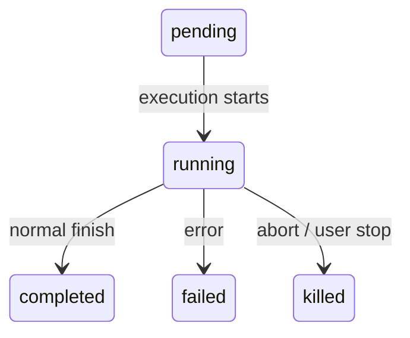
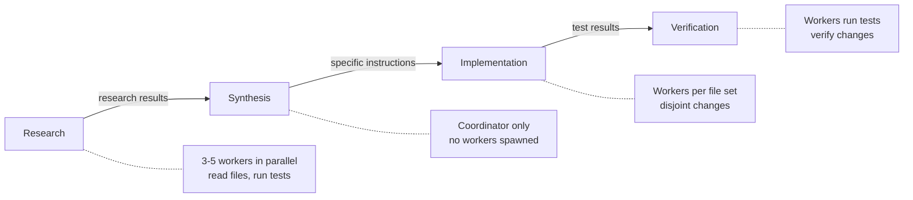
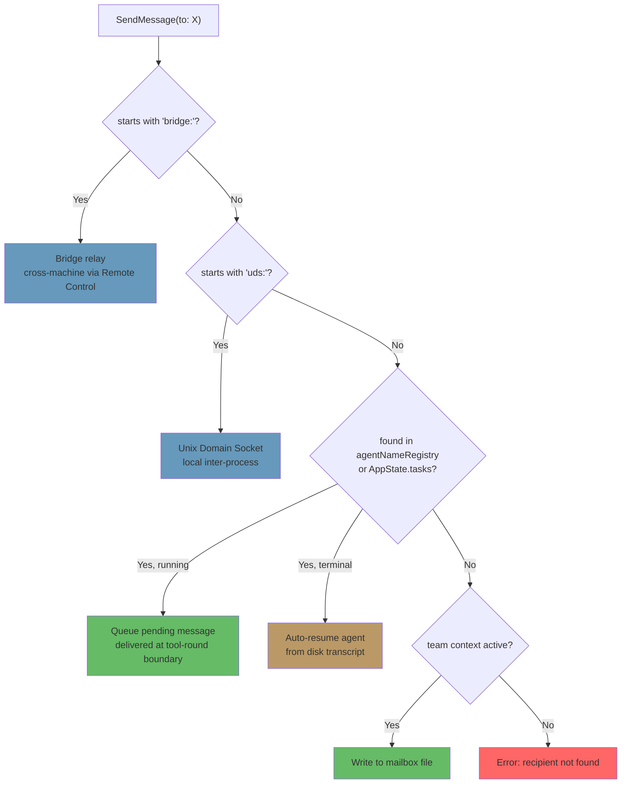

# 第10章：任务、协调与集群

## 单线程的局限

第8章展示了如何创建子智能体（sub-agent）——即通过十五步生命周期从智能体定义构建隔离执行上下文的过程。第9章展示了如何利用提示缓存（prompt cache）使并行生成变得经济高效。然而，创建智能体与管理智能体是两个不同的问题。本章将探讨后者。

单个智能体循环——一个模型、一次对话、一次调用一个工具——能够完成惊人的工作量。它可以读取文件、编辑代码、运行测试、搜索网络以及对复杂问题进行推理。但它会遇到天花板。

这个天花板并非智力上限，而是并行性和作用域的限制。一名开发者在进行大规模重构时，需要更新40个文件，在每批更新后运行测试，并验证没有破坏任何功能。代码库迁移会同时触及前端、后端和数据库层。全面的代码审查需要在后台运行测试套件的同时阅读数十个文件。这些并不是更难的问题——而是更宽泛的问题。它们要求具备同时处理多项任务的能力，能够将工作委派给专家，并协调各方结果。

Claude Code 针对这一问题的解决方案并非单一机制，而是一套分层的编排模式栈，每种模式适用于不同形态的工作。后台任务用于“触发后即忘”（fire-and-forget）的命令。协调器模式（Coordinator mode）用于管理者-工作者层级结构。集群团队（Swarm teams）用于点对点协作。此外还有一个统一的通信协议将它们紧密联系在一起。

编排层大约跨越40个文件，分布在 `tools/AgentTool/`、`tasks/`、`coordinator/`、`tools/SendMessageTool/` 和 `utils/swarm/` 中。尽管范围广泛，但其设计锚定于所有模式共享的一个状态机。理解该状态机——即 `Task.ts` 中的 `Task` 抽象——是理解其他一切的前提。

本章将从基础的任务状态机开始，一直追踪到最复杂的多智能体拓扑结构。

---

## 任务状态机

Claude Code 中的每一个后台操作——shell 命令、子智能体、远程会话、工作流脚本——都被作为一个*任务*进行跟踪。任务抽象位于 `Task.ts` 中，提供了统一的状态模型，编排层的其余部分均构建于此之上。

### 七种类型

系统定义了七种任务类型，每种代表不同的执行模型：

这七种任务类型为：`local_bash`（后台 shell 命令）、`local_agent`（后台子智能体）、`remote_agent`（远程会话）、`in_process_teammate`（集群队友）、`local_workflow`（工作流脚本执行）、`monitor_mcp`（MCP 服务器监控）以及 `dream`（推测性后台思考）。

`local_bash` 和 `local_agent` 是主力军——分别对应后台 shell 命令和后台子智能体。`in_process_teammate` 是集群原语。`remote_agent` 桥接到远程 Claude Code Runtime 环境。`local_workflow` 运行多步骤脚本。`monitor_mcp` 监视 MCP 服务器的健康状况。`dream` 最为特殊——它是一种后台任务，允许智能体在等待用户输入时进行推测性思考。

每种类型都有一个单字符 ID 前缀，便于即时视觉识别：

| 类型 | 前缀 | 示例 ID |
|------|--------|------------|
| `local_bash` | `b` | `b4k2m8x1` |
| `local_agent` | `a` | `a7j3n9p2` |
| `remote_agent` | `r` | `r1h5q6w4` |
| `in_process_teammate` | `t` | `t3f8s2v5` |
| `local_workflow` | `w` | `w6c9d4y7` |
| `monitor_mcp` | `m` | `m2g7k1z8` |
| `dream` | `d` | `d5b4n3r6` |

任务 ID 使用单字符前缀（a 代表智能体，b 代表 bash，t 代表队友等），后跟8个随机字母数字字符，这些字符取自大小写不敏感的安全字母表（数字加小写字母）。这产生了大约2.8万亿种组合——足以抵御针对磁盘上任务输出文件的暴力符号链接攻击。

当你在日志行中看到 `a7j3n9p2` 时，你立刻知道这是一个后台智能体。看到 `b4k2m8x1` 时，则是一个 shell 命令。这个前缀是对人类读者的微优化，但在一个可能拥有数十个并发任务的系统中，它至关重要。

### 五种状态

生命周期是一个简单的无环有向图：



`pending` 是注册与首次执行之间的短暂状态。`running` 表示任务正在积极工作。三个终态分别为 `completed`（成功）、`failed`（错误）和 `killed`（被用户、协调器或中止信号显式停止）。一个辅助函数可防止与已终止的任务交互：

```typescript
export function isTerminalTaskStatus(status: TaskStatus): boolean {
  return status === 'completed' || status === 'failed' || status === 'killed'
}
```

该函数随处可见——在消息注入保护、驱逐逻辑、孤儿清理以及决定是排队消息还是恢复已终止智能体的 SendMessage 路由中。

### 基础状态

每个任务状态都扩展自 `TaskStateBase`，其中包含所有七种类型共享的字段：

```typescript
export type TaskStateBase = {
  id: string              // 带前缀的随机 ID
  type: TaskType          // 判别符
  status: TaskStatus      // 当前生命周期位置
  description: string     // 人类可读的摘要
  toolUseId?: string      // 生成此任务的 tool_use 块
  startTime: number       // 创建时间戳
  endTime?: number        // 终态时间戳
  totalPausedMs?: number  // 累计暂停时间
  outputFile: string      // 流式输出的磁盘路径
  outputOffset: number    // 增量输出的读取游标
  notified: boolean       // 是否已向父级报告完成
}
```

有两个字段值得关注。`outputFile` 是异步执行与父级对话之间的桥梁——每个任务将其输出写入磁盘文件，父级可以通过 `outputOffset` 增量读取。`notified` 防止重复的完成消息；一旦父级被告知任务已完成，该标志就会翻转为 `true`，通知永远不会再次发送。如果没有这个保护，在两次连续轮询通知队列之间完成的任务会产生重复通知，导致模型误以为有两个任务完成，而实际上只有一个。

### 智能体任务状态

`LocalAgentTaskState` 是最复杂的变体，承载了管理后台子智能体完整生命周期所需的一切：

```typescript
export type LocalAgentTaskState = TaskStateBase & {
  type: 'local_agent'
  agentId: string
  prompt: string
  selectedAgent?: AgentDefinition
  agentType: string
  model?: string
  abortController?: AbortController
  pendingMessages: string[]       // 通过 SendMessage 排队
  isBackgrounded: boolean         // 最初是否为前台智能体？
  retain: boolean                 // UI 是否保留此任务
  diskLoaded: boolean             // 侧链转录记录已加载
  evictAfter?: number             // GC 截止时间
  progress?: AgentProgress
  lastReportedToolCount: number
  lastReportedTokenCount: number
  // ... 其他生命周期字段
}
```

三个字段揭示了重要的设计决策。`pendingMessages` 是收件箱——当 `SendMessage` 指向一个正在运行的智能体时，消息会在此处排队，而不是立即注入。消息在工具轮次边界被排空，这保留了智能体的回合结构。`isBackgrounded` 区分了天生异步的智能体与那些最初作为前台同步智能体启动、后来因用户按键而被转入后台的智能体。`evictAfter` 是一种垃圾回收机制：未被保留的已完成任务在被从内存中清除之前会有一个宽限期。

所有任务状态都以带前缀的 ID 为键，作为 `Record<string, TaskState>` 存储在 `AppState.tasks` 中。这是一个扁平映射，而非树形结构——系统不在状态存储中对父子关系建模。父子关系隐含在对话流中：父级持有生成子级的 `toolUseId`。

### 任务注册表

每种任务类型都由一个具有最小接口的 `Task` 对象支持：

```typescript
export type Task = {
  name: string
  type: TaskType
  kill(taskId: string, setAppState: SetAppState): Promise<void>
}
```

注册表收集所有任务实现：

```typescript
export function getAllTasks(): Task[] {
  return [
    LocalShellTask,
    LocalAgentTask,
    RemoteAgentTask,
    DreamTask,
    ...(LocalWorkflowTask ? [LocalWorkflowTask] : []),
    ...(MonitorMcpTask ? [MonitorMcpTask] : []),
  ]
}
```

注意条件包含——`LocalWorkflowTask` 和 `MonitorMcpTask` 受特性门控（feature-gated），运行时可能不存在。`Task` 接口刻意保持极简。早期版本包含 `spawn()` 和 `render()` 方法，但当明确生成和渲染从未被多态调用时，这些方法被移除了。每种任务类型都有自己的生成逻辑、状态管理和渲染方式。唯一真正需要按类型分发的操作是 `kill()`，因此这也是接口所要求的唯一内容。

这是通过减法进行接口演进的一个例子。最初的设计设想所有任务类型共享一个通用的生命周期接口。在实践中，各类型差异足够大，以至于共享接口变成了一种虚构——shell 命令的 `spawn()` 与进程内队友的 `spawn()` 几乎没有共同点。与其维护一个有漏洞的抽象，团队选择移除除真正受益于多态的那个方法之外的所有内容。

---

## 通信模式

只有当父级能够观察进度并接收结果时，后台运行的任务才有用。Claude Code 支持三种通信通道，每种都针对不同的访问模式进行了优化。

### 前台：生成器链

当智能体同步运行时，父级直接迭代其 `runAgent()` 异步生成器，将每条消息沿调用栈向上产出。这里有趣的机制是后台逃生口——同步循环在“来自智能体的下一条消息”与“后台信号”之间竞速：

```typescript
const agentIterator = runAgent({ ...params })[Symbol.asyncIterator]()

while (true) {
  const nextMessagePromise = agentIterator.next()
  const raceResult = backgroundPromise
    ? await Promise.race([nextMessagePromise.then(...), backgroundPromise])
    : { type: 'message', result: await nextMessagePromise }

  if (raceResult.type === 'background') {
    // 用户触发了后台化 -- 转换为异步
    await agentIterator.return(undefined)
    void runAgent({ ...params, isAsync: true })
    return { data: { status: 'async_launched' } }
  }

  agentMessages.push(message)
}
```

如果用户在执行过程中决定将同步智能体转为后台任务，前台迭代器会被干净地返回（触发其 `finally` 块以进行资源清理），然后智能体以相同的 ID 重新生成为异步任务。这种转换是无缝的——不会丢失任何工作，智能体从断点处继续执行，并使用一个与父级 ESC 键解耦的异步中止控制器。

这是一个极难正确处理的状态转换。前台智能体共享父级的中止控制器（ESC 会终止两者）。后台智能体需要自己的控制器（ESC 不应终止它）。智能体的消息需要从前端生成器流转移到后台通知系统。任务状态需要翻转 `isBackgrounded`，以便 UI 知道在后台面板中显示它。所有这些都必须原子性地发生——转换过程中不能丢失消息，也不能留下僵尸迭代器继续运行。下一条消息与后台信号之间的 `Promise.race` 正是实现这一点的机制。

### 后台：三种通道

后台智能体通过磁盘、通知和消息队列进行通信。

**磁盘输出文件。** 每个任务都会写入一个 `outputFile` 路径——这是一个指向智能体 JSONL 格式转录记录的符号链接。父级（或任何观察者）可以使用 `outputOffset` 增量读取此文件，该偏移量跟踪文件中已被消费的位置。`TaskOutputTool` 将此暴露给模型：

```typescript
inputSchema = z.strictObject({
  task_id: z.string(),
  block: z.boolean().default(true),
  timeout: z.number().default(30000),
})
```

当 `block: true` 时，工具会轮询直到任务达到终态或超时过期。这是协调器生成工作者并等待其结果的主要机制。

**任务通知。** 当后台智能体完成时，系统会生成 XML 通知并将其排入父级对话的传递队列：

```xml
<task-notification>
  <task-id>a7j3n9p2</task-id>
  <tool-use-id>toolu_abc123</tool-use-id>
  <output-file>/path/to/output</output-file>
  <status>completed</status>
  <summary>Agent "Investigate auth bug" completed</summary>
  <result>Found null pointer in src/auth/validate.ts:42...</result>
  <usage>
    <total_tokens>15000</total_tokens>
    <tool_uses>8</tool_uses>
    <duration_ms>12000</duration_ms>
  </usage>
</task-notification>
```

通知作为用户角色消息注入父级对话，这意味着模型在其正常消息流中看到它。不需要特殊工具来检查完成情况——它们作为上下文到达。任务状态上的 `notified` 标志防止重复传递。

**命令队列。** `LocalAgentTaskState` 上的 `pendingMessages` 数组是第三种通道。当 `SendMessage` 指向运行中的智能体时，消息被排队：

```typescript
if (isLocalAgentTask(task) && task.status === 'running') {
  queuePendingMessage(agentId, input.message, setAppState)
  return { data: { success: true, message: 'Message queued...' } }
}
```

这些消息在工具轮次边界由 `drainPendingMessages()` 排空，并作为用户消息注入智能体的对话。这是一个关键的设计选择——消息在工具轮次之间到达，而不是在执行中途。智能体完成当前思考后才接收新信息。没有竞态条件，没有损坏的状态。

### 进度跟踪

`ProgressTracker` 提供对智能体活动的实时可见性：

```typescript
export type ProgressTracker = {
  toolUseCount: number
  latestInputTokens: number        // 累计值（最新值，非总和）
  cumulativeOutputTokens: number   // 跨轮次求和
  recentActivities: ToolActivity[] // 最近5次工具使用
}
```

输入和输出 token 跟踪的区别是刻意的，反映了 API 计费模型的微妙之处。输入 token 是按 API 调用累计的，因为每次都会重新发送完整对话——第15轮包含了前14轮的所有内容，因此 API 报告的输入 token 数已经反映了总量。保留最新值是正确的聚合方式。输出 token 是按轮次的——模型每次都生成新 token——因此求和是正确的聚合方式。弄错这一点会导致严重的高估（对累计输入 token 求和）或严重的低估（仅保留最新的输出 token）。

`recentActivities` 数组（上限为5条）提供了人类可读的智能体活动流：“Read src/auth/validate.ts”、“Bash: npm test”、“Edit src/auth/validate.ts”。这显示在 VS Code 子智能体面板和终端的后台任务指示器中，让用户无需阅读完整转录记录即可了解智能体的工作情况。

对于后台智能体，进度通过 `updateAsyncAgentProgress()` 写入 `AppState`，并通过 `emitTaskProgress()` 作为 SDK 事件发出。VS Code 子智能体面板消费这些事件以渲染实时进度条、工具计数和活动流。进度跟踪不仅仅是装饰性的——它是告诉用户后台智能体是在取得进展还是陷入循环的主要反馈机制。

---

## 协调器模式

协调器模式将 Claude Code 从带有后台助手的单一智能体转变为真正的管理者-工作者架构。它是系统中最具主张性的编排模式，其设计揭示了对 LLM 应如何及不应如何委派工作的深刻思考。

### 协调器模式解决的问题

标准智能体循环拥有单一对话和单一上下文窗口。当它生成后台智能体时，后台智能体独立运行并通过任务通知报告结果。这对于简单委派效果很好——“在我继续编辑的同时运行测试”——但对于复杂的多步骤工作流则会崩溃。

考虑代码库迁移。智能体需要：(1) 理解200个文件中的当前模式，(2) 设计迁移策略，(3) 对每个文件应用更改，(4) 验证没有破坏任何功能。步骤1和3受益于并行性。步骤2需要综合步骤1的结果。步骤4依赖于步骤3。单个智能体按顺序执行会将大部分 token 预算花费在重新读取文件上。多个后台智能体在没有协调的情况下执行会产生不一致的更改。

协调器模式通过将“思考”智能体与“执行”智能体分离来解决这个问题。协调器处理步骤1和2（派遣研究工作者，然后综合）。工作者处理步骤3和4（应用更改，运行测试）。协调器看到全貌；工作者看到其特定任务。

### 激活

一个环境变量即可开启开关：

```typescript
export function isCoordinatorMode(): boolean {
  if (feature('COORDINATOR_MODE')) {
    return isEnvTruthy(process.env.CLAUDE_CODE_COORDINATOR_MODE)
  }
  return false
}
```

在会话恢复时，`matchSessionMode()` 检查恢复会话的存储模式是否与当前环境匹配。如果不一致，环境变量会被翻转以匹配。这防止了令人困惑的场景：协调器会话恢复为普通智能体（失去对工作者的感知）或普通会话恢复为协调器（失去对其工具的访问）。会话的模式是事实来源；环境变量是运行时信号。

### 工具限制

协调器的能力不在于拥有更多工具，而在于拥有更少。在协调器模式下，协调器智能体恰好拥有三个工具：

- **Agent** —— 生成工作者
- **SendMessage** —— 与现有工作者通信
- **TaskStop** —— 终止运行中的工作者

仅此而已。不能读取文件。不能编辑代码。不能执行 shell 命令。协调器不能直接接触代码库。这种限制不是缺陷——而是核心设计原则。协调器的工作是思考、规划、分解和综合。工作者负责执行。

相反，工作者获得完整的工具集，但减去内部协调工具：

```typescript
const INTERNAL_WORKER_TOOLS = new Set([
  TEAM_CREATE_TOOL_NAME,
  TEAM_DELETE_TOOL_NAME,
  SEND_MESSAGE_TOOL_NAME,
  SYNTHETIC_OUTPUT_TOOL_NAME,
])
```

工作者不能生成自己的子团队或向同伴发送消息。他们通过正常的任务完成机制报告结果，协调器在他们之间进行综合。

### 370行的系统提示词

协调器系统提示词逐行来看，是代码库中关于如何使用 LLM 进行编排的最具指导意义的文档。它大约有370行，编码了关于委派模式的宝贵经验教训。关键教导包括：

**“绝不委派理解。”** 这是中心论点。协调器必须将研究发现综合成包含文件路径、行号和确切更改的具体提示词。提示词明确指出了反模式，如“根据你的发现修复错误”——这种提示词将*理解*委派给了工作者，迫使其重新推导协调器已有的上下文。正确的模式是：“在 `src/auth/validate.ts` 的第42行，当从 OAuth 流程调用时，`userId` 参数可能为 null。添加一个 null 检查，返回 401 响应。”

**“并行是你的超能力。”** 提示词建立了清晰的并发模型。只读任务自由并行运行——研究、探索、文件读取。写密集型任务按文件集串行化。协调器应推理哪些任务可以重叠，哪些必须按序执行。优秀的协调器同时生成五个研究工作者，等待所有结果，综合，然后生成三个触及不相交文件集的实现工作者。糟糕的协调器生成一个工作者，等待，再生成下一个，再次等待——将本可并行的工作串行化。

**任务工作流阶段。** 提示词定义了四个阶段：



1. **研究（Research）** —— 工作者并行探索代码库，读取文件，运行测试，收集信息
2. **综合（Synthesis）** —— 协调器（而非工作者）阅读所有研究结果并建立统一理解
3. **实施（Implementation）** —— 工作者接收源自综合结果的精确指令
4. **验证（Verification）** —— 工作者运行测试并验证更改

协调器不应跳过阶段。最常见的失败模式是从研究直接跳到实施而没有综合。当这种情况发生时，协调器将理解委派给了实施工作者——每个人都必须从头重新推导上下文，导致更改不一致和 token 浪费。

**继续与生成的决策。** 当工作者完成且协调器有后续工作时，应该向现有工作者发送消息（通过 SendMessage）还是生成一个新的（通过 Agent）？该决策取决于上下文重叠度：

- **高重叠，相同文件**：继续。工作者上下文中已有文件内容，理解模式，并可在之前的工作基础上构建。重新生成会迫使重新读取相同文件并重新推导相同理解。
- **低重叠，不同领域**：重新生成。刚调查完认证系统的工作者携带了20,000个 token 的认证特定上下文，这对 CSS 重构任务是死重。重新开始更便宜。
- **高重叠但工作者失败**：重新生成并提供关于出错原因的明确指导。继续一个失败的工作者通常意味着对抗混乱的上下文。带有“上次尝试因 X 失败，避免 Y”的全新开始更可靠。
- **后续工作需要工作者的输出**：继续，并在 SendMessage 中包含输出。工作者无需重新推导自己的结果。

**工作者提示词编写与反模式。** 提示词教导协调器如何编写有效的工作者提示词，并明确标记不良模式：

反模式：*“根据你的研究发现，实施修复。”* 这委派了理解。做研究的不是工作者——是协调器阅读了研究结果。

反模式：*“修复认证模块中的错误。”* 没有文件路径，没有行号，没有错误描述。工作者必须从头搜索整个代码库。

反模式：*“对所有其他文件进行相同的更改。”* 哪些文件？什么更改？协调器知道；它应该列举出来。

良好模式：*“在 `src/auth/validate.ts` 的第42行，当从 `src/oauth/callback.ts:89` 调用时，`userId` 参数可能为 null。添加 null 检查：如果 `userId` 为 null，返回 `{ error: 'unauthorized', status: 401 }`。然后更新 `src/auth/__tests__/validate.test.ts` 中的测试以覆盖 null 情况。”*

编写具体提示词的成本由协调器承担一次。收益——工作者第一次尝试就正确执行——是巨大的。模糊的提示词造成了虚假的经济性：协调器节省了30秒的提示词编写时间，而工作者浪费了5分钟的探索时间。

### 工作者上下文

协调器将可用工具的信息注入其自身上下文，以便模型知道工作者能做什么：

```typescript
export function getCoordinatorUserContext(mcpClients, scratchpadDir?) {
  return {
    workerToolsContext: `Workers spawned via Agent have access to: ${workerTools}`
      + (mcpClients.length > 0
        ? `\nWorkers also have MCP tools from: ${serverNames}` : '')
      + (scratchpadDir ? `\nScratchpad: ${scratchpadDir}` : '')
  }
}
```

暂存目录（受 `tengu_scratch` 特性标志门控）是一个共享文件系统位置，工作者可以在其中读写而无需权限提示。它实现了持久的跨工作者知识共享——一个工作者的研究笔记成为另一个工作者的输入，通过文件系统而非协调器的 token 窗口进行中介。

这很重要，因为它解决了协调器模式的一个根本局限。没有暂存目录，所有信息都流经协调器：工作者 A 产出发现，协调器通过 TaskOutput 读取，将其综合到工作者 B 的提示词中。协调器的上下文窗口成为瓶颈——它必须保留所有中间结果足够长的时间来进行综合。有了暂存目录，工作者 A 将发现写入 `/tmp/scratchpad/auth-analysis.md`，协调器告诉工作者 B：“读取 `/tmp/scratchpad/auth-analysis.md` 的认证分析并将该模式应用于 OAuth 模块。”协调器通过引用而非值来移动信息。

### Fork 互斥

协调器模式与基于 fork 的子智能体互斥：

```typescript
export function isForkSubagentEnabled(): boolean {
  if (feature('FORK_SUBAGENT')) {
    if (isCoordinatorMode()) return false
    // ...
  }
}
```

冲突是根本性的。Fork 智能体继承父级的整个对话上下文——它们是共享提示缓存的廉价克隆。协调器工作者是具有全新上下文和特定指令的独立智能体。这是对立的委派哲学，系统在特性标志层面强制执行这一选择。

---

## 集群系统

协调器模式是层级式的：一个管理者，多个工作者，自上而下的控制。集群系统是点对点的替代方案——多个 Claude Code 实例作为一个团队工作，领导者通过消息传递协调多个队友。

### 团队上下文

团队由 `teamName` 标识，并在 `AppState.teamContext` 中跟踪：

```typescript
teamContext?: {
  teamName: string
  teammates: {
    [id: string]: { name: string; color?: string; ... }
  }
}
```

每个队友都有一个名称（用于寻址）和一个颜色（用于 UI 中的视觉区分）。团队文件持久化在磁盘上，以便团队成员身份在进程重启后依然存在。

### 智能体名称注册表

后台智能体可以在生成时被赋予名称，这使得它们可以通过人类可读的标识符而非随机任务 ID 进行寻址：

```typescript
if (name) {
  rootSetAppState(prev => {
    const next = new Map(prev.agentNameRegistry)
    next.set(name, asAgentId(asyncAgentId))
    return { ...prev, agentNameRegistry: next }
  })
}
```

`agentNameRegistry` 是一个 `Map<string, AgentId>`。当 `SendMessage` 解析 `to` 字段时，首先检查注册表：

```typescript
const registered = appState.agentNameRegistry.get(input.to)
const agentId = registered ?? toAgentId(input.to)
```

这意味着你可以向 `"researcher"` 发送消息，而不是 `a7j3n9p2`。这种间接寻址很简单，但它使协调器能够从角色而非 ID 的角度思考——这对模型推理多智能体工作流的能力是一个显著改进。

### 进程内队友

进程内队友在与领导者相同的 Node.js 进程中运行，通过 `AsyncLocalStorage` 隔离。其状态在基础状态上扩展了团队特定字段：

```typescript
export type InProcessTeammateTaskState = TaskStateBase & {
  type: 'in_process_teammate'
  identity: TeammateIdentity
  prompt: string
  messages?: Message[]                  // 上限50条
  pendingUserMessages: string[]
  isIdle: boolean
  shutdownRequested: boolean
  awaitingPlanApproval: boolean
  permissionMode: PermissionMode
  onIdleCallbacks?: Array<() => void>
  currentWorkAbortController?: AbortController
}
```

`messages` 上限为50条值得解释。在开发过程中，分析显示每个进程内智能体在500+轮次后累积约20MB RSS。鲸鱼会话（运行扩展工作流的超级用户）被观察到在2分钟内启动了292个智能体，将 RSS 推高至36.8GB。UI 表示的50条消息上限是一种内存安全阀。智能体的实际对话继续保留完整历史；只有面向 UI 的快照被截断。

`isIdle` 标志启用了工作窃取模式。空闲队友不消耗 token 或 API 调用——它只是在等待下一条消息。`onIdleCallbacks` 数组让系统能够挂钩从活跃到空闲的转换，从而实现“等待所有队友完成，然后继续”等编排模式。

`currentWorkAbortController` 不同于队友的主中止控制器。中止当前工作控制器会取消队友正在进行的回合，但不会杀死队友。这启用了一种“重定向”模式：领导者发送更高优先级的消息，队友的当前工作被中止，队友接收新消息。主中止控制器被中止时，会完全杀死队友。两级中断对应两级意图。

`shutdownRequested` 标志实现了协作终止。当领导者发送关闭请求时，设置此标志。队友可以在自然停止点检查它并优雅地结束——完成当前的文件写入，提交更改，或发送最终状态更新。这比硬杀更温和，硬杀可能会使文件处于不一致状态。

### 邮箱

队友通过基于文件的邮箱系统进行通信。当 `SendMessage` 指向队友时，消息被写入接收者在磁盘上的邮箱文件：

```typescript
await writeToMailbox(recipientName, {
  from: senderName,
  text: content,
  summary,
  timestamp: new Date().toISOString(),
  color: senderColor,
}, teamName)
```

消息可以是纯文本、结构化协议消息（关闭请求、计划批准）或广播（`to: "*"` 发送给除发送者外的所有团队成员）。轮询钩子处理传入消息并将其路由到队友的对话中。

基于文件的方法刻意保持简单。没有消息代理，没有事件总线，没有共享内存通道。文件是持久的（能在进程崩溃中幸存），可检查的（你可以 `cat` 邮箱），且廉价的（无基础设施依赖）。对于一个消息量以每次会话数十条而非每秒数千条衡量的系统来说，这是正确的权衡。Redis 支持的消息队列会增加运维复杂性、依赖项和故障模式——而这一切只是为了满足文件系统调用就能轻松处理的吞吐量需求。

广播机制值得一提。当消息发送给 `"*"` 时，发送者遍历团队文件中的所有成员，跳过自己（大小写不敏感比较），并单独写入每个成员的邮箱：

```typescript
for (const member of teamFile.members) {
  if (member.name.toLowerCase() === senderName.toLowerCase()) continue
  recipients.push(member.name)
}
for (const recipientName of recipients) {
  await writeToMailbox(recipientName, { from: senderName, text: content, ... }, teamName)
}
```

没有扇出优化——每个接收者都有单独的文件写入。同样，在智能体团队的规模下（通常3-8名成员），这完全足够。如果团队有100名成员，这需要重新思考。但防止36GB RSS场景的50条消息内存上限也隐式限制了有效团队规模。

### 权限转发

集群工作者以受限权限运行，但在需要敏感操作批准时可以向领导者升级：

```typescript
const request = createPermissionRequest({
  toolName, toolUseId, input, description, permissionSuggestions
})
registerPermissionCallback({ requestId, toolUseId, onAllow, onReject })
void sendPermissionRequestViaMailbox(request)
```

流程是：工作者遇到需要权限的工具，bash 分类器尝试自动批准，如果失败，请求通过邮箱系统转发给领导者。领导者在 UI 中看到请求并可以批准或拒绝。回调触发，工作者继续。这让工作者在安全操作上自主运行，同时对危险操作保持人工监督。

---

## 智能体间通信：SendMessage

`SendMessageTool` 是通用通信原语。它通过单一工具接口处理四种不同的路由模式，由 `to` 字段的形态选择。

### 输入模式

```typescript
inputSchema = z.object({
  to: z.string(),
  // "teammate-name", "*", "uds:<socket>", "bridge:<session-id>"
  summary: z.string().optional(),
  message: z.union([
    z.string(),
    z.discriminatedUnion('type', [
      z.object({ type: z.literal('shutdown_request'), reason: z.string().optional() }),
      z.object({ type: z.literal('shutdown_response'), request_id, approve, reason }),
      z.object({ type: z.literal('plan_approval_response'), request_id, approve, feedback }),
    ]),
  ]),
})
```

`message` 字段是纯文本和结构化协议消息的联合类型。这意味着 SendMessage 身兼二职——既是非正式聊天通道（“这是我的发现”），也是正式协议层（“我批准你的计划”/“请关闭”）。

### 路由分发

`call()` 方法遵循优先级排序的分发链：



**1. Bridge 消息** (`bridge:<session-id>`)。通过 Anthropic 远程控制服务器的跨机器通信。这是覆盖范围最广的——两台不同机器甚至不同大陆上的 Claude Code 实例通过中继进行通信。系统在发送 bridge 消息前需要明确的用户同意——这是一项安全检查，防止一个智能体单方面与远程实例建立通信。没有这个门控，受损或混乱的智能体可能会将信息泄露到远程会话。同意检查使用 `postInterClaudeMessage()`，它处理序列化并通过远程控制中继传输。

**2. UDS 消息** (`uds:<socket-path>`)。通过 Unix 域套接字的本地进程间通信。这适用于在同一机器上但在不同进程中运行的 Claude Code 实例——例如，一个 VS Code 扩展托管一个实例，终端托管另一个。UDS 通信快速（无网络往返），安全（文件系统权限控制访问），且可靠（内核处理传递）。`sendToUdsSocket()` 函数序列化消息并将其写入 `to` 字段指定的套接字路径。对等方通过扫描活动 UDS 端点的 `ListPeers` 工具发现彼此。

**3. 进程内子智能体路由**（纯名称或智能体 ID）。这是最常见的路径。路由逻辑：

- 在 `agentNameRegistry` 中查找 `input.to`
- 如果找到且正在运行：`queuePendingMessage()` —— 消息等待下一个工具轮次边界
- 如果找到但处于终态：`resumeAgentBackground()` —— 智能体被透明重启
- 如果不在 `AppState` 中：尝试从磁盘转录记录恢复

**4. 团队邮箱**（当团队上下文激活时的回退）。命名接收者的消息被写入其邮箱文件。`"*"` 通配符触发向所有团队成员的广播。

### 结构化协议

除了纯文本，SendMessage 还承载两种正式协议。

**关闭协议。** 领导者向队友发送 `{ type: 'shutdown_request', reason: '...' }`。队友响应 `{ type: 'shutdown_response', request_id, approve: true/false, reason }`。如果批准，进程内队友中止其控制器；基于 tmux 的队友收到 `gracefulShutdown()` 调用。该协议是协作式的——如果队友正处于关键工作中，它可以拒绝关闭请求，领导者必须处理这种情况。

**计划批准协议。** 在计划模式下运行的队友必须在执行前获得批准。他们提交计划，领导者响应 `{ type: 'plan_approval_response', request_id, approve, feedback }`。只有团队负责人可以发布批准。这创建了一个审查关口——领导者可以在触及任何文件之前检查工作者的预期方法，尽早发现误解。

### 自动恢复模式

路由系统最优雅的特性是透明的智能体恢复。当 `SendMessage` 指向已完成或被杀死的智能体时，它不会返回错误，而是复活该智能体：

```typescript
if (task.status !== 'running') {
  const result = await resumeAgentBackground({
    agentId,
    prompt: input.message,
    toolUseContext: context,
    canUseTool,
  })
  return {
    data: {
      success: true,
      message: `Agent "${input.to}" was stopped; resumed with your message`
    }
  }
}
```

`resumeAgentBackground()` 函数从磁盘转录记录重建智能体：

1. 读取侧链 JSONL 转录记录
2. 重建消息历史，过滤孤立的思考块和未解决的工具使用
3. 重建内容替换状态以保持提示缓存稳定性
4. 从存储的元数据解析原始智能体定义
5. 使用新的中止控制器重新注册为后台任务
6. 使用恢复的历史记录加上新消息作为提示词调用 `runAgent()`

从协调器的角度来看，向已终止智能体发送消息和向活跃智能体发送消息是相同的操作。路由层处理复杂性。这意味着协调器不需要跟踪哪些智能体是活跃的——它们只需发送消息，系统会自行解决。

影响是深远的。如果没有自动恢复，协调器需要维护智能体活跃度的心智模型：“`researcher` 还在运行吗？让我检查一下。它完成了。我需要生成一个新智能体。但等等，我应该使用相同的名字吗？它会有相同的上下文吗？”有了自动恢复，所有这些简化为：“给 `researcher` 发消息。”如果它活着，消息被排队。如果它死了，它带着完整历史被复活。协调器的提示词复杂性大幅降低。

当然也有代价。从磁盘转录记录恢复意味着重新读取可能数千条消息，重建内部状态，并使用完整上下文窗口进行新的 API 调用。对于长生命周期的智能体，这在延迟和 token 方面都可能很昂贵。但替代方案——要求协调器手动管理智能体生命周期——更糟。协调器是一个 LLM。它擅长推理问题和编写指令。它不擅长记账。自动恢复通过完全消除一类记账工作来发挥 LLM 的优势。

---

## TaskStop：终止开关

`TaskStopTool` 是 Agent 和 SendMessage 的补充——它终止运行中的任务：

```typescript
inputSchema = z.strictObject({
  task_id: z.string().optional(),
  shell_id: z.string().optional(),  // 已弃用的向后兼容
})
```

实现委托给 `stopTask()`，根据任务类型分发：

1. 在 `AppState.tasks` 中查找任务
2. 调用 `getTaskByType(task.type).kill(taskId, setAppState)`
3. 对于智能体：中止控制器，将状态设为 `'killed'`，启动驱逐计时器
4. 对于 shell：杀死进程组

该工具有一个遗留别名 `"KillShell"` ——提醒我们任务系统是从更简单的起源演变而来的，那时唯一的后台操作就是 shell 命令。

终止机制因任务类型而异，但模式一致。对于智能体，终止意味着中止中止控制器（导致 `query()` 循环在下一个 yield 点退出），将状态设为 `'killed'`，并启动驱逐计时器，以便在宽限期后清理任务状态。对于 shell，终止意味着向进程组发送信号——首先是 `SIGTERM`，如果进程未在超时时间内退出，则是 `SIGKILL`。对于进程内队友，终止还会触发向团队的关闭通知，以便其他成员知道该队友已离开。

驱逐计时器值得一提。当智能体被杀死时，其状态不会立即被清除。它在 `AppState.tasks` 中停留一段宽限期（由 `evictAfter` 控制），以便 UI 可以显示已杀死状态，可以读取任何最终输出，并且通过 SendMessage 的自动恢复仍然可行。宽限期过后，状态被垃圾回收。这与已完成任务使用的模式相同——系统区分“已完成”（结果可用）和“已遗忘”（状态已清除）。

---

## 模式选择

（关于命名的说明：代码库还包含 `TaskCreate`/`TaskGet`/`TaskList`/`TaskUpdate` 工具，用于管理结构化待办事项列表——这与此处描述的后台任务状态机是完全独立的系统。`TaskStop` 操作 `AppState.tasks`；`TaskUpdate` 操作项目跟踪数据存储。命名重叠是历史原因造成的，也是模型混淆的常见来源。）

有三种编排模式可用——后台委派、协调器模式和集群团队——自然的问题是何时使用哪种。

**简单委派**（带 `run_in_background: true` 的 Agent 工具）适用于父级有一两个独立任务需要卸载的情况。在后台运行测试同时继续编辑。在等待构建时搜索代码库。父级保持控制，准备好时检查结果，永远不需要复杂的通信协议。开销极小——一个任务状态条目，一个磁盘输出文件，完成时一个通知。

**协调器模式**适用于问题可分解为研究阶段、综合阶段和实施阶段的情况——以及当协调器需要在指导下一步之前跨多个工作者的结果进行推理时。协调器不能接触文件，这强制了关注点的清晰分离：思考在一个上下文中发生，执行在另一个上下文中发生。370行的系统提示词不是仪式——它编码了防止 LLM 委派最常见失败模式（即委派理解而非委派行动）的模式。

**集群团队**适用于长期运行的协作会话，其中智能体需要点对点通信，工作是持续性的而非批处理导向的，并且智能体可能需要根据传入消息空闲和恢复。邮箱系统支持协调器模式（同步的生成-等待-综合）所不支持的异步模式。计划批准关口增加了审查层。权限转发在不需要每个智能体都拥有完全权限的情况下维持安全性。

实用决策表：

| 场景 | 模式 | 原因 |
|----------|---------|-----|
| 编辑时运行测试 | 简单委派 | 一个后台任务，无需协调 |
| 搜索代码库的所有用法 | 简单委派 | 触发后即忘，完成后读取输出 |
| 重构3个模块中的40个文件 | 协调器 | 研究阶段发现模式，综合规划更改，工作者按模块并行执行 |
| 带审查关口的多天功能开发 | 集群 | 长生命周期智能体，计划批准协议，同伴通信 |
| 修复已知位置的错误 | 都不需要——单智能体 | 对于专注的顺序工作，编排开销超过收益 |
| 迁移数据库架构 + 更新 API + 更新前端 | 协调器 | 共享研究/规划阶段后的三个独立工作流 |
| 带用户监督的结对编程 | 带计划模式的集群 | 工作者提议，领导者批准，工作者执行 |

这些模式原则上并不互斥，但在实践中是互斥的。协调器模式禁用 fork 子智能体。集群团队有自己的通信协议，不与协调器任务通知混合。选择在会话启动时通过环境变量和特性标志做出，它塑造了整个交互模型。

最后一点观察：最简单的模式几乎总是正确的起点。大多数任务不需要协调器模式或集群团队。带有偶尔后台委派的单个智能体处理了绝大多数开发工作。复杂的模式是为那5%确实宽泛、确实并行或确实长期运行的问题而存在的。在单文件错误修复上使用协调器模式就像为静态网站部署 Kubernetes ——技术上可行，架构上不恰当。

---

## 编排的代价

在审视编排层在哲学上揭示了什么之前，值得承认它在实际上的代价。

每个后台智能体都是一个独立的 API 对话。它有自己的上下文窗口、token 预算和提示缓存槽。一个生成5个研究工作者的协调器正在进行6个并发 API 调用，每个都有自己的系统提示词、工具定义和 CLAUDE.md 注入。Token 开销不容忽视——仅系统提示词就可能数千 token，每个工作者都会重新读取其他工作者可能已经读过的文件。

通信通道增加了延迟。磁盘输出文件需要文件系统 I/O。任务通知在工具轮次边界传递，而非即时。命令队列引入了完整的往返延迟——协调器发送消息，消息等待工作者完成当前工具使用，工作者处理消息，结果写入磁盘供协调器读取。

状态管理增加了复杂性。七种任务类型，五种状态，每个任务状态数十个字段。驱逐逻辑、垃圾回收计时器、内存上限——所有这些存在都是因为无界状态增长导致了真实的生产事故（36.8GB RSS）。

这并不意味着编排是错误的。这意味着编排是一种有代价的工具，代价应与收益权衡。当搜索需要5分钟顺序时间时，运行5个并行工作者搜索代码库是值得的。运行协调器修复一个文件中的拼写错误纯粹是开销。

---

## 编排层的启示

该系统最有趣的方面不是任何单一机制——任务状态、邮箱和通知 XML 都是直接的工程实现。有趣的是它们组合在一起所体现的*设计哲学*。

协调器提示词的“绝不委派理解”不仅是 LLM 编排的好建议。它是关于基于上下文窗口推理的根本局限性的声明。拥有全新上下文窗口的工作者无法理解协调器在阅读50个文件并综合三份研究报告后所理解的内容。弥合这一差距的唯一方法是协调器将其理解提炼为具体、可操作的提示词。模糊的委派不仅效率低下——而且在信息论上是有损的。

SendMessage 中的自动恢复模式揭示了对*表面简单性优于实际简单性*的偏好。实现很复杂——读取磁盘转录记录，重建内容替换状态，重新解析智能体定义。但接口微不足道：发送消息，无论接收者是活是死都能工作。复杂性被基础设施吸收，以便模型（和用户）可以用更简单的术语进行推理。

进程内队友的50条消息内存上限提醒我们，编排系统在真实的物理约束下运行。2分钟内292个智能体达到36.8GB RSS 不是理论上的担忧——它在生产中发生过。抽象是优雅的，但它们运行在内存有限的硬件上，当用户将其推向极端时，系统必须优雅降级。

分层架构本身也有教训。任务状态机是不可知的——它不知道协调器或集群。通信通道是不可知的——SendMessage 不知道它是被协调器、集群领导者还是独立智能体调用的。协调器提示词叠加在上面，增加方法论而不改变底层机制。每一层都可以独立理解、独立测试和独立演进。当团队添加集群系统时，他们不需要修改任务状态机。当他们添加协调器提示词时，他们不需要修改 SendMessage。

这是良好分解编排的标志：原语是通用的，模式是由它们组合而成的。协调器只是一个拥有受限工具和详细系统提示词的智能体。集群领导者只是一个拥有团队上下文和邮箱访问权限的智能体。后台工作者只是一个拥有独立中止控制器和磁盘输出文件的智能体。七种任务类型、五种状态和四种路由模式结合产生的编排模式大于各部分之和。

编排层是 Claude Code 从单线程工具执行器转变为更接近开发团队的地方。任务状态机提供记账。通信通道提供信息流。协调器提示词提供方法论。集群系统为不适合严格层级结构的问题提供点对点拓扑。它们共同使语言模型能够做到单次模型调用无法做到的事情：并行地、协调地处理宽泛问题。

下一章将考察权限系统——决定这些智能体能做什么以及危险操作如何从工作者升级到人类的安全层。没有权限控制的编排将是错误的力量倍增器。权限系统确保更多的智能体意味着更多的能力，而非更多的风险。
