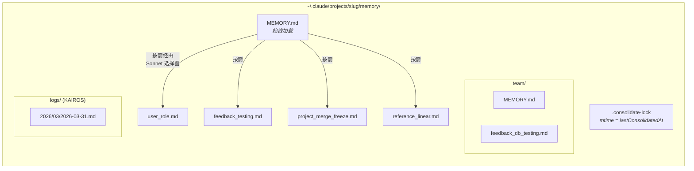
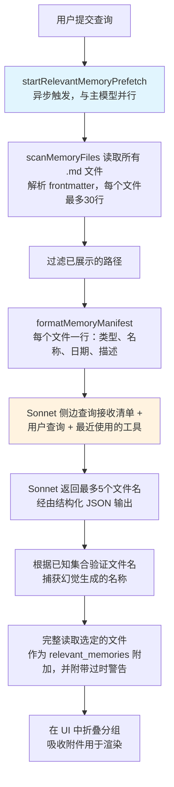
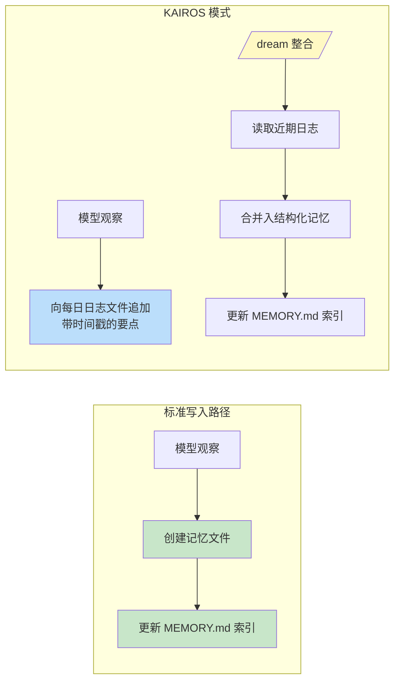

# 第11章：记忆——跨会话学习

## 无状态问题

到目前为止，每一章描述的都是存在于单个会话内的机制。智能体循环运行，工具执行，子智能体协调，而当进程退出时，这一切都会消失。下一次对话以相同的系统提示词、相同的工具定义、相同的模型开始——并且对之前发生的事情一无所知。

这是无状态架构的根本局限。开发者在周一纠正了模型的测试方法，周二模型又犯了同样的错误。用户解释了他们的角色、项目的约束条件以及代码风格偏好，而每次新会话都要求他们重新解释一遍。模型并非健忘——它从未知道过。每次对话都是一个独立的宇宙。

这个问题并非理论上的。它以具体的方式表现出来，侵蚀着信任。用户说“记住，我们在测试中使用真实的数据库实例，而不是模拟对象（mocks）”——下周模型却生成了使用模拟对象的测试。用户解释自己是高级工程师，不需要入门级的讲解——而下一次会话却以教程级别的演练开场。没有记忆，每次会话都从零开始。智能体永远像是第一天入职的新员工。

业界的通用解决方案是检索增强生成（RAG）：将文档嵌入为向量，存储在向量数据库中，并在查询时检索相关片段。这对于知识库——文档、常见问题解答、参考资料——效果很好。但在架构上，它与智能体跨会话实际需要记忆的内容不匹配。智能体的记忆不是知识库。它是观察结果的集合：用户是谁、他们纠正了什么、项目当前的约束是什么、去哪里找东西。这些观察结果细碎、变化频繁，且必须可由人类编辑。向量数据库解决的是错误的问题。

Claude Code 的记忆系统则是一种完全不同的尝试：磁盘上的文件、Markdown 格式、由大语言模型（LLM）驱动的召回、无需基础设施。这一尝试基于这样的理念：存储的简单性加上检索的智能性，能产生比两者都复杂更好的系统。

这种设计理念带来了塑造整个系统的后果：

- **人类可读。** 想查看 Claude Code 记住了什么的用户，可以在任何文本编辑器中打开 `~/.claude/projects/<slug>/memory/MEMORY.md`。无需特殊工具，无需解密，无需导出命令。
- **人类可编辑。** 过时的记忆可以用 vim 修正。错误的记忆可以用 `rm` 删除。用户对智能体的知识拥有完全的掌控权。
- **可版本控制。** 团队记忆可以提交到 git。因为记忆是 Markdown 格式，其变更可以清晰地显示差异（diff）。
- **零基础设施。** 记忆系统可离线工作，无需服务器，可在任何具有文件系统的操作系统上运行。因为没有模式（schema），所以也不存在迁移路径。
- **易于调试。** 当记忆行为异常时，诊断路径是 `ls` 和 `cat`，而不是查询日志和数据库检查。

模型使用 `FileWriteTool` 和 `FileEditTool` 来读写记忆——这与它编辑源代码所使用的工具相同（在第6章中介绍）。不存在特殊的记忆 API。系统提示词教会模型一个两步写入协议（创建文件、更新索引），模型利用其现有能力在新的指令下执行该协议。这是将工具复用作为架构原则——记忆系统不是强行拼接到智能体上的子系统，而是智能体利用其现有能力产生的涌现行为。

基于文件的选择之所以在这里有效，还有一个更深层的原因。对于 AI 智能体而言，记忆与传统应用中的记忆有着本质区别。传统应用的数据库保存着权威状态——是系统数据的唯一事实来源。而智能体的记忆保存的是*观察结果*——即在某个时间点为真、但现在未必仍然为真的事物。文件自然地传达了这种认识论状态。它们有修改时间，揭示了观察结果被记录的时间。当人类知道某个观察结果是错误的时候，可以读取、编辑和删除这些文件。数据库暗示着永久性和权威性；而 Markdown 文件则暗示着某人写下并可能需要更新的笔记。存储介质传达了数据的本质——这些是工作笔记，而非绝对真理。

### 按项目划分作用域

记忆的作用域限定在 git 仓库根目录，而非当前工作目录。如果用户在一个终端中打开了 `src/components/`，在另一个终端中打开了 `tests/`，这两个会话将共享同一个记忆目录。解析逻辑首先查找规范的 git 根目录，若失败则回退到项目根目录：

基础路径解析首先查找规范的 git 根目录，若失败则回退到项目根目录。这确保了同一仓库的所有 git 工作树（worktrees）共享单个记忆目录。

`findCanonicalGitRoot` 调用确保了同一仓库的所有 git 工作树共享单个记忆目录。git 根目录经过清洗（通过 `sanitizePath()` 将斜杠转换为短横线）以生成扁平化的目录名：

```
~/.claude/projects/-Users-alex-code-myapp/memory/
```

一个内容完整的记忆目录揭示了系统的结构：



命名约定是语义化的：`<类型>_<主题>.md`。类型前缀并非由代码强制执行，而是提示词指令的一部分，这使得目视扫描目录并了解记忆全貌变得容易。

---

## 四类型分类法

并非所有事情都值得记住。记忆系统将所有记忆严格限制为四种类型：

这四种类型是：**user（用户）**、**feedback（反馈）**、**project（项目）** 和 **reference（参考）**。

该分类法围绕单一标准设计：**此知识是否可从当前项目状态推导得出？** 代码模式、架构、文件结构、git 历史——所有这些都可以通读代码库重新推导出来。因此它们被排除在外。这四种类型捕获的是那些无法重新推导的信息。

**User（用户）记忆**记录关于个人的信息：他们的角色、目标、职责、专业水平。一位熟悉 Go 但刚接触 React 的高级工程师，与一位初次编程的人相比，会得到不同的解释。

**Feedback（反馈）记忆**捕获关于如何开展工作的指导——包括纠正和确认。系统明确指示模型同时记录这两者：“如果你只保存纠正意见，你就会偏离用户已经验证过的方法。”每条反馈记忆都有特定的结构：规则本身，接着是一行说明原因的 `**Why:**`（通常是过去的事故），然后是一行说明触发条件的 `**How to apply:**`。

**Project（项目）记忆**记录正在进行的工作上下文——谁在做什么、为什么做、何时完成。提示词强调将相对日期转换为绝对日期：“周四”变为“2026-03-05”，以便记忆在数周后仍可解读。

**Reference（参考）记忆**是书签——指向外部系统中信息所在位置的指针。Linear 项目 URL、Grafana 仪表板、Slack 频道。这些告诉模型去哪里查找，而不是要找什么。

### 分类法作为过滤器

这四种类型不仅仅是类别——它们还是过滤器。通过明确定义什么算作记忆，系统隐含地定义了什么都不算。如果没有分类法，急切的模型会保存一切：代码模式、架构图、错误消息。所有这些都可从代码库推导得出。保存这些信息会创建一个平行的、可能过时的信息副本，而这些信息最好直接从其源头获取。

该分类法还防止了一种更隐蔽的失败：将记忆当作拐杖。如果模型将架构决策保存为记忆，它就不再通过阅读代码库来理解架构。通过排除可推导的信息，系统迫使模型立足于代码的当前状态。

排除列表是明确的：代码模式、git 历史、调试解决方案、CLAUDE.md 中的任何内容、临时任务细节。即使用户明确要求保存，这些排除项依然适用。如果用户说“记住这个 PR 列表”，模型会被指示进行反驳——“其中有什么*令人惊讶*或*不明显*的地方吗？”那个令人惊讶的部分值得保留。原始列表则不值得。这条指令已通过评估验证：当添加排除覆盖指令后，得分从 0/2 提升至 3/3。

### Frontmatter 作为契约

每个记忆文件都使用包含三个必填字段的 YAML frontmatter：

```markdown
---
name: {{记忆名称}}
description: {{单行描述——用于判断相关性}}
type: {{user, feedback, project, reference}}
---
```

`description` 是最关键的字段。相关性选择器（一个 Sonnet 侧边查询，下文讨论）依靠它来决定是否展示该记忆。像“测试相关事项”这样模糊的描述要么匹配范围过广，要么完全无法匹配。而像“集成测试必须访问真实数据库，而非模拟对象——Q4曾因模拟对象偏差踩坑”这样具体的描述，则能精确匹配到相关的对话场景。描述是记忆的搜索索引——其消费者不是搜索引擎，而是一个能够理解细微差别、上下文和意图的语言模型。

Frontmatter 也是扫描系统在召回过程中读取的文件唯一部分。`scanMemoryFiles()` 读取每个文件时仅读取前30行以提取头部信息。除非文件被显式选中并加载，否则正文内容是私有的。

---

## 写入路径

写入记忆是一个使用标准文件工具执行的两步过程。

**步骤1：写入记忆文件。** 模型在记忆目录中创建一个带有 YAML frontmatter 的 `.md` 文件：

```markdown
---
name: Testing Policy
description: Integration tests must hit real DB, not mocks
type: feedback
---

Don't mock the database in integration tests.

**Why:** We got burned last quarter when mocked tests passed but production
queries hit edge cases the mocks didn't cover.

**How to apply:** Any test file under `__tests__/` that touches database
operations should use the real PGlite instance from test-utils.
```

**步骤2：更新索引。** 模型向 `MEMORY.md` 添加一行指针：

```markdown
- [Testing Policy](feedback_testing.md) -- integration tests must hit real DB
```

每个条目必须保持在大约150个字符以内。索引是目录，而非知识库。

当模型学到修改现有记忆的新信息时，它使用 `FileEditTool` 更新现有文件，而不是创建副本。系统不在内部对记忆进行版本管理——文件位于本地文件系统上，如果用户想要版本控制，可以使用 `git`。在构建提示词之前，`ensureMemoryDirExists()` 会创建记忆目录，并且提示词会告知模型该目录已存在，避免浪费轮次去执行 `ls` 和 `mkdir -p`。

---

## 召回路径

写入记忆是必要的，但并不充分。更难的问题是检索：给定用户的查询，在可能多达数百个记忆文件中，应该将哪些加载到模型的上下文中？全部加载会耗尽 token 预算。完全不加载则违背了初衷。加载错误的文件会在无关信息上浪费 token，同时错过了本可以改变模型行为的知识。

召回系统分为两个层级。`MEMORY.md` 索引在会话开始时始终加载到上下文中，提供导向。各个记忆文件则通过 LLM 驱动的相关性查询按需展示，每轮最多选择五个记忆。

### 完整召回流水线



步骤2中的异步预取是关键的性能决策。当主模型运行到召回上下文会有用的节点时，侧边查询通常已经完成。用户不会感受到额外的延迟。

### Sonnet 侧边查询

清单作为侧边查询发送给 Sonnet 模型。该选择器的系统提示词非常精确：

选择器的系统提示词指示其保持保守：仅包含对当前查询有用的记忆，不确定时跳过记忆，避免为正在活跃使用的工具选择 API/用法文档（因为模型已经加载了这些工具）——但仍需展示关于这些工具的警告、注意事项或已知问题。

响应使用结构化输出——`{ selected_memories: string[] }`——并且文件名会根据已知集合进行验证。

这种方法以延迟换取精确度，其权衡分析具有启发意义。**关键词匹配**速度很快，但不理解上下文——它无法表达“不要为正在活跃使用的工具选择记忆”。**嵌入相似度**能处理语义匹配，但引入了基础设施（嵌入模型、向量存储、更新管道），并且在处理否定语义时表现不佳——“不要使用数据库模拟对象”的嵌入与“使用数据库模拟对象”非常接近。**Sonnet 侧边查询**理解语义相关性，能对上下文进行推理，处理否定语义，且无需任何基础设施。延迟成本是有界的（数百毫秒），并且隐藏在主流模型的初始处理之后。

遥测系统即使在没有选择任何记忆时也会跟踪选择率。0/150 的选择率与 0/3 的含义不同——前者表明精确度问题，后者表明覆盖率问题。

---

## 过时性

过时性系统解决了一个源自实际使用的故障模式。用户报告称，旧记忆——包含指向已变更代码的“文件:行号”引用——被模型当作事实断言。这种引用使得过时的声明听起来*更*权威，而非更不可信。

解决方案并非设置过期时间。旧记忆不会被删除——它们可能包含多年有效的机构知识。相反，系统会附加时效警告：

过时性函数计算记忆的存续天数。今天或昨天的记忆不会收到警告（函数返回空字符串）。更早的记忆会在内容旁注入一条告诫：说明存续天数，并警告代码行为声明或“文件:行号”引用可能已过时，建议对照当前代码进行验证。

今天或昨天的记忆不会收到警告。更早的记忆会在内容旁注入一条过时告诫。人类可读的格式——“今天”、“昨天”、“47天前”——之所以存在，是因为模型不擅长日期运算。原始的 ISO 时间戳不会像“47天前”那样触发过时性推理。这是关于模型行为的经验观察，并通过评估得到了验证：在正文文本相同的情况下，行动提示框架“在根据记忆推荐之前”得分为 3/3，而更抽象的“信任你所回忆的内容”得分为 0/3。

这里有一个值得指出的哲学张力。过时性系统将记忆视为假设，而非事实。但模型的自然倾向是自信地呈现信息。过时警告是在对抗模型自身的声音——利用其指令遵循能力来覆盖其自信生成的倾向。

---

## MEMORY.md 作为始终加载的索引

每次对话都以上下文中的 `MEMORY.md` 开始。它不是记忆——它是索引，是实际记忆文件的目录。

索引有两个硬性上限：

索引有两个硬性上限：200行和25,000字节。

200行的上限应对正常增长。25KB 的字节上限应对一种观察到的故障模式：用户塞入长行，虽然行数保持在200行以下，但消耗了巨大的 token 预算。在第97百分位，仅有197行的 MEMORY.md 大小达到了197KB。当任一上限触发时，可操作的指导会告知用户如何修复：“将索引条目保持在一行约200字符以内；将详细信息移至主题文件中。”

这种两层架构——轻量级始终在线索引加上重量级按需内容——是使记忆能够扩展的设计。一个拥有150条记忆的项目，其150行的索引大约消耗3,000个 token，而不是150个完整文件消耗100,000个 token。

---

从个人记忆到共享知识的过渡是自然的。测试策略、部署约定、构建系统中的已知陷阱——这些都需要在团队间共享。

## 团队记忆

团队记忆是自动记忆目录下的一个子目录，位于 `<autoMemPath>/team/`，受功能开关（feature flag）控制，并要求启用自动记忆。这种架构上的嵌套是刻意的：禁用自动记忆会连带禁用团队记忆。

### 纵深防御

团队记忆引入了个人记忆所不具备的攻击面。团队同步的文件来自其他用户，恶意队友可能会尝试路径遍历。安全模型采用三层防御。

**第1层：输入清洗。** `sanitizePathKey()` 函数验证并拦截空字节、URL 编码的遍历（`%2e%2e%2f`）、Unicode 规范化攻击（规范化为 `../` 的全角字符）、反斜杠以及绝对路径。

**第2层：字符串级路径验证。** 清洗后，`path.resolve()` 规范化剩余的 `..` 段，并将解析后的路径与团队目录前缀进行比对（包括尾部分隔符，以防止 `team-evil/` 匹配 `team/`）。

**第3层：符号链接解析。** `realpathDeepestExisting()` 解析最深存在的祖先节点上的符号链接，捕获字符串级验证无法检测的攻击。如果 `team/evil` 是指向 `/etc/` 的符号链接，字符串验证看到的是有效前缀，但 `realpath` 会揭示真实目标。

所有验证失败都会产生 `PathTraversalError`。没有部分成功，没有回退。失败即关闭（Fail closed）。

### 作用域指导

提示词教会模型区分私有记忆与共享记忆。User 记忆始终是私有的。Reference 记忆通常是团队的。Feedback 记忆默认为私有，除非它们代表项目范围内的约定。交叉检查指令——“在保存私有反馈记忆之前，检查它是否与团队反馈记忆相矛盾”——防止了冲突的指导因召回顺序不同而不可预测地出现。

---

## KAIROS 模式：仅追加的每日日志

标准记忆假设离散的会话。KAIROS 模式（Claude Code 的助手模式）打破了这一假设——会话是长生命周期的，可能持续运行数天。两步写入模式无法扩展到连续操作。

解决方案是在捕获和整合之间进行架构分离：



在 KAIROS 模式下，模型向以日期命名的日志文件（`<autoMemPath>/logs/YYYY/MM/YYYY-MM-DD.md`）追加内容。每个条目都是一个简短的带时间戳的要点。模型被指示：“不要重写或重组日志”——在捕获阶段进行重构会丢失整合所需的时序信号。

提示词中的路径被描述为一种*模式*，而非当天的字面日期。这是一种缓存优化：记忆提示词被缓存，且在午夜日期变更时不会失效。模型从一个单独的 `date_change` 附件中推导当前日期。

### /dream 整合

整合分四个阶段运行：**定向（Orient）**（列出目录、读取索引、浏览现有文件）、**收集（Gather）**（搜索日志、检查漂移的记忆）、**整合（Consolidate）**（写入或更新文件，合并而非复制）、**修剪（Prune）**（将索引更新至200行以内，移除过时的指针）。强调合并到现有文件而非创建新文件非常重要——如果不这样做，记忆目录将随使用量线性增长。

### 整合锁

锁文件 `.consolidate-lock` 具有双重用途：其内容是持有者的 PID（互斥），其 mtime *即为* `lastConsolidatedAt`（调度状态）。自动 dream 在三个条件均满足时触发，按评估成本从低到高排列：距上次整合超过24小时、此后修改过的会话超过5个、且没有其他进程持有锁。崩溃恢复通过 `process.kill(pid, 0)` 检测死 PID，并设有一小时的过时超时作为防止 PID 复用的防御措施。

---

## 后台提取

主智能体拥有主动写入记忆的完整指令。但智能体并不完美——且这种不完美是可预测的。当用户说“记住始终使用集成测试”，紧接着问“现在修复登录 bug”时，模型的注意力会完全转移到 bug 上。保存记忆的指令已被处理，但可能未被执行。

在每个完整查询循环结束时，一个分叉的智能体——共享父级的提示词缓存——会分析近期消息并写入主智能体遗漏的任何记忆。当主智能体在当前轮次范围内已写入记忆时，提取智能体会跳过该范围。提取智能体拥有受限的工具预算：只读工具加上仅对记忆目录路径的写入权限。其提示词指示采用两轮策略：第1轮并行读取，第2轮并行写入。

这种交互是协作式的，而非竞争式的。主智能体的提示词始终包含完整的保存指令。当主智能体保存时，后台智能体会推迟。当主智能体未保存时，后台智能体会填补空缺。这种模式——带有后台安全网的主路径——使记忆捕获更可靠，而不会给主要交互增加负担。两者单独都不足以胜任。

---

## 路径解析与安全

自动记忆路径通过优先级链解析：

1. **`CLAUDE_COWORK_MEMORY_PATH_OVERRIDE`** —— Cowork 的全路径覆盖。
2. **settings.json 中的 `autoMemoryDirectory`** —— 仅限受信任的设置源。项目设置被有意排除。
3. **默认计算路径** —— `~/.claude/projects/<sanitized-git-root>/memory/`。

排除项目设置是一项安全决策。恶意仓库可能会提交带有 `autoMemoryDirectory: "~/.ssh"` 的 `.claude/settings.json`，而对记忆文件的权限豁免将授予模型对 SSH 密钥的自动写入权限。通过将覆盖限制在策略、标志、本地和用户设置——这些都不可提交到仓库——此攻击载体被关闭。

`isAutoMemPath()` 函数在前缀检查之前规范化路径以防止遍历，尾部分隔符约定确保前缀匹配需要目录边界。

### 启用/禁用链

自动记忆是否处于活动状态由 `isAutoMemoryEnabled()` 决定，它实现了自己的优先级链：环境变量、bare 模式、无持久存储的 CCR、设置、默认启用。当禁用时，提示词相关部分会被丢弃（因此模型不会收到记忆指令），后台进程也会停止（extract-memories、auto-dream、team sync）。两个门控必须对齐——仅移除提示词不会阻止提取智能体，因为它有自己的提示词。

---

## 实践应用：设计智能体记忆

记忆系统的复杂性在于行为层——提示词指令、LLM 驱动的召回、过时性管理、后台提取——而不在于存储基础设施。这种复杂性分布本身就是一种设计原则。

**对于智能体记忆，文件优于数据库。** 文件是可检查、可编辑和可版本控制的。透明度建立信任。当替代方案是用户难以读取的数据库时，文件仅凭信任就能胜出。

**约束保存的内容，而不仅仅是保存方式。** 可推导性测试——此知识能否从当前项目状态重新推导？——消除了大多数潜在记忆，同时保留了真正重要的记忆。

**使用 LLM 进行召回，而非关键词或嵌入。** LLM 侧边查询理解上下文，能推理对话中已有的内容，处理否定语义，且无需索引维护。延迟成本是真实存在的，但是有界的，并且隐藏在主流模型的处理之后。

**警告过时性，而非设置过期。** 机构知识可能在数年内保持有效。附加时效警告让模型将旧记忆视为假设而非事实。人类可读的时效格式能以原始时间戳无法做到的方式触发正确的推理。

**为捕获构建安全网。** 主智能体会遗漏记忆。审查近期对话的后台提取智能体使系统更可靠，而不会给主要交互增加负担。当主智能体保存时，后台智能体会推迟。

---

智能体现在可以跨会话学习——积累关于其用户、用户偏好、项目状态以及用户所做纠正的知识。记忆系统做出了一项哲学承诺：智能体与其用户的关系应随时间加深，而非在每次交互时重置。基于文件的实现使这一承诺变得具体——在磁盘上可见、可由人类编辑、与代码一同版本控制。智能体的记忆不是一个黑盒。它是一个文件夹中的笔记集合，用模型和人类都能读懂的语言写成。

下一章将探讨 Claude Code 如何将其能力扩展到核心之外：教模型学习新行为的技能系统（skills system），以及允许外部代码在二十多个生命周期点上约束和修改这些行为的钩子系统（hooks system）。
