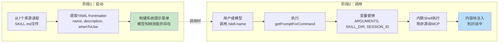
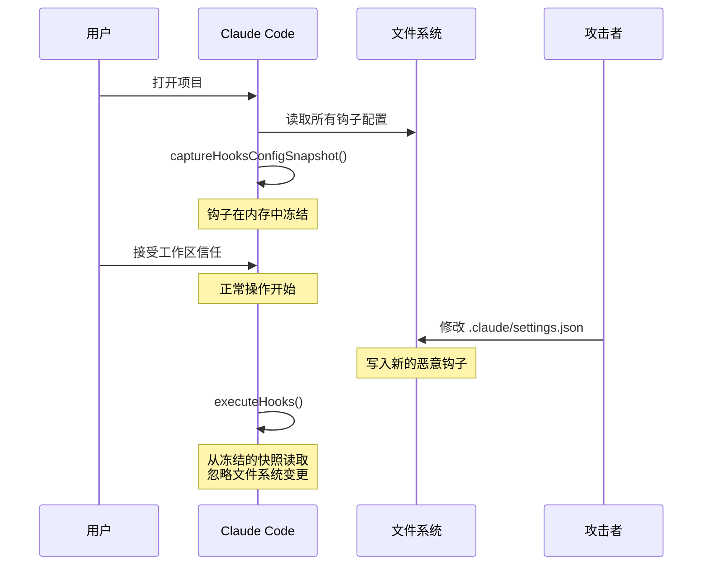
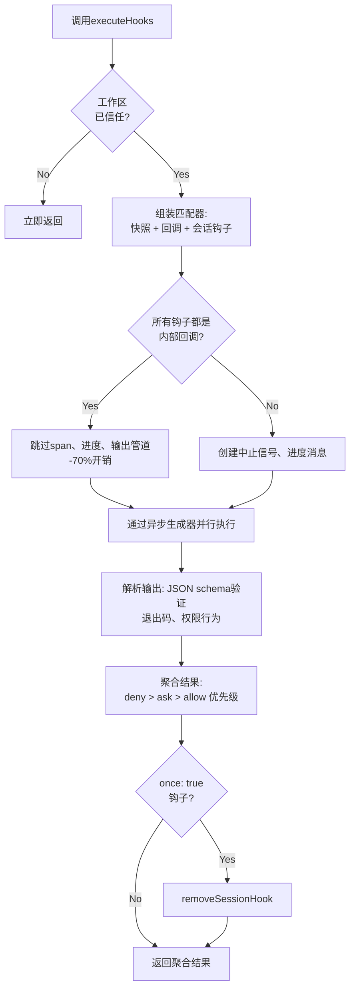

# 第12章：可扩展性——技能与钩子

## 扩展的两个维度

每个可扩展性系统都需要回答两个问题：系统能做什么，以及何时去做。大多数框架将这两者混为一谈——插件在同一个对象中同时注册功能和生命周期回调，导致“添加功能”与“拦截功能”之间的界限模糊成一个单一的注册 API。

Claude Code 将二者清晰地分离开来。技能（Skills）扩展模型的能力。它们是转化为斜杠命令的 Markdown 文件，在被调用时向对话中注入新的指令。钩子（Hooks）扩展事情发生的时间和方式。它们是生命周期拦截器，在会话期间的二十多个不同节点触发，运行任意代码以阻止操作、修改输入、强制继续执行或静默观察。

这种分离并非偶然。技能是内容——它们通过添加提示词文本来扩展模型的知识和能力。钩子是控制流——它们在不改变模型已知内容的前提下修改执行路径。一个技能可以教会模型如何运行团队的部署流程；一个钩子则可以确保在未通过测试套件之前不执行任何部署命令。技能增加能力；钩子增加约束。

本章将深入探讨这两个系统，随后分析它们的交汇点：技能声明的钩子，即在技能被调用时注册为会话级生命周期拦截器的机制。

---

## 技能：教授模型新本领

### 两阶段加载

技能系统的核心优化在于：frontmatter 在启动时加载，但完整内容仅在调用时才加载。



**阶段1** 读取每个 `SKILL.md` 文件，将 YAML frontmatter 与 Markdown 正文分离，并提取元数据。frontmatter 字段成为系统提示的一部分，使模型知晓该技能的存在。Markdown 正文被捕获在闭包中但不进行处理。一个拥有50个技能的项目仅需支付50条简短描述的 token 成本，而非50份完整文档的成本。

**阶段2** 在模型或用户调用技能时触发。`getPromptForCommand` 会前置基础目录，替换变量（`$ARGUMENTS`、`${CLAUDE_SKILL_DIR}`、`${CLAUDE_SESSION_ID}`），并执行内联 shell 命令（以 `` !` `` 为前缀）。结果作为内容块返回并注入到对话中。

### 七个来源及其优先级

技能来自七个不同的来源，并行加载并按优先级合并：

| 优先级 | 来源 | 位置 | 备注 |
|----------|--------|----------|-------|
| 1 | 托管（策略） | `<MANAGED_PATH>/.claude/skills/` | 企业管控 |
| 2 | 用户 | `~/.claude/skills/` | 个人所有，全局可用 |
| 3 | 项目 | `.claude/skills/`（向上遍历至主目录） | 纳入版本控制 |
| 4 | 附加目录 | `<add-dir>/.claude/skills/` | 通过 `--add-dir` 标志指定 |
| 5 | 旧版命令 | `.claude/commands/` | 向后兼容 |
| 6 | 内置 | 编译进二进制文件 | 受特性开关控制 |
| 7 | MCP | MCP 服务器提示 | 远程，不可信 |

去重机制使用 `realpath` 来解析符号链接和重叠的父目录。先发现的来源优先。`getFileIdentity` 函数通过 `realpath` 解析为规范路径，而不是依赖 inode 值，因为 inode 在容器/NFS 挂载和 ExFAT 文件系统上不可靠。

### Frontmatter 契约

控制技能行为的关键 frontmatter 字段：

| YAML 字段 | 用途 |
|-----------|---------|
| `name` | 面向用户的显示名称 |
| `description` | 在自动补全和系统提示中显示 |
| `when_to_use` | 供模型发现使用的详细场景描述 |
| `allowed-tools` | 技能可使用的工具列表 |
| `disable-model-invocation` | 阻止模型自主调用 |
| `context` | 设为 `'fork'` 以作为子代理运行 |
| `hooks` | 调用时注册的生命周期钩子 |
| `paths` | 用于条件激活的 glob 模式 |

`context: 'fork'` 选项使技能作为拥有独立上下文窗口的子代理运行，这对于需要大量工作且不希望占用主对话 token 预算的技能至关重要。`disable-model-invocation` 和 `user-invocable` 字段控制两个不同的访问路径——将两者都设为 true 会使技能不可见，这对仅包含钩子的技能很有用。

### MCP 安全边界

变量替换后，内联 shell 命令会被执行。安全边界是绝对的：**MCP 技能绝不执行内联 shell 命令。** MCP 服务器是外部系统。如果允许，包含 `` !`rm -rf /` `` 的 MCP 提示将以用户的完整权限执行。系统将 MCP 技能视为纯内容。这一信任边界与第15章讨论的更广泛的 MCP 安全模型相关联。

### 动态发现

技能不仅在启动时加载。当模型访问文件时，`discoverSkillDirsForPaths` 会从每个路径向上遍历查找 `.claude/skills/` 目录。带有 `paths` frontmatter 的技能存储在 `conditionalSkills` 映射中，仅当被访问的路径匹配其模式时才激活。声明了 `paths: "packages/database/**"` 的技能在模型读取或编辑数据库文件之前保持不可见——这是一种上下文感知的能力扩展。

---

## 钩子：控制事情发生的时机

钩子是 Claude Code 在生命周期节点拦截和修改行为的机制。主执行引擎超过 4,900 行代码。该系统服务于三类受众：个人开发者（自定义 lint、验证）、团队（纳入项目的共享质量门禁）和企业（策略管理的合规规则）。

### 真实案例：阻止提交到 Main 分支

在深入探讨底层机制之前，先看看钩子在实践中的样子。假设你的团队希望阻止模型直接提交到 `main` 分支。

**步骤1：settings.json 配置：**

```json
{
  "hooks": {
    "PreToolUse": [
      {
        "matcher": "Bash",
        "hooks": [
          {
            "type": "command",
            "command": "/path/to/check-not-main.sh",
            "if": "Bash(git commit*)"
          }
        ]
      }
    ]
  }
}
```

**步骤2：Shell 脚本：**

```bash
#!/bin/bash
BRANCH=$(git rev-parse --abbrev-ref HEAD 2>/dev/null)
if [ "$BRANCH" = "main" ]; then
  echo "Cannot commit directly to main. Create a feature branch first." >&2
  exit 2  # Exit 2 = blocking error
fi
exit 0
```

**步骤3：模型的体验。** 当模型尝试在 `main` 分支上执行 `git commit` 时，钩子会在命令执行前触发。脚本检查分支，写入 stderr，并以退出码 2 退出。模型看到一条系统消息：“Cannot commit directly to main. Create a feature branch first.”。提交从未执行。模型转而创建分支并在该分支上提交。

`if: "Bash(git commit*)"` 条件意味着脚本仅针对 git commit 命令运行——而非每次 Bash 调用。退出码 2 表示阻止；退出码 0 表示通过；任何其他退出码产生非阻塞警告。这就是完整的协议。

### 四种用户可配置类型

Claude Code 定义了六种钩子类型——四种用户可配置，两种内部使用。

**命令钩子（Command hooks）** 生成一个 shell 进程。钩子输入 JSON 通过管道传入 stdin；钩子通过退出码和 stdout/stderr 进行通信。这是主力类型。

**提示钩子（Prompt hooks）** 进行单次 LLM 调用，返回 `{"ok": true}` 或 `{"ok": false, "reason": "..."}`。轻量级的 AI 驱动验证，无需完整的代理循环。

**代理钩子（Agent hooks）** 运行多轮代理循环（最多50轮，`dontAsk` 权限，禁用思考）。每个钩子拥有独立的会话作用域。这是用于“验证测试套件是否通过并覆盖新功能”的重型机制。

**HTTP 钩子（HTTP hooks）** 将钩子输入 POST 到指定 URL。支持远程策略服务器和审计日志记录，无需本地进程生成。

两种内部类型是**回调钩子（callback hooks）**（以编程方式注册，通过跳过 span 追踪的快速路径减少热路径上70%的开销）和**函数钩子（function hooks）**（会话级 TypeScript 回调，用于在代理钩子中强制执行结构化输出）。

### 五个最重要的生命周期事件

钩子系统在二十多个生命周期节点触发。其中五个在实际使用中占主导地位：

**PreToolUse** —— 在每次工具执行前触发。可以阻止、修改输入、自动批准或注入上下文。权限行为遵循严格的优先级：deny > ask > allow。这是质量门禁最常用的钩子点。

**PostToolUse** —— 在成功执行后触发。可以注入上下文或完全替换 MCP 工具输出。适用于对工具结果的自动化反馈。

**Stop** —— 在 Claude 结束响应前触发。阻塞型钩子会强制继续执行。这是自动化验证循环的机制：“你真的完成了吗？”

**SessionStart** —— 在会话开始时触发。可以设置环境变量、覆盖第一条用户消息或注册文件监视路径。不能阻止（钩子无法阻止会话启动）。

**UserPromptSubmit** —— 在用户提交提示时触发。可以阻止处理，从而在模型看到提示之前启用输入验证或内容过滤。

**参考表——其余事件：**

| 类别 | 事件 |
|----------|--------|
| 工具生命周期 | PostToolUseFailure, PermissionDenied, PermissionRequest |
| 会话 | SessionEnd (1.5s timeout), Setup |
| 子代理 | SubagentStart, SubagentStop |
| 压缩 | PreCompact, PostCompact |
| 通知 | Notification, Elicitation, ElicitationResult |
| 配置 | ConfigChange, InstructionsLoaded, CwdChanged, FileChanged, TaskCreated, TaskCompleted, TeammateIdle |

这种阻塞不对称性是有意设计的。代表可恢复决策的事件（工具调用、停止条件）支持阻塞。代表不可撤销事实的事件（会话已启动、API 失败）则不支持。

### 退出码语义

对于命令钩子，退出码具有特定含义：

| 退出码 | 含义 | 是否阻塞 |
|-----------|---------|--------|
| 0 | 成功，若 stdout 为 JSON 则解析 | 否 |
| 2 | 阻塞错误，stderr 作为系统消息显示 | 是 |
| 其他 | 非阻塞警告，仅向用户显示 | 否 |

选择退出码 2 是经过深思熟虑的。退出码 1 太常见了——任何未处理的异常、断言失败或语法错误都会产生退出码 1。使用退出码 2 可防止意外强制执行。

### 六个钩子来源

| 来源 | 信任级别 | 备注 |
|--------|-------------|-------|
| `userSettings` | 用户 | `~/.claude/settings.json`，最高优先级 |
| `projectSettings` | 项目 | `.claude/settings.json`，纳入版本控制 |
| `localSettings` | 本地 | `.claude/settings.local.json`，被 gitignore |
| `policySettings` | 企业 | 不可被覆盖 |
| `pluginHook` | 插件 | 优先级 999（最低） |
| `sessionHook` | 会话 | 仅存在于内存中，由技能注册 |

---

## 快照安全模型

钩子执行任意代码。项目的 `.claude/settings.json` 可以定义在每次工具调用前触发的钩子。如果恶意仓库在用户接受工作区信任对话框后修改了其钩子，会发生什么？

什么都不会发生。钩子配置在启动时被冻结。



`captureHooksConfigSnapshot()` 在启动期间仅被调用一次。从那时起，`executeHooks()` 从快照中读取，不再隐式重新读取设置文件。快照仅通过显式渠道更新：`/hooks` 命令或文件监视器检测，两者都通过 `updateHooksConfigSnapshot()` 重建。

策略执行级联：策略设置中的 `disableAllHooks` 清除所有内容。`allowManagedHooksOnly` 排除用户和项目钩子。用户可以通过设置 `disableAllHooks` 禁用自己的钩子，但不能禁用企业托管的钩子。策略层始终优先。

信任检查本身（`shouldSkipHookDueToTrust()`）是在两个漏洞之后引入的：当用户*拒绝*信任对话框时 SessionEnd 钩子仍会执行，以及在呈现信任提示之前 SubagentStop 钩子就已触发。两者都有相同的根本原因——钩子在用户尚未同意执行工作区代码的生命周期状态下触发。修复方案是在 `executeHooks()` 顶部设置一个集中式门控。

---

## 执行流程



内部回调的快速路径是一项重要的优化。当所有匹配的钩子都是内部的（文件访问分析、提交归属）时，系统跳过 span 追踪、中止信号创建、进度消息和完整的输出处理管道。大多数 PostToolUse 调用仅命中内部回调。

钩子输入 JSON 通过惰性 `getJsonInput()` 闭包序列化一次，并在所有并行钩子中复用。环境注入会设置 `CLAUDE_PROJECT_DIR`、`CLAUDE_PLUGIN_ROOT`，对于某些事件还会设置 `CLAUDE_ENV_FILE`，钩子可以在其中写入环境导出。

---

## 集成：技能与钩子的交汇

当技能被调用时，其 frontmatter 声明的钩子会注册为会话级钩子。`skillRoot` 成为钩子 shell 命令的 `CLAUDE_PLUGIN_ROOT`：

```
my-skill/
  SKILL.md          # 技能内容
  validate.sh       # 由frontmatter中声明的PreToolUse钩子调用
```

技能的 frontmatter 声明：

```yaml
hooks:
  PreToolUse:
    - matcher: "Bash"
      hooks:
        - type: command
          command: "${CLAUDE_PLUGIN_ROOT}/validate.sh"
          once: true
```

当用户调用 `/my-skill` 时，技能内容加载到对话中，并且 PreToolUse 钩子完成注册。下一次 Bash 工具调用将触发 `validate.sh`。由于设置了 `once: true`，钩子在首次成功执行后会自行移除。

对于代理，frontmatter 中声明的 `Stop` 钩子会自动转换为 `SubagentStop` 钩子，因为子代理触发的是 `SubagentStop` 而非 `Stop`。如果没有这种转换，代理的停止验证钩子将永远不会触发。

### 权限行为优先级

`executePreToolHooks()` 可以阻止（通过 `blockingError`）、自动批准（通过 `permissionBehavior: 'allow'`）、强制询问（通过 `'ask'`）、拒绝（通过 `'deny'`）、修改输入（通过 `updatedInput`）或添加上下文（通过 `additionalContext`）。当多个钩子返回不同的行为时，deny 始终优先。对于安全相关的决策，这是正确的默认设置。

### Stop 钩子：强制继续执行

当 Stop 钩子返回退出码 2 时，stderr 会作为反馈显示给模型，对话继续进行。这将单次提示-响应转变为目标导向的循环。Stop 钩子可以说是整个系统中最强大的集成点。

---

## 实践应用：设计可扩展性系统

**将内容与控制流分离。** 技能增加能力；钩子约束行为。将两者混淆会导致无法理清插件究竟是做了什么还是阻止了什么。

**在信任边界处冻结配置。** 快照机制在同意时刻捕获钩子，且永不隐式重新读取。如果你的系统执行用户提供的代码，这可以消除 TOCTOU（检查时间与使用时间不一致）攻击。

**使用不常见的退出码作为语义信号。** 退出码 1 是噪声——每个未处理的错误都会产生它。使用退出码 2 作为阻塞信号可防止意外强制执行。选择的信号应需要刻意意图才能触发。

**在套接字层级而非应用层级进行验证。** SSRF 防护在 DNS 查找时运行，而不是作为预检检查。这消除了 DNS 重绑定窗口。在验证网络目标时，检查必须与连接是原子的。

**针对常见情况进行优化。** 内部回调快速路径（-70% 开销）认识到大多数钩子调用仅命中内部回调。两阶段技能加载认识到大多数技能在给定会话中从未被调用。每项优化都针对实际的使用分布。

该可扩展性系统反映了对能力与安全之间张力的成熟理解。技能赋予模型新的能力，并受限于 MCP 安全线（第15章）。钩子赋予外部代码对模型行为的影响力，并受限于快照机制、退出码语义和策略级联。两个系统互不信任——正是这种相互不信任使得组合起来能够安全地大规模部署。

下一章将转向视觉层：介绍 Claude Code 如何以 60fps 渲染响应式终端 UI 并跨五种终端协议处理输入。
