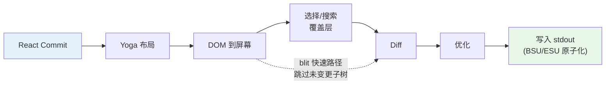
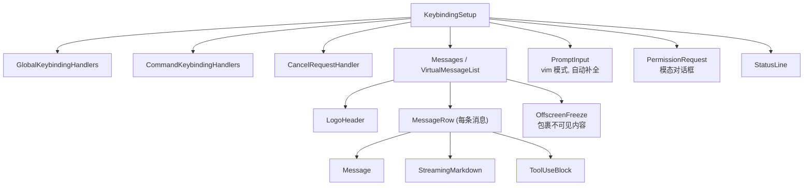

# 第 13 章：终端 UI

## 为什么要构建自定义渲染器？

终端不是浏览器。这里没有 DOM，没有 CSS 引擎，没有合成器，也没有保留模式（retained-mode）图形管线。有的只是流向 stdout 的字节流和来自 stdin 的字节流。这两个流之间的一切——布局、样式、diff 比对、命中测试、滚动、选择——都必须从头发明。

Claude Code 需要一个响应式 UI。它包含提示符输入框、流式 Markdown 输出、权限对话框、进度加载动画、可滚动的消息列表、搜索高亮以及 vim 模式编辑器。React 是声明此类组件树的显而易见之选。但 React 需要一个宿主环境来进行渲染，而终端并不提供这样的环境。

Ink 是标准答案：一个基于 Yoga 实现 flexbox 布局的终端 React 渲染器。Claude Code 最初使用 Ink，随后对其进行了大幅 fork，以至于面目全非。原版 Ink 每帧为每个单元格分配一个 JavaScript 对象——在 200x120 的终端上，这意味着每 16ms 就要创建并垃圾回收 24,000 个对象。它在字符串层面进行 diff 比对，比较整行 ANSI 编码的文本。它没有位块传输（blit）优化的概念，没有双缓冲，也没有单元格级别的脏标记追踪。对于一个每秒刷新一次的简单 CLI 仪表盘来说，这没问题。但对于一个以 60fps 流式传输 token，同时用户在包含数百条消息的对话中滚动的 LLM Agent 来说，这是完全不可行的。

Claude Code 中保留下来的是一个自定义渲染引擎，它继承了 Ink 的概念基因——React reconciler、Yoga 布局、ANSI 输出——但重新实现了关键路径：使用紧凑的类型化数组代替每单元格对象，使用基于池的字符串驻留（string interning）代替每帧字符串，使用带单元格级 diff 的双缓冲渲染，以及一个将相邻终端写入合并为最小转义序列的优化器。

其结果是在 200 列终端上以 60fps 运行，同时从 Claude 流式接收 token。为了理解其实现原理，我们需要考察四个层面：React 进行协调（reconcile）的自定义 DOM、将该 DOM 转换为终端输出的渲染管线、使系统在长达数小时的会话中保持活力而不被垃圾回收淹没的基于池的内存管理，以及将所有这些联系在一起的组件架构。

---

## 自定义 DOM

React 的 reconciler 需要有一个协调目标。在浏览器中，那是 DOM。在 Claude Code 的终端中，它是一个自定义的内存树，包含七种元素类型和一种文本节点类型。

这些元素类型直接映射到终端渲染概念：

- **`ink-root`** -- 文档根节点，每个 Ink 实例一个
- **`ink-box`** -- flexbox 容器，相当于终端中的 `<div>`
- **`ink-text`** -- 带有 Yoga measure 函数用于自动换行的文本节点
- **`ink-virtual-text`** -- 嵌套在另一个文本节点内的带样式文本（当处于文本上下文中时，自动从 `ink-text` 提升而来）
- **`ink-link`** -- 超链接，通过 OSC 8 转义序列渲染
- **`ink-progress`** -- 进度指示器
- **`ink-raw-ansi`** -- 具有已知尺寸的预渲染 ANSI 内容，用于语法高亮的代码块

每个 `DOMElement` 都携带渲染管线所需的状态：

```typescript
// 示意性代码 — 实际接口比这扩展得多
interface DOMElement {
  yogaNode: YogaNode;           // Flexbox 布局节点
  style: Styles;                // 映射到 Yoga 的类 CSS 属性
  attributes: Map<string, DOMNodeAttribute>;
  childNodes: (DOMElement | TextNode)[];
  dirty: boolean;               // 需要重新渲染
  _eventHandlers: EventHandlerMap; // 与 attributes 分离
  scrollTop: number;            // 命令式滚动状态
  pendingScrollDelta: number;
  stickyScroll: boolean;
  debugOwnerChain?: string;     // 用于调试的 React 组件栈
}
```

将 `_eventHandlers` 与 `attributes` 分离是有意为之的。在 React 中，handler 的身份在每次渲染时都会改变（除非手动 memoize）。如果 handler 作为 attribute 存储，每次渲染都会将节点标记为脏并触发完整重绘。通过单独存储它们，reconciler 的 `commitUpdate` 可以在不弄脏节点的情况下更新 handler。

`markDirty()` 函数是 DOM 变更与渲染管线之间的桥梁。当任何节点的内容发生变化时，`markDirty()` 会向上遍历所有祖先节点，在每个元素上设置 `dirty = true`，并在叶子文本节点上调用 `yogaNode.markDirty()`。这就是深层嵌套文本节点中的单个字符更改如何调度从该节点到根的整个路径重新渲染的方式——但也仅限于该路径。兄弟子树保持干净，可以直接从上一帧进行位块传输（blit）。

`ink-raw-ansi` 元素类型值得特别说明。当代码块已经过语法高亮处理（生成了 ANSI 转义序列）时，重新解析这些序列以提取字符和样式将是浪费资源的。相反，预高亮的内容被包装在一个带有 `rawWidth` 和 `rawHeight` 属性的 `ink-raw-ansi` 节点中，告知 Yoga 确切的尺寸。渲染管线直接将原始 ANSI 内容写入输出缓冲区，而无需将其分解为单独的带样式字符。这使得语法高亮的代码块在初始高亮处理之后基本上是零成本的——UI 中最昂贵的视觉元素同时也是渲染成本最低的。

`ink-text` 节点的 measure 函数值得深入理解，因为它在 Yoga 的布局过程中运行，该过程是同步且阻塞的。该函数接收可用宽度并必须返回文本的尺寸。它执行自动换行（遵循 `wrap` 样式属性：`wrap`、`truncate`、`truncate-start`、`truncate-middle`），考虑字素簇（grapheme cluster）边界（因此不会将多码点 emoji 跨行拆分），正确测量 CJK 全角字符（每个计为 2 列），并从宽度计算中剥离 ANSI 转义码（转义序列的视觉宽度为零）。所有这些必须在每个节点微秒级内完成，因为一个包含 50 个可见文本节点的对话意味着每次布局过程要调用 50 次 measure 函数。

---

## React Fiber 容器

Reconciler 桥接层使用 `react-reconciler` 创建自定义宿主配置（host config）。这与 React DOM 和 React Native 使用的 API 相同。关键区别在于：Claude Code 运行在 `ConcurrentRoot` 模式下。

```typescript
createContainer(rootNode, ConcurrentRoot, ...)
```

ConcurrentRoot 启用了 React 的并发特性——用于懒加载语法高亮的 Suspense，以及用于流式传输期间非阻塞状态更新的 transitions。另一种选择 `LegacyRoot` 会强制同步渲染，并在繁重的 Markdown 重新解析期间阻塞事件循环。

宿主配置方法将 React 操作映射到自定义 DOM：

- **`createInstance(type, props)`** 通过 `createNode()` 创建一个 `DOMElement`，应用初始样式和属性，附加事件处理器，并捕获 React 组件所有者链（owner chain）用于调试归因。所有者链存储为 `debugOwnerChain`，并由 `CLAUDE_CODE_DEBUG_REPAINTS` 模式使用，以将全屏重置归因于特定组件
- **`createTextInstance(text)`** 创建一个 `TextNode`——但前提是我们在文本上下文内部。Reconciler 强制要求原始字符串必须包装在 `<Text>` 中。试图在文本上下文之外创建文本节点会抛出异常，从而在协调阶段而非渲染阶段捕获一类错误
- **`commitUpdate(node, type, oldProps, newProps)`** 通过浅比较对旧新 props 进行 diff，然后仅应用变更部分。样式、属性和事件处理器各有自己的更新路径。如果没有任何变化，diff 函数返回 `undefined`，完全避免不必要的 DOM 变更
- **`removeChild(parent, child)`** 从树中移除节点，递归释放 Yoga 节点（在 `free()` 之前调用 `unsetMeasureFunc()` 以避免访问已释放的 WASM 内存），并通知焦点管理器
- **`hideInstance(node)` / `unhideInstance(node)`** 切换 `isHidden` 并在 `Display.None` 和 `Display.Flex` 之间切换 Yoga 节点。这是 React 处理 Suspense fallback 过渡的机制
- **`resetAfterCommit(container)`** 是关键钩子：它调用 `rootNode.onComputeLayout()` 运行 Yoga，然后调用 `rootNode.onRender()` 调度终端绘制

Reconciler 在每个 commit 周期跟踪两个性能计数器：Yoga 布局时间 (`lastYogaMs`) 和总 commit 时间 (`lastCommitMs`)。这些数据流入 Ink 类报告的 `FrameEvent`，使得生产环境中的性能监控成为可能。

事件系统镜像了浏览器的捕获/冒泡模型。`Dispatcher` 类实现了完整的事件传播，分为三个阶段：捕获阶段（从根到目标）、目标阶段和冒泡阶段（从目标到根）。事件类型映射到 React 调度优先级——键盘和点击事件为离散型（discrete，最高优先级，立即处理），滚动和调整大小为连续型（continuous，可延迟）。Dispatcher 将所有事件处理包装在 `reconciler.discreteUpdates()` 中，以确保正确的 React 批处理。

当你在终端按下按键时，产生的 `KeyboardEvent` 会通过自定义 DOM 树分发，从聚焦元素冒泡到根节点，就像键盘事件在浏览器 DOM 元素中冒泡一样。路径上的任何处理器都可以调用 `stopPropagation()` 或 `preventDefault()`，其语义与浏览器规范完全相同。

---

## 渲染管线

每一帧都要经过七个阶段，每个阶段单独计时：



每个阶段单独计时并在 `FrameEvent.phases` 中报告。这种分阶段插桩对于诊断性能问题至关重要：当一帧耗时 30ms 时，你需要知道瓶颈是 Yoga 重新测量文本（阶段 2）、渲染器遍历大型脏子树（阶段 3），还是慢速终端导致的 stdout 背压（阶段 7）。答案决定了修复方案。

**阶段 1：React commit 和 Yoga 布局。** Reconciler 处理状态更新并调用 `resetAfterCommit`。这将根节点的宽度设置为 `terminalColumns` 并运行 `yogaNode.calculateLayout()`。Yoga 按照 CSS flexbox 规范一次性计算整个 flexbox 树：它解析所有节点的 flex-grow、flex-shrink、padding、margin、gap、alignment 和换行。结果——`getComputedWidth()`、`getComputedHeight()`、`getComputedLeft()`、`getComputedTop()`——按节点缓存。对于 `ink-text` 节点，Yoga 在布局期间调用自定义 measure 函数 (`measureTextNode`)，通过自动换行和字素测量计算文本尺寸。这是每节点最昂贵的操作：它必须处理 Unicode 字素簇、CJK 全角字符、emoji 序列以及嵌入文本内容中的 ANSI 转义码。

**阶段 2：DOM 到屏幕。** 渲染器深度优先遍历 DOM 树，将字符和样式写入 `Screen` 缓冲区。每个字符变成一个紧凑单元格。输出是一个完整的帧：终端上的每个单元格都有定义的字符、样式和宽度。

**阶段 3：覆盖层。** 文本选择和搜索高亮就地修改屏幕缓冲区，翻转匹配单元格的样式 ID。选择应用反色（inverse video）以创建熟悉的“高亮文本”外观。搜索高亮应用更激进的视觉效果：当前匹配项使用反色 + 黄色前景 + 粗体 + 下划线，其他匹配项仅使用反色。这会污染缓冲区——由 `prevFrameContaminated` 标志跟踪，以便下一帧知道跳过 blit 快速路径。这种污染是一种有意的权衡：就地修改缓冲区避免了分配单独的覆盖层缓冲区（在 200x120 终端上节省 48KB），代价是在清除覆盖层后产生一帧的全损（full-damage）渲染。

**阶段 4：Diff。** 新屏幕与前帧屏幕逐单元格比较。只有变化的单元格才会产生输出。比较是每个单元格两次整数比较（两个紧凑的 `Int32` 字），并且 diff 遍历损伤矩形（damage rectangle）而非整个屏幕。在稳态帧（仅有加载动画跳动）上，这可能只为 24,000 个单元格中的 3 个生成补丁。每个补丁是一个 `{ type: 'stdout', content: string }` 对象，包含光标移动序列和 ANSI 编码的单元格内容。

**阶段 5：优化。** 同一行上的相邻补丁被合并为单次写入。冗余的光标移动被消除——如果补丁 N 结束于第 10 列，补丁 N+1 开始于第 11 列，则光标已在正确位置，无需移动序列。样式转换通过 `StylePool.transition()` 缓存预序列化，因此从“粗体红色”变为“暗绿色”只是一次缓存字符串查找，而非 diff 加序列化操作。与朴素的逐单元格输出相比，优化器通常可减少 30-50% 的字节数。

**阶段 6：写入。** 优化后的补丁被序列化为 ANSI 转义序列，并在单次 `write()` 调用中写入 stdout，在支持同步更新的终端上包裹在 BSU/ESU 标记中。BSU（Begin Synchronized Update，`ESC [ ? 2026 h`）告诉终端缓冲后续所有输出，ESU（`ESC [ ? 2026 l`）告诉终端刷新。这在支持该协议的终端上消除了可见的画面撕裂——整帧原子化显示。

每一帧通过 `FrameEvent` 对象报告其耗时细分：

```typescript
interface FrameEvent {
  durationMs: number;
  phases: {
    renderer: number;    // DOM 到屏幕
    diff: number;        // 屏幕比较
    optimize: number;    // 补丁合并
    write: number;       // stdout 写入
    yoga: number;        // 布局计算
  };
  yogaVisited: number;   // 遍历的节点数
  yogaMeasured: number;  // 运行 measure() 的节点数
  yogaCacheHits: number; // 命中布局缓存的节点数
  flickers: FlickerEvent[];  // 全屏重置归因
}
```

当启用 `CLAUDE_CODE_DEBUG_REPAINTS` 时，全屏重置会通过 `findOwnerChainAtRow()` 归因于其源 React 组件。这相当于终端版的 React DevTools “Highlight Updates”——它向你展示是哪个组件导致了整个屏幕重绘，这是渲染管线中可能发生的最昂贵的事情。

Blit 优化值得特别关注。当一个节点不脏且自上一帧以来位置未变（通过节点缓存检查）时，渲染器直接从 `prevScreen` 复制单元格到当前屏幕，而不是重新渲染子树。这使得稳态帧极其廉价——在仅有加载动画跳动的典型帧上，blit 覆盖了 99% 的屏幕，只有加载动画的 3-4 个单元格是从头重新渲染的。

在三种情况下 blit 会被禁用：

1. **`prevFrameContaminated` 为 true** -- 选择覆盖层或搜索高亮就地修改了前帧的屏幕缓冲区，因此这些单元格不能作为“正确”的前一状态被信任
2. **绝对定位节点被移除** -- 绝对定位意味着该节点可能覆盖了非兄弟单元格，这些单元格需要从实际拥有它们的元素重新渲染
3. **布局发生偏移** -- 任何节点的缓存位置与其当前计算位置不同，意味着 blit 会将单元格复制到错误的坐标

损伤矩形 (`screen.damage`) 跟踪渲染期间所有写入单元格的边界框。Diff 仅检查此矩形内的行，完全跳过未变更区域。在一个 120 行的终端上，如果流式消息占据第 80-100 行，diff 只检查 20 行而不是 120 行——比较工作量减少了 6 倍。

---

## 双缓冲渲染与帧调度

Ink 类维护两个帧缓冲区：

```typescript
private frontFrame: Frame;  // 当前显示在终端上
private backFrame: Frame;   // 正在渲染中
```

每个 `Frame` 包含：

- `screen: Screen` -- 单元格缓冲区（紧凑 `Int32Array`）
- `viewport: Size` -- 渲染时的终端尺寸
- `cursor: { x, y, visible }` -- 终端光标的停放位置
- `scrollHint` -- alt-screen 模式下的 DECSTBM（滚动区域）优化提示
- `scrollDrainPending` -- ScrollBox 是否有剩余滚动增量待处理

每次渲染后，帧进行交换：`backFrame = frontFrame; frontFrame = newFrame`。旧的前帧成为下一个后帧，为 blit 优化提供 `prevScreen`，并为单元格级 diff 提供基准。

这种双缓冲设计消除了分配。渲染器不再每帧创建新的 `Screen`，而是重用后帧的缓冲区。交换只是一个指针赋值。该模式借鉴自图形编程，其中双缓冲通过确保显示器读取完整帧而渲染器写入另一帧来防止撕裂。在终端环境中，撕裂不是主要顾虑（BSU/ESU 协议已处理）；真正的顾虑是每 16ms 分配和丢弃包含 48KB+ 类型化数组的 `Screen` 对象所带来的 GC 压力。

渲染调度使用 lodash `throttle`，间隔 16ms（约 60fps），并启用前沿和后沿触发：

```typescript
const deferredRender = () => queueMicrotask(this.onRender);
this.scheduleRender = throttle(deferredRender, FRAME_INTERVAL_MS, {
  leading: true,
  trailing: true,
});
```

微任务延迟并非偶然。`resetAfterCommit` 在 React 的 layout effects 阶段之前运行。如果渲染器在此处同步运行，它将错过在 `useLayoutEffect` 中设置的光标声明。微任务在 layout effects 之后但在同一事件循环滴答内运行——终端看到的是单一、一致的帧。

对于滚动操作，单独的 `setTimeout` 设为 4ms (FRAME_INTERVAL_MS >> 2)，提供更快的滚动帧而不干扰节流。滚动变更完全绕过 React：`ScrollBox.scrollBy()` 直接修改 DOM 节点属性，调用 `markDirty()`，并通过微任务调度渲染。没有 React 状态更新，没有协调开销，不会因为单个滚轮事件而重新渲染整个消息列表。

**Resize 处理**是同步的，而非防抖的。当终端调整大小时，`handleResize` 立即更新尺寸以保持布局一致。对于 alt-screen 模式，它重置帧缓冲区并将 `ERASE_SCREEN` 推迟到下一个原子 BSU/ESU 绘制块中，而不是立即写入。同步写入擦除命令会使屏幕在渲染所需的约 80ms 内保持空白；将其推迟到原子块中意味着旧内容保持可见，直到新帧完全准备好。

**Alt-screen 管理**增加了另一层复杂性。`AlternateScreen` 组件在挂载时进入 DEC 1049 备用屏幕缓冲区，将高度限制为终端行数。它使用 `useInsertionEffect`——而非 `useLayoutEffect`——以确保 `ENTER_ALT_SCREEN` 转义序列在第一个渲染帧之前到达终端。使用 `useLayoutEffect` 就太晚了：第一帧会渲染到主屏幕缓冲区，在切换前产生可见的闪烁。`useInsertionEffect` 在 layout effects 之前以及浏览器（或终端）绘制之前运行，使过渡无缝衔接。

---

## 基于池的内存：为什么驻留很重要

200 列乘 120 行的终端有 24,000 个单元格。如果每个单元格都是一个包含 `char` 字符串、`style` 字符串和 `hyperlink` 字符串的 JavaScript 对象，那就是每帧 72,000 次字符串分配——加上单元格本身的 24,000 次对象分配。在 60fps 下，这是每秒 576 万次分配。V8 的垃圾收集器可以处理这个问题，但不可避免地会出现表现为掉帧的暂停。GC 暂停通常为 1-5ms，但它们是不可预测的：可能正好发生在流式 token 更新期间，导致用户在观看输出时出现明显的卡顿。

Claude Code 通过紧凑类型化数组和三个驻留池彻底消除了这个问题。结果是：单元格缓冲区的每帧对象分配为零。唯一的分配发生在池本身（摊销后的，因为大多数字符和样式在第一帧就被驻留并在之后重用）以及 diff 生成的补丁字符串中（不可避免的，因为 stdout.write 需要 string 或 Buffer 参数）。

**单元格布局**每个单元格使用两个 `Int32` 字，存储在连续的 `Int32Array` 中：

```
word0: charId        (32 bits, CharPool 索引)
word1: styleId[31:17] | hyperlinkId[16:2] | width[1:0]
```

同一缓冲区上的并行 `BigInt64Array` 视图支持批量操作——清除一行只需对 64 位字进行一次 `fill()` 调用，而无需逐个字段置零。

**CharPool** 将字符字符串驻留为整数 ID。它对 ASCII 有快速路径：128 项的 `Int32Array` 将字符码直接映射到池索引，完全避免 `Map` 查找。多字节字符（emoji、CJK 表意文字）则回退到 `Map<string, number>`。索引 0 始终是空格，索引 1 始终是空字符串。

```typescript
export class CharPool {
  private strings: string[] = [' ', '']
  private ascii: Int32Array = initCharAscii()

  intern(char: string): number {
    if (char.length === 1) {
      const code = char.charCodeAt(0)
      if (code < 128) {
        const cached = this.ascii[code]!
        if (cached !== -1) return cached
        const index = this.strings.length
        this.strings.push(char)
        this.ascii[code] = index
        return index
      }
    }
    // 多字节字符的 Map 回退
    ...
  }
}
```

**StylePool** 将 ANSI 样式码数组驻留为整数 ID。巧妙之处在于：每个 ID 的第 0 位编码了该样式是否对空格字符有可见效果（背景色、反色、下划线）。仅前景色的样式获得偶数 ID；对空格可见的样式获得奇数 ID。这让渲染器可以通过单次位掩码检查跳过不可见的空格——`if (!(styleId & 1) && charId === 0) continue`——而无需查找样式定义。该池还缓存了任意两个样式 ID 之间预序列化的 ANSI 转换字符串，因此从“粗体红色”转换为“暗绿色”是一次缓存的字符串拼接，而非 diff 加序列化操作。

**HyperlinkPool** 驻留 OSC 8 超链接 URI。索引 0 表示无超链接。

这三个池在前帧和后帧之间共享。这是一个关键的设计决策。因为池是共享的，驻留 ID 在各帧之间有效：blit 优化可以直接将紧凑单元格字从 `prevScreen` 复制到当前屏幕，而无需重新驻留。Diff 可以将 ID 作为整数比较，无需字符串查找。如果每帧有自己的池，blit 将需要重新驻留每个复制的单元格（通过旧 ID 查找字符串，然后在新池中驻留），这将抵消 blit 的大部分性能优势。

池会定期重置（每 5 分钟），以防止长时间会话期间的无限增长。迁移过程将前帧的活跃单元格重新驻留到新池中。

**CellWidth** 使用 2 位分类处理全角字符：

| 值 | 含义 |
|-------|---------|
| 0 (Narrow) | 标准单列字符 |
| 1 (Wide) | CJK/emoji 头部单元格，占两列 |
| 2 (SpacerTail) | 全角字符的第二列 |
| 3 (SpacerHead) | 软换行续行标记 |

这存储在 `word1` 的低 2 位中，使得对紧凑单元格的宽度检查是零成本的——常见情况下无需字段提取。

额外的每单元格元数据存在于并行数组中，而非紧凑单元格内：

- **`noSelect: Uint8Array`** -- 每单元格标志，排除内容被文本选中。用于不应出现在复制文本中的 UI 装饰（边框、指示器）
- **`softWrap: Int32Array`** -- 每行标记，指示自动换行续行。当用户跨软换行行选择文本时，选择逻辑知道不在换行点插入换行符
- **`damage: Rectangle`** -- 当前帧中所有写入单元格的边界框。Diff 仅检查此矩形内的行，完全跳过未变更区域

这些并行数组避免了加宽紧凑单元格格式（这会增加 diff 内循环中的缓存压力），同时提供了选择、复制和优化所需的元数据。

`Screen` 还暴露了一个 `createScreen()` 工厂函数，接受尺寸和池引用。创建屏幕时通过 `BigInt64Array` 视图上的 `fill(0n)` 将 `Int32Array` 置零——这是一个单次原生调用，可在微秒级清除整个缓冲区。这在调整大小（需要新帧缓冲区）和池迁移（旧屏幕单元格重新驻留到新池）期间使用。

---

## REPL 组件

REPL (`REPL.tsx`) 大约有 5,000 行。它是代码库中最大的单个组件，原因充分：它是整个交互体验的编排者。一切都流经它。

该组件大致分为九个部分：

1. **Imports** (~100 行) -- 引入引导状态、命令、历史记录、hooks、组件、快捷键绑定、成本跟踪、通知、swarm/team 支持、语音集成
2. **Feature-flagged imports** -- 通过带 `require()` 的 `feature()` 守卫条件加载语音集成、主动模式、brief 工具和协调器 agent
3. **State management** -- 大量的 `useState` 调用，涵盖消息、输入模式、待处理权限、对话框、成本阈值、会话状态、工具状态和 agent 状态
4. **QueryGuard** -- 管理活跃 API 调用的生命周期，防止并发请求相互冲突
5. **Message handling** -- 处理来自查询循环的传入消息，规范化排序，管理流式状态
6. **Tool permission flow** -- 协调工具使用块与 PermissionRequest 对话框之间的权限请求
7. **Session management** -- 恢复、切换、导出对话
8. **Keybinding setup** -- 连接快捷键绑定提供者：`KeybindingSetup`、`GlobalKeybindingHandlers`、`CommandKeybindingHandlers`
9. **Render tree** -- 综合以上所有内容构建最终 UI

其渲染树在全屏模式下组合完整界面：



`OffscreenFreeze` 是针对终端渲染的特定性能优化。当消息滚动到视口上方时，其 React 元素被缓存，其子树被冻结。这防止了屏幕外消息中基于定时器的更新（加载动画、耗时计数器）触发终端重置。如果没有这个，消息 3 中的旋转指示器会导致完整重绘，即使用户正在查看消息 47。

该组件全程由 React Compiler 编译。编译器不使用手动的 `useMemo` 和 `useCallback`，而是使用槽数组插入表达式级 memoization：

```typescript
const $ = _c(14);  // 14 个 memoization 槽
let t0;
if ($[0] !== dep1 || $[1] !== dep2) {
  t0 = expensiveComputation(dep1, dep2);
  $[0] = dep1; $[1] = dep2; $[2] = t0;
} else {
  t0 = $[2];
}
```

这种模式出现在代码库的每个组件中。它提供了比 `useMemo`（在 hook 级别 memoize）更细的粒度——渲染函数内的单个表达式获得自己的依赖跟踪和缓存。对于像 REPL 这样 5,000 行的组件，这消除了每次渲染中数百个潜在的不必要重新计算。

---

## 选择与搜索高亮

文本选择和搜索高亮作为屏幕缓冲区覆盖层运行，在主渲染之后但在 diff 之前应用。

**文本选择**仅限 alt-screen 模式。Ink 实例持有一个 `SelectionState`，跟踪锚点和焦点、拖动模式（字符/单词/行）以及已滚出屏幕的捕获行。当用户点击并拖动时，选择处理器更新这些坐标。在 `onRender` 期间，`applySelectionOverlay` 遍历受影响的行，并使用 `StylePool.withSelectionBg()` 就地修改单元格样式 ID，该函数返回添加了反色的新样式 ID。这种对屏幕缓冲区的直接修改正是 `prevFrameContaminated` 标志存在的原因——前帧的缓冲区已被覆盖层修改，因此下一帧不能信任它进行 blit 优化，必须进行全损 diff。

鼠标跟踪使用 SGR 1003 模式，该模式报告带有列/行坐标的点击、拖动和移动。`App` 组件实现了多次点击检测：双击选择单词，三击选择行。检测使用 500ms 超时和 1 单元格的位置容差（鼠标在点击之间可以移动一个单元格而不重置多次点击计数器）。超链接点击被此超时有意延迟——双击链接会选择单词而不是打开浏览器，这符合用户对文本编辑器的预期行为。

丢失释放恢复机制处理用户在终端内开始拖动、将鼠标移出窗口然后释放的情况。终端报告按下和拖动，但不报告释放（发生在窗口外）。如果没有恢复机制，选择将永久卡在拖动模式。恢复机制通过检测没有按钮按下的鼠标移动事件来工作——如果我们处于拖动状态并收到无按钮移动事件，我们推断按钮在窗口外被释放并完成选择。

**搜索高亮**有两个并行运行的机制。基于扫描的路径 (`applySearchHighlight`) 遍历可见单元格查找查询字符串并应用 SGR 反色样式。基于位置的路径使用来自 `scanElementSubtree()` 的预计算 `MatchPosition[]`，相对于消息存储，并在已知偏移处应用带有“当前匹配”黄色高亮的堆叠 ANSI 码（反色 + 黄色前景 + 粗体 + 下划线）。黄色前景结合反色变成黄色背景——终端在反色激活时交换前景/背景。下划线是当黄色与现有背景色冲突时的备用可见性标记。

**光标声明**解决了一个微妙的问题。终端模拟器在物理光标位置渲染 IME（输入法编辑器）预编辑文本。CJK 用户在组字时需要光标位于文本输入的插入符号处，而不是终端自然停放的屏幕底部。`useDeclaredCursor` hook 允许组件声明每帧后光标应处的位置。Ink 类从 `nodeCache` 读取声明节点的位置，将其转换为屏幕坐标，并在 diff 之后发出光标移动序列。屏幕阅读器和放大镜也跟踪物理光标，因此该机制既有利于无障碍访问，也有利于 CJK 输入。

在主屏幕模式下，声明的光标位置与 `frame.cursor` 分开跟踪（后者必须停留在内容底部，以满足日志更新的相对移动不变量）。在 alt-screen 模式下，问题更简单：每帧以 `CSI H`（光标归位）开始，因此声明的光标只是在帧末尾发出的绝对位置。

---

## 流式 Markdown

渲染 LLM 输出是终端 UI 面临的最艰巨任务。Token 逐个到达，每秒 10-50 个，每个 token 都会改变可能包含代码块、列表、粗体文本和内联代码的消息内容。朴素的方法——在每个 token 上重新解析整个消息——在规模化时将是灾难性的。

Claude Code 使用了三种优化：

**Token 缓存。** 模块级 LRU 缓存（500 条目）存储以内容哈希为键的 `marked.lexer()` 结果。该缓存在虚拟滚动期间的 React 卸载/重挂载周期中存活。当用户滚回先前可见的消息时，Markdown token 从缓存提供服务，而不是重新解析。

**快速路径检测。** `hasMarkdownSyntax()` 通过单个正则表达式检查前 500 个字符是否有 Markdown 标记。如果未发现语法，它直接构造单段落 token，绕过完整的 GFM 解析器。这在纯文本消息上每次渲染节省约 3ms——当你每秒渲染 60 帧时，这很重要。

**懒加载语法高亮。** 代码块高亮通过 React `Suspense` 加载。`MarkdownBody` 组件立即以 `highlight={null}` 作为 fallback 渲染，然后异步解析 cli-highlight 实例。用户立即看到代码（无样式），然后在一两帧后弹出颜色。

流式情况增加了一层复杂性。当 token 从模型到达时，Markdown 内容增量增长。在每个 token 上重新解析整个内容在消息过程中将是 O(n^2)。快速路径检测有所帮助——大多数流式内容是纯文本段落，完全绕过解析器——但对于包含代码块和列表的消息，LRU 缓存提供了真正的优化。缓存键是内容哈希，因此当 10 个 token 到达且只有最后一段发生变化时，未变更前缀的缓存解析结果被重用。Markdown 渲染器仅重新解析变更的尾部。

`StreamingMarkdown` 组件不同于静态 `Markdown` 组件。它处理内容仍在生成的情况：未完成的代码围栏（有 ` ``` ` 但没有闭合围栏）、部分粗体标记和截断的列表项。流式变体在解析上更宽容——它不会因未闭合语法而报错，因为闭合语法尚未到达。当消息完成流式传输时，组件过渡到静态 `Markdown` 渲染器，应用完整的 GFM 解析和严格的语法检查。

代码块的语法高亮是渲染管线中每元素最昂贵的操作。一个 100 行的代码块用 cli-highlight 高亮可能需要 50-100ms。加载高亮库本身需要 200-300ms（它捆绑了数十种语言的语法定义）。这两项成本都隐藏在 React `Suspense` 之后：代码块立即渲染为纯文本，高亮库异步加载，解析完成后代码块重新渲染带颜色的版本。用户即时看到代码，稍后看到颜色——这比库加载时 300ms 的空白帧体验要好得多。

---

## 实践应用：高效渲染流式输出

终端渲染管线是消除工作的案例研究。三个原则驱动着设计：

**驻留一切。** 如果你有一个出现在数千个单元格中的值——样式、字符、URL——存储一次并通过整数 ID 引用。整数比较是一条 CPU 指令。字符串比较是一个循环。当你的内循环在 60fps 下每帧运行 24,000 次时，整数 `===` 和字符串 `===` 之间的区别就是流畅滚动与可见卡顿的区别。

**在正确的层级 Diff。** 单元格级 diff 听起来很昂贵——每帧 24,000 次比较。但它是每个单元格两次整数比较（紧凑字），并且在稳态帧上，diff 在检查第一个单元格后就会跳出大多数行。替代方案——重新渲染整个屏幕并将其写入 stdout——每帧会产生 100KB+ 的 ANSI 转义序列。Diff 通常产生不到 1KB。

**将热路径与 React 分离。** 滚动事件以鼠标输入频率到达（可能每秒数百次）。将每个事件路由通过 React 的 reconciler——状态更新、协调、commit、布局、渲染——每个事件增加 5-10ms 延迟。通过直接修改 DOM 节点并通过微任务调度渲染，滚动路径保持在 1ms 以内。React 仅在最终绘制时参与，而这无论如何都会运行。

这些原则适用于任何流式输出系统，不仅仅是终端。如果你正在构建渲染实时数据的 Web 应用程序——日志查看器、聊天客户端、监控仪表盘——同样的权衡适用。驻留重复值。对前一帧进行 diff。将热路径保持在响应式框架之外。

第四个原则，特定于长时间运行的会话：**定期清理。** Claude Code 的池随着新字符和样式的驻留单调增长。在数小时的会话中，池可能积累数千个不再被任何活跃单元格引用的条目。5 分钟的重置周期限制了这种增长：每 5 分钟，创建新池，前帧的单元格被迁移（重新驻留到新池），旧池变为垃圾。这是一种分代收集策略，在应用层实施，因为 JavaScript GC 无法感知池条目的语义活性。

使用 `Int32Array` 而非普通对象的决定除了 GC 压力外还有一个更微妙的好处：内存局部性。当 diff 比较 24,000 个单元格时，它遍历连续的类型化数组。现代 CPU 预取顺序内存访问，因此整个屏幕比较在 L1/L2 缓存内运行。每单元格对象的布局会将单元格分散在堆上，使每次比较都变成缓存未命中。性能差异是可测量的：在 200x120 屏幕上，类型化数组 diff 在 0.5ms 内完成，而等效的基于对象的 diff 需要 3-5ms——当与其他管线阶段结合时，足以超出 16ms 的帧预算。

第五个原则适用于任何渲染到固定大小网格的系统：**跟踪损伤边界。** 每个屏幕上的 `damage` 矩形记录了渲染期间写入单元格的边界框。Diff 查阅此矩形并完全跳过其外的行。当流式消息占据 120 行终端的底部 20 行时，diff 检查 20 行，而不是 120 行。结合 blit 优化（仅为重新渲染区域填充损伤矩形，而非 blit 区域），这意味着常见情况——一条消息流式传输而对话其余部分静止——只触及屏幕缓冲区的一小部分。

更广泛的教训是：渲染系统的性能不在于让任何单个操作变快，而在于完全消除操作。Blit 消除了重新渲染。损伤矩形消除了 diff。池共享消除了重新驻留。紧凑单元格消除了分配。每项优化都移除了一整类工作，它们以乘法方式叠加。

量化一下：在 200x120 终端上，最坏情况帧（全部脏，无 blit，全屏损伤）大约需要 12ms。最佳情况帧（一个脏节点，blit 其余所有，3 行损伤矩形）不到 1ms。系统大部分时间处于最佳情况。流式 token 到达触发一个脏文本节点，使其祖先直到消息容器变脏，通常是屏幕的 10-30 行。Blit 处理其他 90-110 行。损伤矩形将 diff 限制在脏区域。池查找是整数操作。流式传输一个 token 的稳态成本主要由 Yoga 布局（重新测量脏文本节点及其祖先）和 Markdown 重新解析主导——而非渲染管线本身。


---


