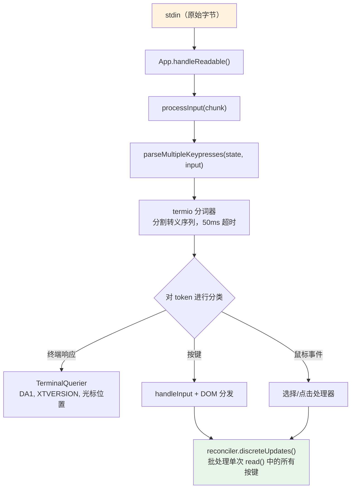
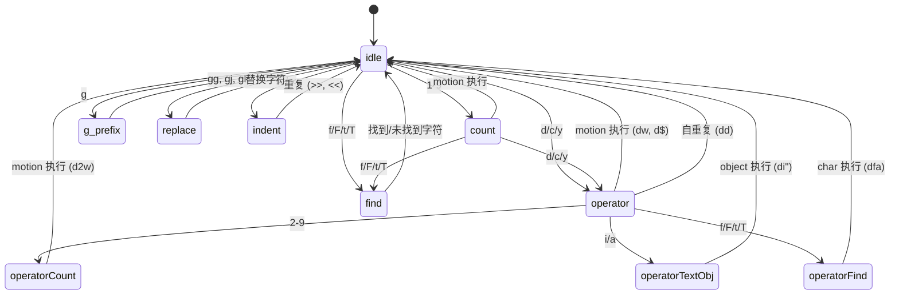

# 第 14 章：输入与交互

## 原始字节与有意义的操作

当你在 Claude Code 中按下 Ctrl+X 紧接着按下 Ctrl+K 时，终端会发送两个字节序列，中间可能间隔约 200 毫秒。第一个是 `0x18`（ASCII CAN）。第二个是 `0x0B`（ASCII VT）。这两个字节本身除了表示“控制字符”外没有任何内在含义。输入系统必须识别出这两个在超时窗口内按顺序到达的字节构成了组合键 `ctrl+x ctrl+k`，该组合键映射到操作 `chat:killAgents`，用于终止所有正在运行的子 agent。

在原始字节与被终止的 agent 之间，有六个系统被激活：一个分词器（tokenizer）分割转义序列，一个解析器根据五种终端协议对其进行分类，一个键绑定解析器将序列与特定上下文的绑定进行匹配，一个组合键状态机管理多键序列，一个处理器执行操作，最后 React 将产生的状态更新批处理为单次渲染。

难点不在于这些系统中的任何一个，而在于终端多样性带来的组合爆炸。iTerm2 发送 Kitty keyboard protocol 序列。macOS Terminal 发送传统的 VT220 序列。通过 SSH 连接的 Ghostty 发送 xterm modifyOtherKeys 序列。tmux 可能会根据其配置吞掉、转换或透传上述任何序列。Windows Terminal 在 VT 模式下也有其自身的怪癖。输入系统必须从所有这些情况中生成正确的 `ParsedKey` 对象，因为用户不应该需要知道他们的终端使用的是哪种键盘协议。

本章追踪了在这一复杂环境中，从原始字节到有意义操作的路径。

设计理念是渐进增强与优雅降级。在支持 Kitty keyboard protocol 的现代终端上，Claude Code 可以获得完整的修饰键检测（Ctrl+Shift+A 与 Ctrl+A 是不同的）、super 键上报（Cmd 快捷键）以及无歧义的按键标识。在通过 SSH 连接的传统终端上，它会回退到可用的最佳协议，虽然丢失了一些修饰键的区分能力，但保持了核心功能的完整性。用户永远不会看到关于其终端不受支持的错误消息。他们可能无法使用 `ctrl+shift+f` 进行全局搜索，但 `ctrl+r` 进行历史搜索在任何地方都能正常工作。

---

## 按键解析管线

输入以字节块的形式到达 stdin。管线分阶段处理它们：



分词器是基础。终端输入是一个字节流，混合了可打印字符、控制代码和多字节转义序列，且没有显式的帧边界。从 stdin 的单次 `read()` 可能返回 `\x1b[1;5A`（Ctrl+Up arrow），也可能在一次读取中返回 `\x1b`，在下一次读取中返回 `[1;5A`，这取决于字节从 PTY 到达的速度。分词器维护一个状态机，缓冲不完整的转义序列并发出完整的 token。

不完整序列问题是根本性的。当分词器看到一个单独的 `\x1b` 时，它无法知道这是 Escape 键还是 CSI 序列的开始。它会缓冲该字节并启动一个 50ms 的计时器。如果没有后续字节到达，缓冲区将被刷新，`\x1b` 变为一次 Escape 按键。但在刷新之前，分词器会检查 `stdin.readableLength`——如果内核缓冲区中有字节在等待，计时器将重新触发而不是刷新。这处理了事件循环被阻塞超过 50ms 且后续字节已被缓冲但尚未被读取的情况。

对于粘贴操作，超时时间延长至 500ms。粘贴的文本可能很大，并且会以多个块的形式到达。

来自单次 `read()` 的所有解析后的按键都在一次 `reconciler.discreteUpdates()` 调用中处理。这会对 React 状态更新进行批处理，使得粘贴 100 个字符只产生一次重新渲染，而不是 100 次。这种批处理至关重要：如果没有它，粘贴中的每个字符都会触发一个完整的协调周期——状态更新、协调、提交、Yoga 布局、渲染、diff、写入。按每个周期 5ms 计算，100 个字符的粘贴将需要 500ms 来处理。有了批处理，同样的粘贴只需一个 5ms 的周期。

### stdin 管理

`App` 组件通过引用计数来管理 raw mode。当任何组件需要原始输入（提示符、对话框、vim 模式）时，它会调用 `setRawMode(true)`，使计数器递增。当不再需要原始输入时，它调用 `setRawMode(false)`，使计数器递减。只有当计数器归零时，raw mode 才会被禁用。这防止了终端应用程序中的一个常见 bug：组件 A 启用 raw mode，组件 B 启用 raw mode，组件 A 禁用 raw mode，然后组件 B 的输入突然中断，因为 raw mode 被全局禁用了。

当首次启用 raw mode 时，App 会：

1. 停止早期输入捕获（即在 React 挂载之前收集按键的引导阶段机制）
2. 将 stdin 置于 raw mode（无行缓冲、无回显、无信号处理）
3. 附加一个 `readable` 监听器以进行异步输入处理
4. 启用 bracketed paste（以便识别粘贴的文本）
5. 启用焦点上报（以便应用程序知道终端窗口何时获得/失去焦点）
6. 启用扩展按键上报（Kitty keyboard protocol + xterm modifyOtherKeys）

在禁用时，所有这些操作都以相反的顺序撤销。这种谨慎的顺序安排防止了转义序列泄漏——在禁用 raw mode 之前先禁用扩展按键上报，可确保终端在应用程序停止解析后不会继续发送 Kitty 编码的序列。

`onExit` 信号处理器（通过 `signal-exit` 包）确保即使在意外终止时也能进行清理。如果进程收到 SIGTERM 或 SIGINT，处理器会在进程退出前禁用 raw mode、恢复终端状态、退出备用屏幕（如果处于活动状态）并重新显示光标。如果没有这个清理过程，崩溃的 Claude Code 会话将使终端处于 raw mode，没有光标也没有回显——用户将需要盲目输入 `reset` 来恢复终端。

---

## 多协议支持

终端对于如何编码键盘输入并没有统一标准。像 Kitty 这样的现代终端模拟器发送带有完整修饰键信息的结构化序列。通过 SSH 连接的传统终端发送模糊的字节序列，需要结合上下文才能解释。Claude Code 的解析器同时处理五种不同的协议，因为用户的终端可能是其中任何一种。

**CSI u（Kitty keyboard protocol）** 是现代标准。格式：`ESC [ codepoint [; modifier] u`。示例：`ESC[13;2u` 是 Shift+Enter，`ESC[27u` 是不带修饰键的 Escape。codepoint 明确地标识了按键——Escape 键本身与作为序列前缀的 Escape 之间不存在歧义。修饰字段将 shift、alt、ctrl 和 super（Cmd）编码为独立的位。Claude Code 在启动时通过 `ENABLE_KITTY_KEYBOARD` 转义序列在支持该协议的终端上启用它，并在退出时通过 `DISABLE_KITTY_KEYBOARD` 禁用它。该协议通过查询/响应握手进行检测：应用程序发送 `CSI ? u`，终端响应 `CSI ? flags u`，其中 `flags` 指示支持的协议级别。

**xterm modifyOtherKeys** 是针对像通过 SSH 连接的 Ghostty 等终端的回退方案，在这些场景下未协商成功 Kitty 协议。格式：`ESC [ 27 ; modifier ; keycode ~`。注意参数顺序与 CSI u 相反——修饰键在 keycode 之前。这是解析器 bug 的常见来源。该协议通过 `CSI > 4 ; 2 m` 启用，当未检测到终端的 TERM 标识时（在未转发 `TERM_PROGRAM` 的 SSH 连接中很常见），Ghostty、tmux 和 xterm 会发出此序列。

**传统终端序列**涵盖了其他所有内容：通过 `ESC O` 和 `ESC [` 序列实现的功能键、方向键、数字键盘、Home/End/Insert/Delete，以及 40 年终端演进过程中积累的 VT100/VT220/xterm 变体大杂烩。解析器使用两个正则表达式来匹配这些序列：`FN_KEY_RE` 用于匹配 `ESC O/N/[/[[` 前缀模式（匹配功能键、方向键及其修饰变体），`META_KEY_CODE_RE` 用于匹配 meta 键代码（`ESC` 后跟单个字母数字字符，即传统的 Alt+key 编码）。

传统序列的挑战在于歧义性。`ESC [ 1 ; 2 R` 可能是 Shift+F3，也可能是光标位置报告，具体取决于上下文。解析器通过私有标记检查来解决这个问题：光标位置报告使用 `CSI ? row ; col R`（带有 `?` 私有标记），而修饰后的功能键使用 `CSI params R`（不带该标记）。这种消歧机制正是 Claude Code 请求 DECXCPR（扩展光标位置报告）而非标准 CPR 的原因——扩展形式是无歧义的。

终端标识增加了另一层复杂性。在启动时，Claude Code 发送一个 `XTVERSION` 查询（`CSI > 0 q`）以发现终端的名称和版本。响应（`DCS > | name ST`）能够在 SSH 连接中存活——不像 `TERM_PROGRAM` 那样是一个不会通过 SSH 传播的环境变量。了解终端身份允许解析器处理特定于终端的怪癖。例如，xterm.js（VS Code 集成终端所使用的）的转义序列行为与原生 xterm 不同，标识字符串（`xterm.js(X.Y.Z)`）允许解析器考虑这些差异。

**SGR 鼠标事件**使用格式 `ESC [ < button ; col ; row M/m`，其中 `M` 表示按下，`m` 表示释放。按钮代码编码了动作：0/1/2 分别表示左/中/右键点击，64/65 表示滚轮上/下（0x40 与滚轮位进行 OR 运算），32+ 表示拖拽（0x20 与运动位进行 OR 运算）。滚轮事件被转换为 `ParsedKey` 对象，以便流经键绑定系统；点击和拖拽事件变为 `ParsedMouse` 对象，路由到选择处理器。

**Bracketed paste** 将粘贴的内容包裹在 `ESC [200~` 和 `ESC [201~` 标记之间。无论粘贴的文本可能包含什么转义序列，标记之间的所有内容都变成一个带有 `isPasted: true` 的单一 `ParsedKey`。这防止了粘贴的代码被解释为命令——当用户粘贴包含 `\x03`（作为原始字节的 Ctrl+C）的代码片段时，这是一个关键的安全特性。

解析器的输出类型构成了一个清晰的判别联合（discriminated union）：

```typescript
type ParsedKey = {
  kind: 'key';
  name: string;        // 'return', 'escape', 'a', 'f1' 等
  ctrl: boolean; meta: boolean; shift: boolean;
  option: boolean; super: boolean;
  sequence: string;    // 用于调试的原始转义序列
  isPasted: boolean;   // 是否在 bracketed paste 内部
}

type ParsedMouse = {
  kind: 'mouse';
  button: number;      // SGR 按钮代码
  action: 'press' | 'release';
  col: number; row: number;  // 从 1 开始索引的终端坐标
}

type ParsedResponse = {
  kind: 'response';
  response: TerminalResponse;  // 路由到 TerminalQuerier
}
```

`kind` 判别字段确保下游代码显式地处理每种输入类型。按键不会被意外地当作鼠标事件处理；终端响应也不会被意外地解释为按键。`ParsedKey` 类型还携带原始的 `sequence` 字符串用于调试——当用户报告“按下 Ctrl+Shift+A 没有任何反应”时，调试日志可以准确显示终端发送了什么字节序列，从而可以诊断问题是在终端的编码、解析器的识别，还是在键绑定的配置中。

`ParsedKey` 上的 `isPasted` 标志对于安全性至关重要。当启用 bracketed paste 时，终端会将粘贴的内容包裹在标记序列中。解析器在生成的按键事件上设置 `isPasted: true`，键绑定解析器会跳过对粘贴按键的键绑定匹配。如果没有这个机制，粘贴包含 `\x03`（作为原始字节的 Ctrl+C）或转义序列的文本将会触发应用程序命令。有了它，无论字节内容是什么，粘贴的内容都被视为纯文本输入。

解析器还能识别终端响应——即终端自身为回应查询而发送的序列。这些包括设备属性（DA1、DA2）、光标位置报告、Kitty keyboard flag 响应、XTVERSION（终端标识）和 DECRPM（模式状态）。这些被路由到 `TerminalQuerier` 而不是输入处理器：

```typescript
type TerminalResponse =
  | { type: 'decrpm'; mode: number; status: number }
  | { type: 'da1'; params: number[] }
  | { type: 'da2'; params: number[] }
  | { type: 'kittyKeyboard'; flags: number }
  | { type: 'cursorPosition'; row: number; col: number }
  | { type: 'osc'; code: number; data: string }
  | { type: 'xtversion'; version: string }
```

**修饰键解码**遵循 XTerm 约定：修饰字段的值为 `1 + (shift ? 1 : 0) + (alt ? 2 : 0) + (ctrl ? 4 : 0) + (super ? 8 : 0)`。`ParsedKey` 中的 `meta` 字段映射到 Alt/Option（第 2 位）。`super` 字段是独立的（第 8 位，macOS 上的 Cmd）。这种区分很重要，因为 Cmd 快捷键由操作系统保留，终端应用程序无法捕获——除非终端使用 Kitty 协议，该协议会上报 super 修饰的按键，而其他协议则会默默吞掉它们。

stdin 间隙检测器会在间隙后 5 秒内没有输入到达时触发终端模式重新声明。这处理了 tmux 重连和笔记本唤醒的场景，在这些场景中，终端的键盘模式可能已被多路复用器或操作系统重置。当重新声明触发时，它会重新发送 `ENABLE_KITTY_KEYBOARD`、`ENABLE_MODIFY_OTHER_KEYS`、bracketed paste 和焦点上报序列。如果没有这个机制，从 tmux 会话分离再重新连接将会默默地将键盘协议降级为传统模式，导致会话剩余时间内的修饰键检测失效。

### 终端 I/O 层

在解析器之下是一个位于 `ink/termio/` 中的结构化终端 I/O 子系统：

- **csi.ts** —— CSI（Control Sequence Introducer）序列：光标移动、擦除、滚动区域、bracketed paste 启用/禁用、焦点事件启用/禁用、Kitty keyboard protocol 启用/禁用
- **dec.ts** —— DEC 私有模式序列：备用屏幕缓冲区（1049）、鼠标跟踪模式（1000/1002/1003）、光标可见性、bracketed paste（2004）、焦点事件（1004）
- **osc.ts** —— Operating System Commands：剪贴板访问（OSC 52）、标签页状态、iTerm2 进度指示器、tmux/screen 多路复用器包装（针对需要穿越多路复用器边界的序列进行 DCS 透传）
- **sgr.ts** —— Select Graphic Rendition：ANSI 样式代码系统（颜色、粗体、斜体、下划线、反色）
- **tokenize.ts** —— 用于转义序列边界检测的有状态分词器

多路复用器包装值得一提。当 Claude Code 在 tmux 内部运行时，某些转义序列（如 Kitty keyboard protocol 协商）必须透传到外部终端。tmux 使用 DCS 透传（`ESC P ... ST`）来转发它不理解的序列。`osc.ts` 中的 `wrapForMultiplexer` 函数检测多路复用器环境并适当地包装序列。如果没有这个机制，Kitty keyboard mode 将在 tmux 内部默默失败，用户永远不知道为什么他们的 Ctrl+Shift 绑定停止了工作。

### 事件系统

`ink/events/` 目录实现了一个兼容浏览器的事件系统，包含七种事件类型：`KeyboardEvent`、`ClickEvent`、`FocusEvent`、`InputEvent`、`TerminalFocusEvent` 以及基础的 `TerminalEvent`。每种事件都携带 `target`、`currentTarget`、`eventPhase`，并支持 `stopPropagation()`、`stopImmediatePropagation()` 和 `preventDefault()`。

包装 `ParsedKey` 的 `InputEvent` 是为了向后兼容旧的 `EventEmitter` 路径，旧组件可能仍在使用该路径。新组件使用带有捕获/冒泡阶段的 DOM 风格键盘事件分发。两条路径都从同一个解析后的按键触发，因此它们始终是一致的——到达 stdin 的一个按键只会产生一个 `ParsedKey`，它同时生成一个 `InputEvent`（供旧监听器使用）和一个 `KeyboardEvent`（供 DOM 风格分发使用）。这种双路径设计允许从 EventEmitter 模式增量迁移到 DOM 事件模式，而不会破坏现有组件。

---

## 键绑定系统

键绑定系统将三个通常纠缠在一起的关注点分离开来：哪个键触发哪个操作（bindings）、操作触发时发生什么（handlers），以及当前哪些绑定处于活动状态（contexts）。

### Bindings：声明式配置

默认绑定在 `defaultBindings.ts` 中定义为 `KeybindingBlock` 对象数组，每个对象都限定在一个上下文中：

```typescript
export const DEFAULT_BINDINGS: KeybindingBlock[] = [
  {
    context: 'Global',
    bindings: {
      'ctrl+c': 'app:interrupt',
      'ctrl+d': 'app:exit',
      'ctrl+l': 'app:redraw',
      'ctrl+r': 'history:search',
    },
  },
  {
    context: 'Chat',
    bindings: {
      'escape': 'chat:cancel',
      'ctrl+x ctrl+k': 'chat:killAgents',
      'enter': 'chat:submit',
      'up': 'history:previous',
      'ctrl+x ctrl+e': 'chat:externalEditor',
    },
  },
  // ... 还有 14 个上下文
]
```

平台特定的绑定在定义时处理。图片粘贴在 macOS/Linux 上是 `ctrl+v`，但在 Windows 上是 `alt+v`（因为在 Windows 上 `ctrl+v` 是系统粘贴）。模式循环在支持 VT 模式的终端上是 `shift+tab`，但在不支持该模式的 Windows Terminal 上是 `meta+m`。受 feature flag 控制的绑定（快速搜索、语音模式、终端面板）会有条件地被包含。

用户可以通过 `~/.claude/keybindings.json` 覆盖任何绑定。解析器接受修饰键别名（`ctrl`/`control`、`alt`/`opt`/`option`、`cmd`/`command`/`super`/`win`）、按键别名（`esc` -> `escape`、`return` -> `enter`）、组合键表示法（空格分隔的步骤，如 `ctrl+k ctrl+s`），以及用于解绑默认键的 null 操作。null 操作不同于不定义绑定——它显式地阻止默认绑定触发，这对于想要收回某个键以供终端自身使用的用户来说很重要。

### Contexts：16 个活动作用域

每个上下文代表一种交互模式，在该模式下应用一组特定的绑定：

| 上下文 | 何时激活 |
|---------|------------|
| Global | 始终 |
| Chat | 提示符输入获得焦点 |
| Autocomplete | 补全菜单可见 |
| Confirmation | 权限对话框正在显示 |
| Scroll | 带有可滚动内容的备用屏幕 |
| Transcript | 只读对话记录查看器 |
| HistorySearch | 反向历史搜索 (ctrl+r) |
| Task | 后台任务正在运行 |
| Help | 帮助覆盖层已显示 |
| MessageSelector | 回溯对话框 |
| MessageActions | 消息光标导航 |
| DiffDialog | Diff 查看器 |
| Select | 通用选择列表 |
| Settings | 配置面板 |
| Tabs | 标签页导航 |
| Footer | 页脚指示器 |

当一个按键到达时，解析器根据当前活动的上下文（由 React 组件状态决定）构建一个上下文列表，对其进行去重并保持优先级顺序，然后搜索匹配的绑定。最后一个匹配的绑定获胜——这就是用户覆盖优先于默认值的方式。上下文列表在每次按键时都会重建（成本很低：最多 16 个字符串的数组拼接和去重），因此上下文的更改无需任何订阅或监听器机制即可立即生效。

上下文设计处理了一种棘手的交互模式：嵌套模态框。当权限对话框在运行中的任务期间出现时，`Confirmation` 和 `Task` 上下文可能都处于活动状态。`Confirmation` 上下文具有更高的优先级（它在组件树中注册得更晚），因此 `y` 触发“批准”而不是任何任务级别的绑定。当对话框关闭时，`Confirmation` 上下文停用，`Task` 绑定恢复。这种堆叠行为自然地从上下文列表的优先级排序中产生——不需要特殊的模态框处理代码。

### 保留的快捷键

并非所有内容都可以重新绑定。系统强制执行三个级别的保留：

**不可重绑定**（硬编码行为）：`ctrl+c`（中断/退出）、`ctrl+d`（退出）、`ctrl+m`（在所有终端中都等同于 Enter——重新绑定它会破坏 Enter 键）。

**终端保留**（警告）：`ctrl+z`（SIGTSTP）、`ctrl+\`（SIGQUIT）。技术上可以绑定它们，但在大多数配置中，终端会在应用程序看到它们之前拦截它们。

**macOS 保留**（错误）：`cmd+c`、`cmd+v`、`cmd+x`、`cmd+q`、`cmd+w`、`cmd+tab`、`cmd+space`。操作系统会在这些快捷键到达终端之前拦截它们。绑定它们将创建一个永远不会触发的快捷键。

### 解析流程

当一个按键到达时，解析路径如下：

1. 构建上下文列表：组件注册的活动上下文加上 Global，去重并保持优先级
2. 针对合并后的绑定表调用 `resolveKeyWithChordState(input, key, contexts)`
3. 若结果为 `match`：清除任何待处理的组合键，调用处理器，对事件执行 `stopImmediatePropagation()`
4. 若结果为 `chord_started`：保存待处理的按键，停止传播，启动组合键超时计时器
5. 若结果为 `chord_cancelled`：清除待处理的组合键，让事件继续传递
6. 若结果为 `unbound`：清除组合键——这是一个显式的解绑（用户将操作设置为 `null`），因此传播被停止但没有处理器运行
7. 若结果为 `none`：传递给其他处理器

“最后者胜”的解析策略意味着，如果默认绑定和用户绑定都在 `Chat` 上下文中定义了 `ctrl+k`，则用户的绑定优先。这是在匹配时通过按定义顺序遍历绑定并保留最后一个匹配项来评估的，而不是在加载时构建覆盖映射。优势在于：特定于上下文的覆盖自然地组合。用户可以覆盖 `Chat` 中的 `enter` 而不影响 `Confirmation` 中的 `enter`。

---

## 组合键支持

`ctrl+x ctrl+k` 绑定是一个组合键（chord）：两个按键共同构成一个操作。解析器通过状态机来管理这一点。

当一个按键到达时：

1. 解析器将其追加到任何待处理的组合键前缀中
2. 它检查是否有任何绑定的组合键以此前缀开头。如果是，它返回 `chord_started` 并保存待处理的按键
3. 如果完整的组合键精确匹配某个绑定，它返回 `match` 并清除待处理状态
4. 如果组合键前缀不匹配任何内容，它返回 `chord_cancelled`

一个 `ChordInterceptor` 组件在组合键等待状态下拦截所有输入。它有 1000ms 的超时时间——如果第二个按键在一秒内未到达，组合键将被取消，第一个按键将被丢弃。`KeybindingContext` 提供了一个 `pendingChordRef` 用于同步访问待处理状态，避免了 React 状态更新延迟可能导致第二个按键在第一个按键的状态更新完成之前被处理的问题。

组合键设计避免了对 readline 编辑键的遮蔽。如果没有组合键，“kill agents”的键绑定可能是 `ctrl+k`——但那是 readline 的“删除至行尾”，这是用户在终端文本输入中所期望的功能。通过使用 `ctrl+x` 作为前缀（匹配 readline 自身的组合键前缀约定），系统获得了一个不与单键编辑快捷键冲突的绑定命名空间。

该实现处理了一个大多数组合键系统都会忽略的边缘情况：当用户按下 `ctrl+x` 但随后输入了一个不属于任何组合键的字符时会发生什么？如果不仔细处理，该字符将被吞掉——组合键拦截器消耗了输入，组合键被取消，字符也就消失了。在这种情况下，Claude Code 的 `ChordInterceptor` 返回 `chord_cancelled`，这会导致待处理的输入被丢弃，但允许不匹配的字符传递到正常的输入处理流程中。字符不会丢失；只有组合键前缀被丢弃。这符合用户对 Emacs 风格组合键前缀的行为预期。

---

## Vim 模式

### 状态机

vim 的实现是一个具有穷尽类型检查的纯状态机。类型即文档：

```typescript
export type VimState =
  | { mode: 'INSERT'; insertedText: string }
  | { mode: 'NORMAL'; command: CommandState }

export type CommandState =
  | { type: 'idle' }
  | { type: 'count'; digits: string }
  | { type: 'operator'; op: Operator; count: number }
  | { type: 'operatorCount'; op: Operator; count: number; digits: string }
  | { type: 'operatorFind'; op: Operator; count: number; find: FindType }
  | { type: 'operatorTextObj'; op: Operator; count: number; scope: TextObjScope }
  | { type: 'find'; find: FindType; count: number }
  | { type: 'g'; count: number }
  | { type: 'operatorG'; op: Operator; count: number }
  | { type: 'replace'; count: number }
  | { type: 'indent'; dir: '>' | '<'; count: number }
```

这是一个包含 12 个变体的判别联合。TypeScript 的穷尽检查确保对 `CommandState.type` 的每个 `switch` 语句都处理了所有 12 种情况。向联合中添加新状态会导致每个不完整的 switch 产生编译错误。状态机不可能存在死状态或缺失的转换——类型系统禁止了这种情况。

注意每个状态是如何精确携带下一次转换所需的数据的。`operator` 状态知道是哪个操作符（`op`）以及之前的计数。`operatorCount` 状态添加了数字累加器（`digits`）。`operatorTextObj` 状态添加了作用域（`inner` 或 `around`）。没有状态携带它不需要的数据。这不仅仅是良好的品味——它防止了一整类 bug，即处理器从上一个命令中读取过时的数据。如果你处于 `find` 状态，你有一个 `FindType` 和一个 `count`。你没有 operator，因为没有待处理的 operator。类型使得不可能的状态无法被表示。

状态图讲述了整个过程：



从 `idle` 开始，按下 `d` 进入 `operator` 状态。从 `operator` 开始，按下 `w` 执行带有 `w` motion 的 `delete`。再次按下 `d`（`dd`）触发整行删除。按下 `2` 进入 `operatorCount`，因此 `d2w` 变为“删除接下来的 2 个单词”。按下 `i` 进入 `operatorTextObj`，因此 `di"` 变为“删除引号内部”。每个中间状态都精确携带下一次转换所需的上下文——不多也不少。

### 作为纯函数的转换

`transition()` 函数根据当前状态类型分发到 10 个处理函数之一。每个函数返回一个 `TransitionResult`：

```typescript
type TransitionResult = {
  next?: CommandState;    // 新状态（省略 = 保持当前状态）
  execute?: () => void;   // 副作用（省略 = 暂无操作）
}
```

副作用被返回，而不是被执行。转换函数是纯函数——给定一个状态和一个按键，它返回下一个状态以及可选的执行操作的闭包。调用者决定何时运行该效果。这使得状态机极易测试：向其输入状态和按键，断言返回的状态，忽略闭包。这也意味着转换函数不依赖于编辑器状态、光标位置或缓冲区内容。这些细节在创建时被闭包捕获，而不是在转换时被状态机消耗。

`fromIdle` 处理器是入口点，涵盖了完整的 vim 词汇表：

- **计数前缀**：`1-9` 进入 `count` 状态，累积数字。`0` 是特殊的——它是“行首”motion，而不是计数数字，除非已经累积了数字
- **操作符**：`d`、`c`、`y` 进入 `operator` 状态，等待 motion 或 text object 来定义范围
- **查找**：`f`、`F`、`t`、`T` 进入 `find` 状态，等待要搜索的字符
- **G 前缀**：`g` 进入 `g` 状态，用于复合命令（`gg`、`gj`、`gk`）
- **替换**：`r` 进入 `replace` 状态，等待替换字符
- **缩进**：`>`、`<` 进入 `indent` 状态（用于 `>>` 和 `<<`）
- **简单 motion**：`h/j/k/l/w/b/e/W/B/E/0/^/$` 立即执行，移动光标
- **即时命令**：`x`（删除字符）、`~`（切换大小写）、`J`（合并行）、`p/P`（粘贴）、`D/C/Y`（操作符快捷方式）、`G`（转到末尾）、`.`（点重复）、`;/,`（查找重复）、`u`（撤销）、`i/I/a/A/o/O`（进入插入模式）

### Motions、Operators 和 Text Objects

**Motions** 是将按键映射到光标位置的纯函数。`resolveMotion(key, cursor, count)` 应用 motion `count` 次，如果光标停止移动则短路（你不能向左移动超过第 0 列）。这个短路对于行尾的 `3w` 很重要——它停在最后一个单词处，而不是换行或报错。

Motions 按其与 operators 的交互方式进行分类：

- **排他型**（默认）——目标位置的字符不包含在范围内。`dw` 删除直到但不包括下一个单词的第一个字符
- **包含型**（`e`、`E`、`$`）——目标位置的字符包含在内。`de` 删除直到当前单词的最后一个字符
- **行级**（`j`、`k`、`G`、`gg`、`gj`、`gk`）——与 operators 一起使用时，范围扩展以覆盖整行。`dj` 删除当前行及其下面的一行，而不仅仅是两个光标位置之间的字符

**Operators** 应用于一个范围。`delete` 移除文本并将其保存到寄存器。`change` 移除文本并进入插入模式。`yank` 复制到寄存器而不进行修改。`cw`/`cW` 特殊情况遵循 vim 约定：change-word 到当前单词的末尾，而不是下一个单词的开头（与 `dw` 不同）。

一个有趣的边缘情况：`[Image #N]` 芯片吸附。当 word motion 落在图像引用芯片内部（在终端中呈现为单个视觉单元）时，范围会扩展以覆盖整个芯片。这防止了对用户视为原子元素的局部删除——你不能删除 `[Image #3]` 的一半，因为 motion 系统将整个芯片视为单个单词。

额外的命令涵盖了完整的预期 vim 词汇表：`x`（删除字符）、`r`（替换字符）、`~`（切换大小写）、`J`（合并行）、`p`/`P`（具有行级/字符级感知的粘贴）、`>>` / `<<`（以 2 空格为步长的缩进/减少缩进）、`o`/`O`（在下方/上方打开新行并进入插入模式）。

**Text objects** 查找光标周围的边界。它们回答了这个问题：“光标所在的‘东西’是什么？”

Word objects（`iw`、`aw`、`iW`、`aW`）将文本分割为字素（graphemes），将每个字素分类为单词字符、空白或标点，并将选择扩展到单词边界。`i`（inner）变体仅选择单词。`a`（around）变体包括周围的空白——优先选择尾部空白，如果在行尾则回退到首部空白。大写变体（`W`、`aW`）将任何非空白序列视为单词，忽略标点边界。

Quote objects（`i"`、`a"`、`i'`、`a'`、`` i` ``、`` a` ``）在当前行上查找成对的引号。配对按顺序匹配（第一个和第二个引号组成一对，第三个和第四个组成下一对，依此类推）。如果光标位于第一个和第二个引号之间，那就是匹配项。`a` 变体包括引号字符；`i` 变体不包括它们。

Bracket objects（`ib`/`i(`、`ab`/`a(`、`i[`/`a[`、`iB`/`i{`/`aB`/`a{`、`i<`/`a<`）对匹配的定界符进行深度跟踪搜索。它们从光标向外搜索，维护一个嵌套计数，直到在深度为零处找到匹配的对。这正确处理了嵌套括号——在 `foo((bar))` 内部执行 `d i (` 会删除 `bar`，而不是 `(bar)`。

### 持久状态与点重复

vim 模式维护一个跨命令存活的 `PersistentState`——这是让 vim 感觉像 vim 的“记忆”：

```typescript
interface PersistentState {
  lastChange: RecordedChange;   // 用于点重复
  lastFind: { type: FindType; char: string };  // 用于 ; 和 ,
  register: string;             // Yank 缓冲区
  registerIsLinewise: boolean;  // 粘贴行为标志
}
```

每个修改命令都将自己记录为 `RecordedChange`——一个涵盖 insert、operator+motion、operator+textObj、operator+find、replace、delete-char、toggle-case、indent、open-line 和 join 的判别联合。`.` 命令从持久状态重放 `lastChange`，使用记录的计数、操作符和 motion 在当前光标位置重现完全相同的编辑。

查找重复（`;` 和 `,`）使用 `lastFind`。`;` 命令在同一方向上重复上次查找。`,` 命令翻转方向：`f` 变为 `F`，`t` 变为 `T`，反之亦然。这意味着在 `fa`（向后查找 'a'）之后，`;` 向前查找下一个 'a'，而 `,` 向后查找下一个 'a'——用户无需记住他们搜索的方向。

寄存器跟踪 yank 和 delete 的文本。当寄存器内容以 `\n` 结尾时，它被标记为行级，这会改变粘贴行为：`p` 在当前行下方插入（而不是在光标之后），`P` 在上方插入。这种区别对用户是不可见的，但对于 vim 用户经常依赖的“删除一行，将其粘贴到别处”的工作流至关重要。

---

## 虚拟滚动

长时间的 Claude Code 会话会产生很长的对话。繁重的调试会话可能会生成 200 多条消息，每条消息都包含 markdown、代码块、工具使用结果和权限记录。如果没有虚拟化，React 将在内存中维护 200 多个组件子树，每个子树都有自己的状态、effects 和 memoization 缓存。DOM 树将包含数千个节点。Yoga 布局将在每一帧访问所有这些节点。终端将无法使用。

`VirtualMessageList` 组件通过仅渲染视口中可见的消息加上上下方的一小部分缓冲区来解决这个问题。在包含数百条消息的对话中，这决定了是挂载 500 个 React 子树（每个都包含 markdown 解析、语法高亮和工具使用块）还是仅挂载 15 个。

该组件维护：

- 每条消息的**高度缓存**，当终端列数变化时失效
- 用于对话记录搜索导航的**跳转句柄**（跳转到索引、下一个/上一个匹配项）
- 支持热缓存的**搜索文本提取**（当用户输入 `/` 时预先对所有消息进行小写转换）
- **粘性提示符跟踪**——当用户滚动离开输入区域时，他们最后的提示文本会作为上下文出现在顶部
- **消息操作导航**——基于光标的消息选择，用于回溯功能

`useVirtualScroll` hook 根据 `scrollTop`、`viewportHeight` 和累积消息高度计算要挂载哪些消息。它在 `ScrollBox` 上维护滚动钳制边界，以防止突发的 `scrollTo` 调用超过 React 的异步重新渲染时出现空白屏幕——这是虚拟化列表中的一个经典问题，即滚动位置可能会超过 DOM 更新的速度。

虚拟滚动与 markdown token 缓存之间的相互作用值得注意。当一条消息滚出视口时，其 React 子树卸载。当用户滚回时，子树重新挂载。如果没有缓存，这意味着每当用户滚动经过一条消息时都要重新解析 markdown。模块级 LRU 缓存（500 个条目，按内容哈希键控）确保昂贵的 `marked.lexer()` 调用对每个唯一的消息内容最多发生一次，无论组件挂载和卸载多少次。

`ScrollBox` 组件本身通过 `useImperativeHandle` 提供命令式 API：

- `scrollTo(y)` —— 绝对滚动，打破粘性滚动模式
- `scrollBy(dy)` —— 累积到 `pendingScrollDelta`，由渲染器以封顶速率消耗
- `scrollToElement(el, offset)` —— 通过 `scrollAnchor` 将位置读取推迟到渲染时
- `scrollToBottom()` —— 重新启用粘性滚动模式
- `setClampBounds(min, max)` —— 约束虚拟滚动窗口

所有滚动变更直接作用于 DOM 节点属性并通过微任务调度渲染，绕过 React 的协调器。`markScrollActivity()` 调用通知后台间隔（加载动画、计时器）跳过它们的下一个 tick，减少主动滚动期间的事件循环争用。这是一种协作调度模式：滚动路径告诉后台工作“我正在进行延迟敏感的操作，请让步。”后台间隔在调度下一个 tick 之前检查此标志，如果滚动处于活动状态则延迟一帧。结果是即使在后台运行多个加载动画和计时器时也能保持一致流畅的滚动。

---

## 实践应用：构建上下文感知的键绑定系统

Claude Code 的键绑定架构为任何具有模态输入的应用程序提供了模板——编辑器、IDE、绘图工具、终端多路复用器。关键洞察如下：

**将绑定与处理器分离。** 绑定是数据（哪个键映射到哪个操作名称）。处理器是代码（操作触发时发生什么）。将它们分开意味着绑定可以序列化为 JSON 以供用户自定义，而处理器保留在拥有相关状态的组件中。用户可以将 `ctrl+k` 重新绑定到 `chat:submit` 而无需触及任何组件代码。

**将上下文作为一等概念。** 不要使用单一的扁平键映射，而是定义根据应用程序状态激活和停用的上下文。当对话框打开时，`Confirmation` 上下文激活，其绑定优先于 `Chat` 绑定。当对话框关闭时，`Chat` 绑定恢复。这消除了分散在事件处理器中的 `if (dialogOpen && key === 'y')` 这种条件判断的大杂烩。

**将组合键状态作为显式状态机。** 多键序列（组合键）不是单键绑定的特例——它们是另一种类型的绑定，需要一个具有超时和取消语义的状态机。使其显式化（通过专用的 `ChordInterceptor` 组件和 `pendingChordRef`）可以防止细微的 bug，即组合键的第二个按键被不同的处理器消耗，因为 React 的状态更新尚未传播。

**尽早保留，清晰警告。** 在定义时而不是解析时识别无法重新绑定的键（系统快捷键、终端控制字符）。当用户尝试绑定 `ctrl+c` 时，在配置加载期间显示错误，而不是默默接受一个永远不会触发的绑定。这是一个能正常工作的键绑定系统与一个会产生神秘 bug 报告的键绑定系统之间的区别。

**为终端多样性设计。** Claude Code 的键绑定系统在绑定级别而非处理器级别定义平台特定的替代方案。图片粘贴是 `ctrl+v` 还是 `alt+v` 取决于操作系统。模式循环是 `shift+tab` 还是 `meta+m` 取决于 VT 模式支持。无论哪个键触发操作，每个操作的处理器都是相同的。这意味着测试每个操作只覆盖一条代码路径，而不是每个平台-按键组合一条。当新的终端怪癖出现时（例如 Windows Terminal 在 Node 24.2.0 之前缺乏 VT 模式），修复只是绑定定义中的一个条件判断，而不是处理器代码中分散的一组 `if (platform === 'windows')` 检查。

**提供逃生舱。** null 操作解绑机制虽小但重要。在终端多路复用器内运行 Claude Code 的用户可能会发现 `ctrl+t`（切换待办事项）与其多路复用器的标签切换快捷键冲突。通过在其 keybindings.json 中添加 `{ "ctrl+t": null }`，他们可以完全禁用该绑定。按键将透传给多路复用器。如果没有 null 解绑，用户唯一的选择是将 `ctrl+t` 重新绑定到他们不想要的其他操作，或者重新配置他们的多路复用器——这两种体验都不好。

vim 模式的实现增加了一个额外的教训：**让类型系统强制执行你的状态机**。12 变体的 `CommandState` 联合使得在 switch 语句中遗漏状态变得不可能。`TransitionResult` 类型将状态更改与副作用分离，使状态机可作为纯函数进行测试。如果你的应用程序有模态输入，请将模式表达为判别联合，并让编译器验证穷尽性。花在定义类型上的时间会通过消除运行时 bug 得到回报。

考虑另一种方案：使用可变状态和命令式条件判断的 vim 实现。`fromOperator` 处理器将是一堆 `if (mode === 'operator' && pendingCount !== null && isDigit(key))` 检查的嵌套，每个分支都会修改共享变量。添加一个新状态（比如宏录制模式）将需要审查每个分支以确保新状态被处理。有了判别联合，编译器会进行审查——添加新变体的 PR 在每个 switch 语句都处理它之前将无法构建。

这是 Claude Code 输入系统的更深层次教训：在每一层——分词器、解析器、键绑定解析器、vim 状态机——架构都尽可能早地将非结构化输入转换为类型化的、被穷尽处理的结构。原始字节在解析器边界变为 `ParsedKey`。`ParsedKey` 在键绑定边界变为操作名称。操作名称在组件边界变为类型化的处理器。每次转换都缩小了可能状态的空间，每次缩小都由 TypeScript 的类型系统强制执行。当按键到达应用程序逻辑时，歧义已经消失。不存在“如果键未定义怎么办？”也不存在“如果修饰键组合不可能怎么办？”类型已经禁止了这些状态的存在。

这两章共同讲述了一个故事。第 13 章展示了渲染系统如何消除不必要的工作——blitting 未更改的区域、intern 重复的值、在单元格级别进行 diff、跟踪损坏边界。第 14 章展示了输入系统如何消除歧义——将五种协议解析为一种类型、根据上下文绑定解析按键、将模态状态表达为穷尽联合。渲染系统回答了“如何每秒 60 次绘制 24,000 个单元格？”输入系统回答了“如何在碎片化的生态系统中将字节流转化为有意义的操作？”两个答案都遵循相同的原则：将复杂性推向边界，在那里可以一次性正确地处理它，以便下游的所有操作都在干净、类型化、边界良好的数据上进行。终端是混沌的。应用程序是有序的。边界代码完成了将前者转化为后者的艰巨工作。

---

## 总结：两个系统，一种设计理念

第 13 章和第 14 章涵盖了终端接口的两半：输出和输入。尽管关注点不同，但两个系统都遵循相同的架构原则。

**Interning 与间接寻址。** 渲染系统将字符、样式和超链接 intern 到池中，在整个热路径中用整数比较取代字符串比较。输入系统在解析器边界将转义序列 intern 为结构化的 `ParsedKey` 对象，在整个处理器路径中用类型化的字段访问取代字节级的模式匹配。

**分层消除工作。** 渲染系统堆叠了五种优化（脏标志、blit、损坏矩形、单元格级 diff、补丁优化），每一种都消除了一类不必要的计算。输入系统堆叠了三种（分词器、协议解析器、键绑定解析器），每一种都消除了一类歧义。

**纯函数与类型化状态机。** vim 模式是一个具有类型化转换的纯状态机。键绑定解析器是从 (key, contexts, chord-state) 到 resolution-result 的纯函数。渲染管线是从 (DOM tree, previous screen) 到 (new screen, patches) 的纯函数。副作用发生在边界——写入 stdout、分发给 React——而不是在核心逻辑中。

**跨环境的优雅降级。** 渲染系统适应终端大小、备用屏幕支持和同步更新协议的可用性。输入系统适应 Kitty keyboard protocol、xterm modifyOtherKeys、传统 VT 序列和多路复用器透传要求。两个系统都不需要特定的终端才能运行；两者都在更强大的终端上表现更好。

这些原则并非特定于终端应用程序。它们适用于任何必须在多样化的运行时环境中处理高频输入并产生低延迟输出的系统。终端恰好是一个约束足够尖锐的环境，违反这些原则会产生立即可见的退化——丢帧、吞键、闪烁。这种尖锐性使其成为一位优秀的老师。

下一章将从 UI 层转移到协议层：Claude Code 如何实现 MCP——这个通用的工具协议让任何外部服务都能成为一等工具。终端 UI 处理用户体验的最后一公里——将数据结构转化为屏幕上的像素，将按键转化为应用程序操作。MCP 处理可扩展性的第一公里——发现、连接和执行存在于 agent 自身代码库之外的工具。在它们之间，内存系统（第 11 章）和技能/hooks 系统（第 12 章）定义了智能和控制层。整个系统的质量上限取决于这四者：再多的模型智能也无法弥补卡顿的 UI，再多的渲染性能也无法弥补无法访问所需工具的模型。
