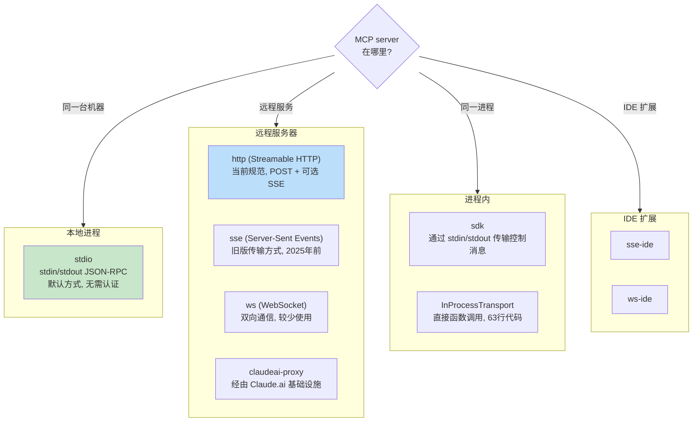
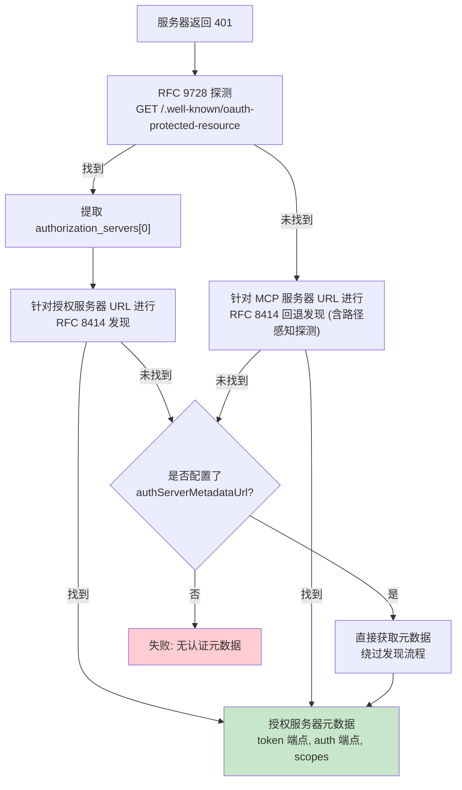

# 第15章：MCP——通用工具协议

## 为什么 MCP 的重要性超越了 Claude Code

本书的其他章节都在探讨 Claude Code 的内部机制，而本章有所不同。Model Context Protocol（模型上下文协议）是一项开放规范，任何 Agent 均可实现，而 Claude Code 的 MCP 子系统是目前最完善的生产级客户端之一。如果你正在构建一个需要调用外部工具的 Agent——无论是何种 Agent、使用何种语言或基于何种模型——本章中的模式都可以直接迁移应用。

其核心主张非常直观：MCP 定义了一套基于 JSON-RPC 2.0 的协议，用于客户端（Agent）与服务端（工具提供方）之间的工具发现和调用。客户端发送 `tools/list` 来发现服务端提供的工具，然后发送 `tools/call` 来执行。服务端通过名称、描述以及输入参数的 JSON Schema 来描述每个工具。这就是全部的契约。其余所有工作——传输方式选择、身份认证、配置加载、工具名称规范化——都是将一份简洁的规范转化为能够经受住现实世界考验的工程实现。

Claude Code 的 MCP 实现涵盖四个核心文件：`types.ts`、`client.ts`、`auth.ts` 和 `InProcessTransport.ts`。它们共同支持八种传输类型、七种配置作用域、基于两项 RFC 的 OAuth 发现机制，以及一个工具包装层，该层使得 MCP 工具与内置工具无法区分——即第6章中介绍的同一个 `Tool` 接口。本章将逐层解析这些内容。

---

## 八种传输类型

在任何 MCP 集成中，首要的设计决策是客户端如何与服务端通信。Claude Code 支持八种传输配置：



有三个设计选择值得注意。首先，`stdio` 是默认方式——当省略 `type` 时，系统会假定使用本地子进程。这与最早的 MCP 配置向后兼容。其次，fetch 包装器是分层堆叠的：超时包装在最外层，其次是升级检测（step-up detection），最内层是基础 fetch。每个包装器只处理单一关注点。第三，`ws-ide` 分支存在 Bun/Node 运行时差异——Bun 的 `WebSocket` 原生支持代理和 TLS 选项，而 Node 则需要 `ws` 包。

**如何选择。** 对于本地工具（文件系统、数据库、自定义脚本），使用 `stdio`——无需网络，无需认证，仅通过管道通信。对于远程服务，`http`（Streamable HTTP）是当前规范的推荐方式。`sse` 虽为旧版但部署广泛。`sdk`、IDE 和 `claudeai-proxy` 类型则专用于各自的生态系统内部。

---

## 配置加载与作用域

MCP 服务器配置从七个作用域加载，并进行合并与去重：

| 作用域 | 来源 | 信任级别 |
|-------|--------|-------|
| `local` | 工作目录中的 `.mcp.json` | 需用户批准 |
| `user` | `~/.claude.json` 的 mcpServers 字段 | 用户管理 |
| `project` | 项目级配置 | 项目共享设置 |
| `enterprise` | 企业托管配置 | 组织预批准 |
| `managed` | 插件提供的服务器 | 自动发现 |
| `claudeai` | Claude.ai Web 界面 | 通过 Web 预授权 |
| `dynamic` | 运行时注入 (SDK) | 编程方式添加 |

**去重基于内容而非名称。** 两个名称不同但命令或 URL 相同的服务器会被识别为同一服务器。`getMcpServerSignature()` 函数计算一个规范键：本地服务器为 `stdio:["command","arg1"]`，远程服务器为 `url:https://example.com/mcp`。如果插件提供的服务器签名与手动配置匹配，则会被抑制。

---

## 工具包装：从 MCP 到 Claude Code

当连接成功后，客户端会调用 `tools/list`。每个工具定义都会被转换为 Claude Code 内部的 `Tool` 接口——与内置工具使用的接口相同。经过包装后，模型无法区分内置工具和 MCP 工具。

包装过程分为四个阶段：

**1. 名称规范化。** `normalizeNameForMCP()` 将无效字符替换为下划线。全限定名遵循 `mcp__{serverName}__{toolName}` 格式。

**2. 描述截断。** 上限为 2,048 个字符。据观察，OpenAPI 生成的服务器会将 15-60KB 的内容塞入 `tool.description`——对于单个工具而言，这大约相当于每轮对话消耗 15,000 个 token。

**3. Schema 透传。** 工具的 `inputSchema` 直接传递给 API。在包装时不进行任何转换或验证。Schema 错误会在调用时暴露，而非注册时。

**4. 注解映射。** MCP 注解映射为行为标志：`readOnlyHint` 标记工具可安全并发执行（如第7章流式执行器所述），`destructiveHint` 触发额外的权限审查。这些注解来自 MCP 服务器——恶意服务器可能会将破坏性工具标记为只读。这是一个既定的信任边界，但值得理解：用户主动选择了该服务器，而恶意服务器将破坏性工具标记为只读是一种真实的攻击向量。系统接受这种权衡，因为替代方案——完全忽略注解——将阻碍合法服务器改善用户体验。

---

## MCP 服务器的 OAuth

远程 MCP 服务器通常需要身份认证。Claude Code 实现了完整的 OAuth 2.0 + PKCE 流程，包括基于 RFC 的发现机制、跨应用访问（Cross-App Access）以及错误响应体规范化。

### 发现链



`authServerMetadataUrl` 这一逃生舱口的存在是因为某些 OAuth 服务器对这两项 RFC 均未实现。

### 跨应用访问 (XAA)

当 MCP 服务器配置包含 `oauth.xaa: true` 时，系统会通过身份提供商（Identity Provider）执行联合令牌交换——一次 IdP 登录即可解锁多个 MCP 服务器。

### 错误响应体规范化

`normalizeOAuthErrorBody()` 函数用于处理违反规范的 OAuth 服务器。Slack 对错误响应返回 HTTP 200，并将错误信息隐藏在 JSON 响应体中。该函数会检查 2xx POST 响应体，当响应体匹配 `OAuthErrorResponseSchema` 但不匹配 `OAuthTokensSchema` 时，将响应重写为 HTTP 400。它还会将 Slack 特有的错误码（`invalid_refresh_token`、`expired_refresh_token`、`token_expired`）规范化为标准的 `invalid_grant`。

---

## 进程内传输

并非每个 MCP 服务器都需要作为独立进程运行。`InProcessTransport` 类允许在同一进程中运行 MCP 服务器和客户端：

```typescript
class InProcessTransport implements Transport {
  async send(message: JSONRPCMessage): Promise<void> {
    if (this.closed) throw new Error('Transport is closed')
    queueMicrotask(() => { this.peer?.onmessage?.(message) })
  }
  async close(): Promise<void> {
    if (this.closed) return
    this.closed = true
    this.onclose?.()
    if (this.peer && !this.peer.closed) {
      this.peer.closed = true
      this.peer.onclose?.()
    }
  }
}
```

整个文件仅有 63 行。有两个设计决策值得关注。首先，`send()` 通过 `queueMicrotask()` 传递消息，以防止同步请求/响应循环中出现栈深度问题。其次，`close()` 会级联关闭对端（peer），防止出现半开状态。Chrome MCP 服务器和 Computer Use MCP 服务器均采用了此模式。

---

## 连接管理

### 连接状态

每个 MCP 服务器连接处于五种状态之一：`connected`（已连接）、`failed`（失败）、`needs-auth`（需要认证，带有 15 分钟 TTL 缓存，防止 30 个服务器各自独立地发现同一个过期令牌）、`pending`（等待中）或 `disabled`（已禁用）。

### 会话过期检测

MCP 的 Streamable HTTP 传输使用会话 ID。当服务器重启时，请求会返回 HTTP 404 及 JSON-RPC 错误码 -32001。`isMcpSessionExpiredError()` 函数会同时检查这两个信号——注意它使用字符串包含来检测错误消息中的错误码，这种做法务实但较为脆弱：

```typescript
export function isMcpSessionExpiredError(error: Error): boolean {
  const httpStatus = 'code' in error ? (error as any).code : undefined
  if (httpStatus !== 404) return false
  return error.message.includes('"code":-32001') ||
    error.message.includes('"code": -32001')
}
```

一旦检测到过期，连接缓存将被清除，并重试一次调用。

### 批量连接

本地服务器以每批 3 个的方式连接（生成过多进程可能会耗尽文件描述符），远程服务器以每批 20 个的方式连接。React Context Provider `MCPConnectionManager.tsx` 负责管理生命周期，对比当前连接与新配置的差异。

---

## Claude.ai 代理传输

`claudeai-proxy` 传输展示了一种常见的 Agent 集成模式：通过中介进行连接。Claude.ai 订阅用户通过 Web 界面配置 MCP "连接器（connectors）"，CLI 则通过 Claude.ai 的基础设施进行路由，由后者处理供应商侧的 OAuth。

`createClaudeAiProxyFetch()` 函数在请求时捕获 `sentToken`，而不是在收到 401 后重新读取。在多个连接器并发收到 401 的情况下，另一个连接器的重试可能已经刷新了令牌。即使刷新处理器返回 false，该函数也会检查是否存在并发刷新——即另一个连接器赢得了锁文件竞争的 "ELOCKED 争用" 情况。

---

## 超时架构

MCP 的超时是分层的，每一层都针对不同的故障模式提供保护：

| 层级 | 时长 | 防护对象 |
|-------|----------|------------------|
| 连接 | 30秒 | 不可达或启动缓慢的服务器 |
| 单请求 | 60秒 (每次请求重新创建) | 过期的超时信号 bug |
| 工具调用 | ~27.8小时 | 合理的长时间操作 |
| 认证 | 每个 OAuth 请求 30秒 | 不可达的 OAuth 服务器 |

单请求超时值得强调。早期实现在连接时创建一个单一的 `AbortSignal.timeout(60000)`。在空闲 60 秒后，下一个请求会立即中止——因为信号已经过期。修复方案是：`wrapFetchWithTimeout()` 为每个请求创建一个全新的超时信号。它还规范化了 `Accept` 头，作为最后一道防线，以应对那些会丢弃该头的运行时和代理。

---

## 实践应用：将 MCP 集成到你自己的 Agent 中

**从 stdio 开始，后续再增加复杂性。** `StdioClientTransport` 处理一切事务：启动、管道、终止。一行配置，一个传输类，你就能拥有 MCP 工具。

**规范化名称并截断描述。** 名称必须匹配 `^[a-zA-Z0-9_-]{1,64}$`。添加 `mcp__{serverName}__` 前缀以避免冲突。描述上限为 2,048 个字符——否则 OpenAPI 生成的服务器会浪费上下文 token。

**延迟处理认证。** 在服务器返回 401 之前不要尝试 OAuth。大多数 stdio 服务器不需要认证。

**对内置服务器使用进程内传输。** `createLinkedTransportPair()` 消除了你自己控制的服务器的子进程开销。

**尊重工具注解并对输出进行清理。** `readOnlyHint` 启用并发执行。对响应进行清理，防范可能误导模型的恶意 Unicode（双向覆盖字符、零宽连接符等）。

MCP 协议刻意保持极简——仅两个 JSON-RPC 方法。从这些方法到生产部署之间的一切都是工程工作：八种传输方式、七种配置作用域、两项 OAuth RFC 以及分层超时机制。Claude Code 的实现展示了这种工程在规模化时的样貌。

下一章将探讨当 Agent 超越 localhost 时会发生什么：远程执行协议使 Claude Code 能够在云容器中运行、接受来自 Web 浏览器的指令，并通过注入凭证的代理隧道传输 API 流量。
