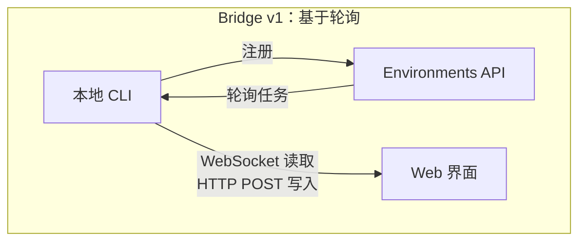
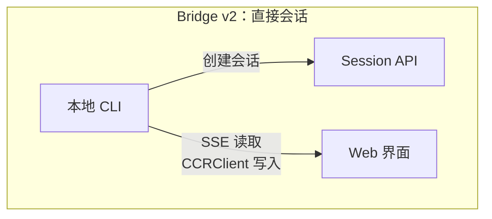
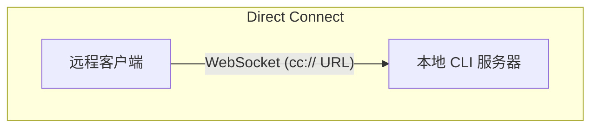
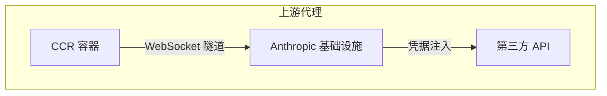

# 第 16 章：远程控制与云端执行

## Agent 突破 Localhost 限制

到目前为止，每一章都假设 Claude Code 运行在代码所在的同一台机器上。终端是本地的，文件系统是本地的，模型响应流式传输回一个同时拥有键盘和工作目录控制权的进程。

一旦你想从浏览器控制 Claude Code、在云容器中运行它，或将其作为服务暴露在局域网（LAN）中，这个假设就会被打破。Agent 需要一种方式来接收来自 Web 浏览器、移动应用或自动化流水线的指令——将权限提示转发给未坐在终端前的人，并通过可能代表 Agent 注入凭据或终止 TLS 的基础设施来隧道传输其 API 流量。

Claude Code 通过四个系统解决了这个问题，每个系统针对不同的拓扑结构：

<div class="diagram-grid">









</div>

这些系统共享一个共同的设计理念：读写是不对称的，重连是自动的，故障能够优雅降级。

---

## Bridge v1：轮询、分发、生成子进程

v1 bridge 是基于环境的远程控制系统。当开发者运行 `claude remote-control` 时，CLI 会向 Environments API 注册，轮询任务，并为每个会话生成一个子进程。

在注册之前，会运行一系列预检程序：运行时特性门控、OAuth token 验证、组织策略检查、死 token 检测（同一过期 token 连续三次失败后的跨进程退避），以及主动 token 刷新（这消除了大约 9% 原本会在首次尝试时失败的注册）。

注册成功后，bridge 进入长轮询循环。工作项以会话（包含带有 session token、API base URL、MCP 配置和环境变量的 `secret` 字段）或健康检查的形式到达。bridge 会将“无任务”日志消息节流为每 100 次空轮询记录一次。

每个会话都会生成一个子 Claude Code 进程，通过 stdin/stdout 上的 NDJSON 进行通信。权限请求通过 bridge 传输层流向 Web 界面，由用户批准或拒绝。整个往返必须在大约 10-14 秒内完成。

---

## Bridge v2：直接会话与 SSE

v2 bridge 移除了整个 Environments API 层——无需注册、无需轮询、无需确认、无需心跳、无需注销。动机在于：v1 要求服务器在分发任务前了解机器的能力。V2 将生命周期简化为三个步骤：

1. **创建会话**：使用 OAuth 凭据 `POST /v1/code/sessions`。
2. **连接 bridge**：`POST /v1/code/sessions/{id}/bridge`。返回 `worker_jwt`、`api_base_url` 和 `worker_epoch`。每次 `/bridge` 调用都会递增 epoch——它本身就是注册。
3. **打开传输通道**：SSE 用于读取，`CCRClient` 用于写入。

传输抽象层（`ReplBridgeTransport`）在统一接口后封装了 v1 和 v2，因此消息处理逻辑无需知道它正在与哪个版本通信。

当 SSE 连接因 401 断开时，传输层会使用来自新 `/bridge` 调用的新凭据重建连接，同时保留序列号游标——不会丢失任何消息。写入路径使用每个实例独立的 `getAuthToken` 闭包，而不是进程级的环境变量，防止 JWT 在并发会话间泄漏。

### FlushGate

一个微妙的顺序问题：bridge 需要在接受来自 Web 界面的实时写入的同时发送对话历史。如果在历史刷新期间收到实时写入，消息可能会乱序传递。`FlushGate` 在刷新 POST 期间将实时写入排队，并在完成后按顺序排空它们。

### Token 刷新与 Epoch 管理

v2 bridge 会在 worker JWT 过期前主动刷新。新的 epoch 告诉服务器这是同一个 worker 但使用了新凭据。Epoch 不匹配（409 响应）会被激进处理：两个连接都会关闭，异常会向上回溯调用方，防止脑裂场景。

---

## 消息路由与回声去重

两代 bridge 都使用 `handleIngressMessage()` 作为中央路由器：

1. 解析 JSON，规范化控制消息键名。
2. 将 `control_response` 路由到权限处理器，将 `control_request` 路由到请求处理器。
3. 根据 `recentPostedUUIDs`（回声去重）和 `recentInboundUUIDs`（重复投递去重）检查 UUID。
4. 转发验证通过的用户消息。

### BoundedUUIDSet：O(1) 查找，O(capacity) 内存

Bridge 存在回声问题——消息可能在读取流上回显，或在传输切换期间被投递两次。`BoundedUUIDSet` 是一个基于循环缓冲区的 FIFO 有界集合：

```typescript
class BoundedUUIDSet {
  private buffer: string[]
  private set: Set<string>
  private head = 0

  add(uuid: string): void {
    if (this.set.size >= this.capacity) {
      this.set.delete(this.buffer[this.head])
    }
    this.buffer[this.head] = uuid
    this.set.add(uuid)
    this.head = (this.head + 1) % this.capacity
  }

  has(uuid: string): boolean { return this.set.has(uuid) }
}
```

两个实例并行运行，每个容量为 2000。通过 Set 实现 O(1) 查找，通过循环缓冲区淘汰实现 O(capacity) 内存占用，无需定时器或 TTL。未知的控制请求子类型会收到错误响应，而不是静默忽略——防止服务器无限等待永远不会到来的响应。

---

## 非对称设计：持久化读取，HTTP POST 写入

CCR 协议使用非对称传输：读取通过持久连接（WebSocket 或 SSE）流动，写入通过 HTTP POST 进行。这反映了通信模式中的根本不对称性。

读取是高频、低延迟、服务器发起的——在 token 流式传输期间每秒数百条小消息。持久连接是唯一合理的选择。写入是低频、客户端发起的，并且需要确认——每分钟几条消息，而非每秒。HTTP POST 提供了可靠的传递、通过 UUID 实现的幂等性，以及与负载均衡器的天然集成。

试图将它们统一到单个 WebSocket 上会产生耦合：如果 WebSocket 在写入期间断开，你需要重试逻辑，并且必须区分“未发送”和“已发送但确认丢失”。分离通道允许各自独立优化。

---

## 远程会话管理

`SessionsWebSocket` 管理 CCR WebSocket 连接的客户端侧。其重连策略会根据故障类型进行区分：

| 故障 | 策略 |
|---------|----------|
| 4003（未授权） | 立即停止，不重试 |
| 4001（会话未找到） | 最多重试 3 次，线性退避（压缩期间的瞬时故障） |
| 其他瞬时故障 | 指数退避，最多 5 次尝试 |

`isSessionsMessage()` 类型守卫接受任何带有字符串 `type` 字段的对象——这是刻意设计的宽松策略。硬编码的白名单会在客户端更新前静默丢弃新消息类型。

---

## Direct Connect：本地服务器

Direct Connect 是最简单的拓扑结构：Claude Code 作为服务器运行，客户端通过 WebSocket 连接。没有云端中介，没有 OAuth token。

会话有五种状态：`starting`、`running`、`detached`、`stopping`、`stopped`。元数据持久化到 `~/.claude/server-sessions.json`，以便在服务器重启后恢复。`cc://` URL scheme 为本地连接提供了简洁的寻址方式。

---

## 上游代理：容器中的凭据注入

上游代理运行在 CCR 容器内部，解决了一个特定问题：在 Agent 可能执行不受信任命令的容器中，向出站 HTTPS 流量注入组织凭据。

设置顺序经过精心编排：

1. 从 `/run/ccr/session_token` 读取 session token。
2. 通过 Bun FFI 设置 `prctl(PR_SET_DUMPABLE, 0)`——阻止同 UID 对进程堆的 ptrace。如果没有这一步，被 prompt injection 利用的 `gdb -p $PPID` 可能会从内存中抓取 token。
3. 下载上游代理 CA 证书并与系统 CA 包拼接。
4. 在临时端口上启动本地 CONNECT-to-WebSocket 中继。
5. 删除 token 文件——token 现在仅存在于堆内存中。
6. 为所有子进程导出环境变量。

每一步都是失败开放（fail open）的：错误会禁用代理而不是终止会话。这是正确的权衡——代理失败意味着某些集成无法工作，但核心功能仍然可用。

### Protobuf 手动编码

通过隧道的字节被封装在 `UpstreamProxyChunk` protobuf 消息中。Schema 非常简单——`message UpstreamProxyChunk { bytes data = 1; }`——Claude Code 用十行代码手动编码，而不是引入 protobuf 运行时：

```typescript
export function encodeChunk(data: Uint8Array): Uint8Array {
  const varint: number[] = []
  let n = data.length
  while (n > 0x7f) { varint.push((n & 0x7f) | 0x80); n >>>= 7 }
  varint.push(n)
  const out = new Uint8Array(1 + varint.length + data.length)
  out[0] = 0x0a  // field 1, wire type 2
  out.set(varint, 1)
  out.set(data, 1 + varint.length)
  return out
}
```

十行代码替代了完整的 protobuf 运行时。单字段消息不值得引入依赖——位操作的维护负担远低于供应链风险。

---

## 实践应用：设计远程 Agent 执行

**分离读写通道。** 当读取是高频流而写入是低频 RPC 时，统一它们会产生不必要的耦合。让每个通道独立地故障和恢复。

**限制去重内存。** BoundedUUIDSet 模式提供了固定内存的去重。任何至少一次（at-least-once）投递系统都需要有界的去重缓冲区，而不是无界的 Set。

**使重连策略与故障信号成比例。** 永久性故障不应重试。瞬时故障应带退避重试。模糊故障应以较低的上限重试。

**在对抗环境中保持密钥仅在堆内存中。** 从文件读取 token、禁用 ptrace 并删除文件，消除了文件系统和内存检查两种攻击向量。

**辅助系统采用失败开放策略。** 上游代理之所以失败开放，是因为它提供的是增强功能（凭据注入），而非核心功能（模型推理）。

远程执行系统体现了一个更深层的原则：Agent 的核心循环（第 5 章）应当对指令来源和结果去向无关。Bridge、Direct Connect 和上游代理都是传输层。其上的消息处理、工具执行和权限流程是完全相同的，无论用户是坐在终端前还是在 WebSocket 的另一端。

下一章将探讨另一个运维关注点：性能——Claude Code 如何在启动、渲染、搜索和 API 成本方面精打细算每一毫秒和每一个 token。
