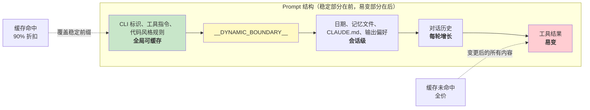

# 第 17 章：性能——每一毫秒与每一个 Token 都至关重要

## 资深工程师实战手册

Agentic 系统中的性能优化并非单一问题，而是包含五个维度：

1.  **启动延迟**——从按键到首次输出有用内容的时间。用户会抛弃那些启动缓慢的工具。
2.  **Token 效率**——上下文窗口中被有用内容占据的比例与开销之比。上下文窗口是最受限的资源。
3.  **API 成本**——每轮对话的美元花费。Prompt caching 可将此成本降低 90%，但前提是系统能在多轮对话中保持缓存稳定性。
4.  **渲染吞吐量**——流式输出期间的每秒帧数（FPS）。第 13 章已涵盖渲染架构；本章将介绍维持其高性能的性能测量与优化手段。
5.  **搜索速度**——在每次按键时，于包含 270,000 个路径的代码库中查找文件所需的时间。

Claude Code 采用了多种技术来攻克这五大难题，既有显而易见的手段（如 memoization），也有精妙细微的技巧（如用于模糊搜索预过滤的 26-bit bitmap）。关于方法论的一点说明：这些并非理论上的优化。Claude Code 内置了 50 多个启动性能分析检查点（profiling checkpoints），对 100% 的内部用户和 0.5% 的外部用户进行采样。下文中的每一项优化均源于该埋点采集的数据，而非凭直觉行事。

---

## 在启动阶段节省毫秒级时间

### 模块级 I/O 并行化

入口文件 `main.tsx` 故意违反了“模块作用域内禁止副作用”的原则：

```typescript
profileCheckpoint('main_tsx_entry');
startMdmRawRead();       // 触发 plutil/reg-query 子进程
startKeychainPrefetch();  // 并行触发两个 macOS keychain 读取操作
```

若按顺序同步执行，两个 macOS keychain 条目将耗费约 65ms。通过在模块级别将它们作为 fire-and-forget promise 启动，它们得以与约 135ms 的模块加载过程并行执行，否则这段时间 CPU 将处于空闲状态。

### API 预连接

`apiPreconnect.ts` 在初始化期间向 Anthropic API 发送一个 `HEAD` 请求，使 TCP+TLS 握手（100-200ms）与设置工作重叠。在交互模式下，这种重叠是无界的——连接会在用户输入时完成预热。该请求在 `applyExtraCACertsFromConfig()` 和 `configureGlobalAgents()` 之后触发，以确保预热的连接使用正确的传输配置。

### 快速路径分发与延迟导入

CLI 入口点包含针对特定子命令的 early-return 路径——`claude mcp` 永远不会加载 React REPL，`claude daemon` 永远不会加载工具系统。重型模块仅在需要时通过动态 `import()` 加载：OpenTelemetry（约 400KB + 约 700KB gRPC）、事件日志、错误对话框、上游代理。`LazySchema` 将 Zod schema 的构建推迟到首次验证时，从而将该开销延后到启动阶段之后。

---

## 在上下文窗口中节省 Token

### Slot 预留：默认 8K，截断时升级至 64K

这是影响最为深远的单项优化：

默认的输出 slot 预留为 8,000 tokens，仅在发生截断时升级至 64,000。API 会为模型响应预留 `max_output_tokens` 的容量。SDK 的默认值为 32K-64K，但生产数据显示 p99 的输出长度仅为 4,911 tokens。默认值多预留了 8-16 倍，导致每轮浪费 24,000-59,000 tokens。Claude Code 将上限设为 8K，仅在极少数截断情况（<1% 的请求）下以 64K 重试。对于 200K 的窗口而言，这相当于免费获得了 12-28% 的可用上下文提升。

### 工具结果预算控制

| 限制项 | 值 | 用途 |
| :--- | :--- | :--- |
| 单工具字符数 | 50,000 | 超出时将结果持久化到磁盘 |
| 单工具 token 数 | 100,000 | 文本上限约为 400KB |
| 单消息聚合限制 | 200,000 字符 | 防止 N 个并行工具在一轮对话中耗尽预算 |

单消息聚合限制是关键洞见。若无此限制，“读取 src/ 下所有文件”可能会产生 10 个并行读取操作，每个返回 40K 字符。

### 上下文窗口大小调整

默认的 200K-token 窗口可通过在模型名称后添加 `[1m]` 后缀或通过实验处理扩展至 1M。当使用量接近上限时，4 层压缩系统会逐步对较早的内容进行摘要。Token 计数以 API 实际的 `usage` 字段为基准，而非客户端估算——这涵盖了 prompt caching credits、thinking tokens 以及服务端的转换处理。

---

## 节省 API 调用费用

### Prompt Cache 架构



Anthropic 的 prompt cache 基于精确的前缀匹配机制。如果前缀中间的任何一个 token 发生变化，其后的所有内容都会导致缓存未命中。Claude Code 对整个 prompt 进行了结构化设计，确保稳定部分在前，易变部分在后。

当 `shouldUseGlobalCacheScope()` 返回 true 时，动态边界之前的 system prompt 条目会被标记为 `scope: 'global'`——运行相同 Claude Code 版本的两个用户可以共享前缀缓存。当存在 MCP 工具时，全局作用域会被禁用，因为 MCP schemas 是用户级别的。

### Sticky Latch 字段

五个布尔字段采用了“sticky-on”模式——一旦变为 true，在整个会话期间将保持为 true：

| Latch 字段 | 防止的问题 |
| :--- | :--- |
| `promptCache1hEligible` | 会话中途超额状态翻转导致缓存 TTL 变更 |
| `afkModeHeaderLatched` | Shift+Tab 切换导致缓存失效 |
| `fastModeHeaderLatched` | 冷却期进入/退出双重导致缓存失效 |
| `cacheEditingHeaderLatched` | 会话中途配置切换导致缓存失效 |
| `thinkingClearLatched` | 确认缓存未命中后翻转 thinking mode |

每个字段都对应一个 header 或参数，如果在会话中途更改，将导致约 50,000-70,000 tokens 的缓存 prompt 失效。这些 latch 机制牺牲了会话中途切换的能力，以保全缓存。

### Memoized 会话日期

```typescript
const getSessionStartDate = memoize(getLocalISODate)
```

若不如此，日期将在午夜变更，导致整个缓存前缀失效。过期的日期仅是显示问题；而缓存失效则会导致整个对话被重新处理。

### Section Memoization

System prompt sections 采用两级缓存。大多数内容使用 `systemPromptSection(name, compute)`，在 `/clear` 或 `/compact` 之前保持缓存。终极选项 `DANGEROUS_uncachedSystemPromptSection(name, compute, reason)` 会在每一轮重新计算——该命名约定强制开发者记录为何必须破坏缓存。

---

## 在渲染中节省 CPU

第 13 章深入探讨了渲染架构——紧凑的类型化数组（packed typed arrays）、基于池的 interning、双缓冲以及单元级 diffing。此处我们重点关注维持其高性能的性能测量与自适应行为。

终端渲染器通过 `throttle(deferredRender, FRAME_INTERVAL_MS)` 将帧率限制在 60fps。当终端失去焦点时，间隔翻倍降至 30fps。滚动消耗帧（scroll drain frames）以四分之一的间隔运行以实现最大滚动速度。这种自适应节流确保渲染不会消耗超出必要的 CPU 资源。

React Compiler (`react/compiler-runtime`) 会自动对整个代码库中的组件渲染进行 memoization。手动的 `useMemo` 和 `useCallback` 容易出错；编译器通过构造保证了正确性。预分配的冻结对象（`Object.freeze()`）消除了常见渲染路径值的分配开销——在 alt-screen 模式下每帧节省一次分配，累积数千帧后效果显著。

有关完整渲染管线的细节——`CharPool`/`StylePool`/`HyperlinkPool` interning 系统、blit 优化、damage rectangle 追踪、OffscreenFreeze 组件——请参阅第 13 章。

---

## 在搜索中节省内存与时间

模糊文件搜索在每次按键时都会运行，需检索超过 270,000 个路径。三层优化机制将其耗时控制在几毫秒以内。

### Bitmap 预过滤器

每个被索引的路径都会生成一个 26-bit bitmap，标记其包含哪些小写字母：

```typescript
// 伪代码——阐释 26-bit bitmap 概念
function buildCharBitmap(filepath: string): number {
  let mask = 0
  for (const ch of filepath.toLowerCase()) {
    const code = ch.charCodeAt(0)
    if (code >= 97 && code <= 122) mask |= 1 << (code - 97)
  }
  return mask  // 每一位代表 a-z 的存在与否
}
```

搜索时：`if ((charBits[i] & needleBitmap) !== needleBitmap) continue`。任何缺少查询字母的路径都会被瞬间排除——仅需一次整数比较，无需字符串操作。拒绝率：对于像 "test" 这样的宽泛查询约为 10%，对于包含稀有字母的查询则超过 90%。开销：每个路径 4 字节，270,000 个路径约占用 1MB。

### 分数上限拒绝与融合 indexOf 扫描

通过 bitmap 筛选的路径在进行昂贵的边界/camelCase 评分之前，会先接受分数上限检查。如果最佳可能得分无法超越当前的 top-K 阈值，该路径将被跳过。

实际匹配过程使用 `String.indexOf()` 将位置查找与间隔/连续奖励计算融合在一起，该方法在 JSC (Bun) 和 V8 (Node) 中均经过 SIMD 加速。引擎优化的搜索速度远快于手动字符循环。

### 异步索引与部分可查询性

对于大型代码库，`loadFromFileListAsync()` 每工作约 4ms 就会让出事件循环（基于时间而非计数——适应机器速度）。它返回两个 promise：`queryable`（在首个 chunk 完成时 resolve，支持即时获取部分结果）和 `done`（完整索引构建完毕）。用户可以在文件列表可用后的 5-10ms 内开始搜索。

让出检查使用 `(i & 0xff) === 0xff`——一种无分支的模 256 运算，用于分摊 `performance.now()` 的调用成本。

---

## 记忆相关性侧边查询

有一项优化处于 Token 效率与 API 成本的交汇点。如第 11 章所述，记忆系统使用轻量级的 Sonnet 模型调用——而非主 Opus 模型——来选择要包含哪些记忆文件。相比于因不包含无关记忆文件而节省的 tokens，其成本（快速模型上最多 256 个输出 tokens）微乎其微。单个无关的 2,000-token 记忆所浪费的上下文成本，远高于侧边查询的 API 调用成本。

---

## 推测性工具执行

`StreamingToolExecutor` 在工具流式传入时即开始执行，无需等待完整响应结束。只读工具（Glob、Grep、Read）可以并行执行；写入工具则需要独占访问权。`partitionToolCalls()` 函数将连续的安全工具分组为批次：[Read, Read, Grep, Edit, Read, Read] 会被分为三个批次——[Read, Read, Grep] 并发执行，[Edit] 串行执行，[Read, Read] 并发执行。

结果始终按原始工具顺序返回，以确保模型推理的确定性。当 Bash 工具报错时，同级 abort controller 会终止并行子进程，防止资源浪费。

---

## Streaming 与 Raw API

Claude Code 使用 raw streaming API 而非 SDK 的 `BetaMessageStream` 辅助类。该辅助类会对每个 `input_json_delta` 调用 `partialParse()`——复杂度随工具输入长度呈 O(n^2)。Claude Code 累积原始字符串，仅在 block 完整时解析一次。

流式看门狗（`CLAUDE_STREAM_IDLE_TIMEOUT_MS`，默认 90 秒）会在没有 chunk 到达时中止并重试，并在代理失败时回退到非流式的 `messages.create()`。

---

## 实践指南：Agentic 系统的性能优化

**审计你的上下文窗口预算。** `max_output_tokens` 预留值与实际 p99 输出长度之间的差距就是被浪费的上下文。设置一个紧凑的默认值，并在截断时升级。

**为缓存稳定性而设计。** Prompt 中的每个字段要么是稳定的，要么是易变的。稳定部分放前面，易变部分放后面。将对话中途对稳定前缀的任何更改视为带有金钱成本的 bug。

**并行化启动 I/O。** 模块加载是 CPU 密集型任务。Keychain 读取和网络握手是 I/O 密集型任务。在 import 之前启动 I/O 操作。

**在搜索中使用 bitmap 预过滤器。** 一个廉价的预过滤器能在昂贵评分之前拒绝 10-90% 的候选项，每条记录仅耗费 4 字节，收益显著。

**在关键处进行测量。** Claude Code 拥有 50 多个启动检查点，内部采样率 100%，外部采样率 0.5%。没有测量的性能优化只是猜测。

---

最后一点观察：这些优化大多在算法上并不复杂。Bitmap 预过滤器、环形缓冲区、memoization、interning——这些都是计算机科学的基础知识。真正的精髓在于知道在哪里应用它们。启动 profiler 告诉你毫秒耗在哪里。API usage 字段告诉你 token 耗在哪里。缓存命中率告诉你钱花在哪里。始终遵循：先测量，后优化。
